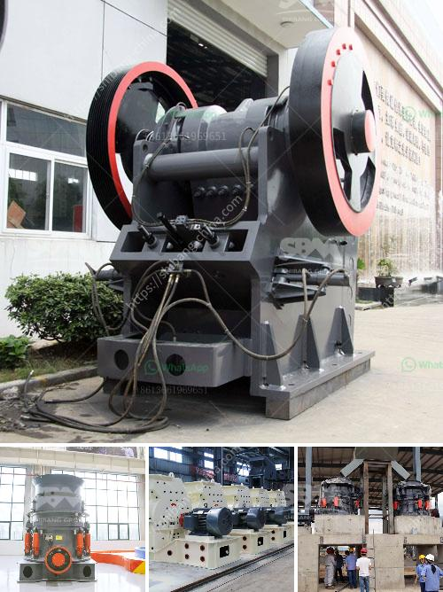

<h3>آلة مطحنة الطحن المستخدمة</h3>
تعتبر آلة مطحنة الطحن أحد الأدوات الهامة في عالم الصناعة والزراعة. تستخدم لطحن الحبوب والبذور والأعلاف والتوابل وغيرها من المواد الصلبة إلى مسحوق ناعم يمكن استخدامه في عمليات تصنيع مختلفة.

تتكون مطاحن الطحن من مجموعة متنوعة من الأجزاء الميكانيكية، بما في ذلك القرص الدوار والقرص الثابت المصنوعان من الفولاذ المقاوم للصدأ. تتميز هذه الأجزاء بجودتها ومتانتها لتحمل الاستخدام المستمر والقاسي.

تعمل المطاحن عن طريق وضع المادة المراد طحنها في الفجوة بين القرصين، ثم يتم تشغيل المحرك لتدوير القرص الدوار، ما يؤدي إلى سحق المادة بين القرصين بسرعة عالية. تأتي المطاحن بمجموعة متنوعة من الأحجام والقدرات، حيث توجد مطاحن الطحن الصغيرة المنزلية وأيضًا المطاحن الكبيرة المستخدمة في الصناعات الكبرى.

تتوفر أيضًا مطاحن الطحن المتخصصة لأغراض محددة، مثل مطاحن البن التجارية ومطاحن الحبوب الصغيرة. تتميز هذه المطاحن بالدقة والموثوقية، حيث يمكنها طحن المواد بشكل متجانس وناعم.

تستخدم مطاحن الطحن في العديد من الصناعات مثل صناعة الأغذية، حيث تستخدم لطحن الحبوب وإنتاج الدقيق والطحين. كما تستخدم في صناعة الأدوية والمستحضرات الصيدلانية لطحن المواد الصلبة إلى أحجام جسيمات محددة ومناسبة. في صناعة البلاستيك، يتم استخدام مطاحن الطحن لسحق البلاستيك المستعاد وإعادة تدويره لاستخدامه في عمليات التصنيع المختلفة.

من المهم الإشارة إلى أن استخدام مطاحن الطحن يتطلب الحذر واتباع إجراءات السلامة المناسبة. قد تكون المطاحن عبارة عن أدوات حادة تتطلب التعامل السليم لتفادي الإصابات. إلى جانب ذلك، يجب تنظيف المطاحن بانتظام للحفاظ على أداءها الأمثل ومنع التلوث المتبادل بين المواد المختلفة.

باختصار، تعتبر مطاحن الطحن أدوات أساسية في عالم الصناعة والزراعة. توفر هذه الآلات القدرة على طحن المواد الصلبة إلى مسحوق ناعم واستخدامها في عمليات التصنيع المختلفة. تحظى بشعبية كبيرة لقدرتها على زيادة كفاءة العمل وتحسين جودة المنتجات في العديد من الصناعات المختلفة.
<h3>Contact us</h3><ul><li><strong>Whatsapp:&nbsp;<a href="https://wa.me/8613661969651">+8613661969651</a></strong></li><li><a href="https://swt.shibang-china.com/?git&amp;zhl&amp;آلة مطحنة الطحن المستخدمة"><strong>Online Service(chat now)</strong></a></li></ul><h3>Related</h3><ul><li><a href='مخططات تدفق لتصنيع الحديد الزهر.md'>مخططات تدفق لتصنيع الحديد الزهر</a></li><li><a href='مصنع تكسير الجرانيت 200 طن في الساعة للبيع.md'>مصنع تكسير الجرانيت 200 طن في الساعة للبيع</a></li><li><a href='مصنع معالجة الحديد في المكسيك.md'>مصنع معالجة الحديد في المكسيك</a></li><li><a href='مصنع غسيل الذهب تروميل في ريفيلستوك.md'>مصنع غسيل الذهب تروميل في ريفيلستوك</a></li><li><a href='آلات كسارة الحجر في المكسيك.md'>آلات كسارة الحجر في المكسيك</a></li></ul>