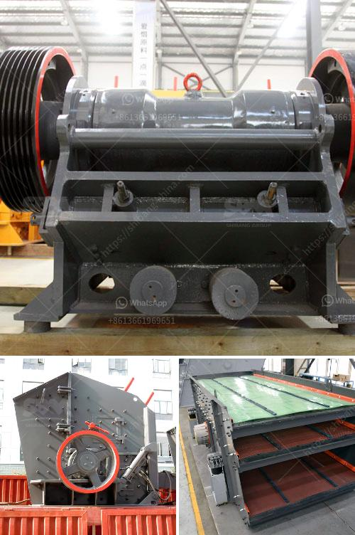

<h3>آلة مطحنة الكرة في الصين</h3>
مطحنة الكرة في الصين هي آلة تستخدم في عمليات طحن المواد الخام والمعادن والمواد الكيميائية. تعد مطاحن الكرة من أكثر الآلات شيوعًا في صناعة التعدين ومعالجة المعادن في العالم.

تعود أصول مطاحن الكرة في الصين إلى قرون عديدة، حيث كانت تستخدم لطحن المعادن واستخراج الذهب والفضة. وقد تطورت هذه المطاحن مع مرور الوقت لتلبية احتياجات الصناعات المعدنية الحديثة.

تتكون مطاحن الكرة الحديثة في الصين من أسطوانة معدنية تدور حول محورها الأفقي. تحتوي الأسطوانة على كمية من وسائط الطحن مثل الكرات المعدنية أو الصغيرة من السيراميك. يتم إدخال المادة الخام إلى الأسطوانة من أحد طرفيها، ومع تدور الأسطوانة، تصطدم الكرات بالمادة الخام وتطحنها إلى حجم صغير.

تستخدم مطاحن الكرة الصينية في العديد من الصناعات، بما في ذلك صناعة الإسمنت والتعدين وصناعة الكيماويات. في صناعة الإسمنت، تستخدم مطاحن الكرة لطحن الكلنكر والمواد الإضافية معًا لإنتاج الإسمنت النهائي. أما في صناعة التعدين، فإنها تستخدم لطحن خام المعادن إلى جسيمات أصغر قبل استخلاص المعدن النفيس المحتوى فيه.

تتمتع مطاحن الكرة الصينية بعدة مزايا. فهي تعمل بكفاءة عالية، وتستطيع طحن المواد إلى حجم جسيمات دقيقة جدًا. كما أنها تستهلك كمية صغيرة من الطاقة مقارنة ببعض الآلات الأخرى المستخدمة في الطحن. بالإضافة إلى ذلك، تتمتع مطاحن الكرة بقدرة على طحن مجموعة متنوعة من المواد الخام، مما يجعلها آلة مثالية للصناعات المختلفة.

تعتبر الصين واحدة من أكبر المنتجين لمطاحن الكرة في العالم. تصدر الصين العديد من هذه الآلات إلى العديد من البلدان في جميع أنحاء العالم بسبب التكنولوجيا المتقدمة والتصنيع ذو الجودة العالية والأسعار التنافسية.

في النهاية، تعتبر مطاحن الكرة في الصين آلات حاسمة في صناعة التعدين ومعالجة المعادن. ومع استمرار تطور التكنولوجيا والابتكار في هذا المجال، ستستمر مطاحن الكرة في الصين في تقديم حلول فعالة واقتصادية لاحتياجات الصناعات المختلفة حول العالم.
<h3>Contact us</h3><ul><li><strong>Whatsapp:&nbsp;<a href="https://wa.me/8613661969651">+8613661969651</a></strong></li><li><a href="https://swt.shibang-china.com/?git&amp;zhl&amp;آلة مطحنة الكرة في الصين"><strong>Online Service(chat now)</strong></a></li></ul><h3>Related</h3><ul><li><a href='أسعار كسارات الحجر الصغيرة.md'>أسعار كسارات الحجر الصغيرة</a></li><li><a href='التدفق النموذجي لمحجر الجرانيت.md'>التدفق النموذجي لمحجر الجرانيت</a></li><li><a href='كسارة الحجر الجيري المصنعة في باكستان.md'>كسارة الحجر الجيري المصنعة في باكستان</a></li><li><a href='كم تكلفة كسارة الفك.md'>كم تكلفة كسارة الفك</a></li><li><a href='ورقة حساب حزام الناقل.md'>ورقة حساب حزام الناقل</a></li></ul>