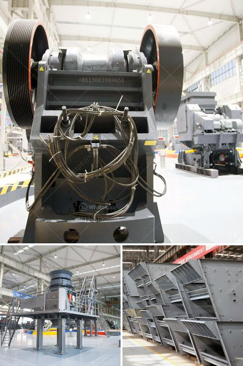

<h3>آلة مطحنة المطارق</h3>
تُعد آلة مطحنة المطارق أحد الأجهزة التي تُستخدم في عمليات طحن المواد الصلبة إلى جزيئات أصغر. تُستخدم هذه الآلة في العديد من الصناعات مثل صناعة الأعلاف وصناعة الأسمنت وتجهيز الغذاء.

تتكون مطحنة المطارق من إطار خارجي يسمى الهيكل، وداخل هذا الهيكل توجد الأجزاء الرئيسية للآلة. هذه الأجزاء تتضمن الأسطوانة الدوارة المُثبتة في محور أفقي، وعليها تُركب أشواط المطارق. الهيكل الخارجي مجهز بفتحات تُسمح بمرور المواد الصلبة إلى داخل الآلة. يتم وضع المواد داخل الآلة ويتم طحنها بواسطة حركة الأجزاء الدوارة والتصادم بين المواد وأشواط المطارق.

تستخدم آلة مطحنة المطارق لطحن المواد الصلبة إلى صورة مسحوقية ناعمة. تُعتبر هذه العملية مهمة جدًا في العديد من الصناعات، حيث تساهم في تحسين خواص المنتج النهائي. أحجام الجسيمات المطحونة يمكن أن تتراوح من خمسة ميليمترات إلى حوالي 0.1 ميكرون، اعتمادًا على متطلبات الصناعة واستخدام المنتج النهائي.

توفر مطحنة المطارق أفضل نسبة أداء لتكلفة الاستثمار. فهي تتميز بكفاءة عالية في طحن المواد وتوفير استهلاك الطاقة، وتتيح أيضًا ضبط حجم الجسيمات المطحونة. بالإضافة إلى ذلك، فإن تصميمها المتقدم يسمح بتشغيلها بكفاءة عالية وبأقل قدر من الضجيج والاهتزاز.

تُستخدم مطاحن المطارق في صناعة الأعلاف لطحن المواد الخام مثل الحبوب والأعلاف النباتية إلى حجم الجسيمات المناسب لتغذية الحيوانات. وفي صناعة الأسمنت، يتم استخدام المطارق لطحن المواد الخام وتجفيفها قبل إدخالها إلى فرن الإنتاج. وفي صناعة الغذاء، تُستخدم مطاحن المطارق لطحن المكونات الغذائية مثل الحبوب والتوابل.

في الختام، تُعد مطحنة المطارق أحد الأجهزة الرئيسية في عملية طحن المواد الصلبة في العديد من الصناعات. توفر هذه الآلة كفاءة عالية وضبط دقيق لحجم الجسيمات المطحونة، مما يعزز جودة المنتج النهائي ويحسن أداء الصناعة بشكل عام.
<h3>Contact us</h3><ul><li><strong>Whatsapp:&nbsp;<a href="https://wa.me/8613661969651">+8613661969651</a></strong></li><li><a href="https://swt.shibang-china.com/?git&amp;zhl&amp;آلة مطحنة المطارق"><strong>Online Service(chat now)</strong></a></li></ul><h3>Related</h3><ul><li><a href='كسارة تأثير كبيرة بسعة ١٠٠٠ طن في الساعة.md'>كسارة تأثير كبيرة بسعة ١٠٠٠ طن في الساعة</a></li><li><a href='مصانع إعادة تدوير النحاس في الصين.md'>مصانع إعادة تدوير النحاس في الصين</a></li><li><a href='قائمة أسعار إعادة تدوير زجاج كونسول للطن.md'>قائمة أسعار إعادة تدوير زجاج كونسول للطن</a></li><li><a href='مصنع إنتاج مسحوق الجبس بسعة 500 طن.md'>مصنع إنتاج مسحوق الجبس بسعة 500 طن</a></li><li><a href='مصنعون لكسارات الصدم.md'>مصنعون لكسارات الصدم</a></li></ul>