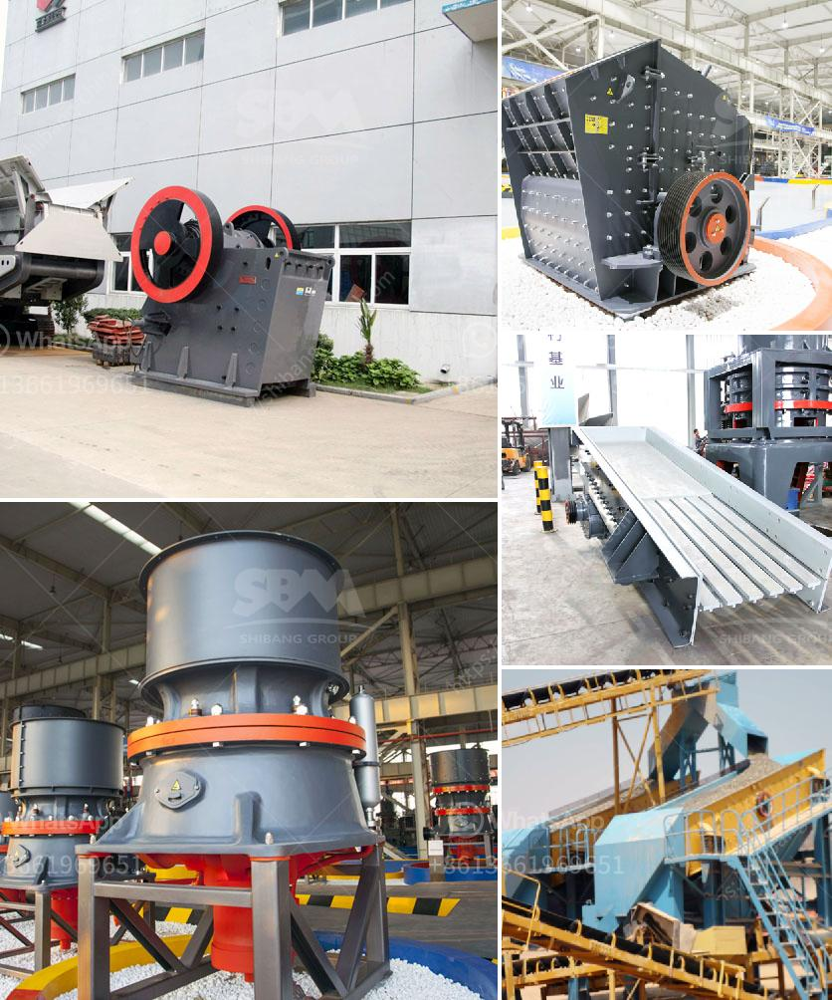

<h3>آلة مطحنة المعادن</h3>
تعتبر آلة مطحنة المعادن من الأدوات الهامة في عمليات تشكيل وقطع المعادن. تستخدم هذه الآلات على نطاق واسع في مختلف صناعات التحويل المعدنية مثل صناعة السيارات والطيران والهندسة المعمارية وغيرها.

يتم استخدام المطحنة لتشكيل الأشكال المعدنية وتجهيز القطع المعدنية. تعمل المطاحن عن طريق استخدام آلية القطع الدائري لإزالة الشحوم والمواد الزائدة عن القطعة المعدنية، وذلك بواسطة الدوران السريع لأداة القطع الدائرية على سطح المعدن.

تتكون المطحنة من عدة أجزاء أساسية. الجزء الأساسي هو الطاولة العمل، التي توفر سطحًا مستويًا ومستقرًا لوضع القطع المعدنية عليها. يتم تحريك الطاولة بشكل رأسي وأفقي باستخدام عجلة التحكم في التحريك. ويتم استخدام محرك كهربائي لدفع العجلة وتحريك الطاولة.

تضم المطحنة أيضًا رأسًا للطحن يحتوي على أداة القطع الدائرية التي يتم تثبيتها على المغزل. هذه الأداة القابلة للتبديل تتيح تشكيل وقطع المعادن بشكل فعال. يتم التحكم في سرعة دوران الأداة باستخدام مفتاح تحكم السرعة، حسب نوع المعدن وحجمه.

تعتبر المطاحن الحديثة أكثر دقة وكفاءة من الموديلات القديمة، حيث تستخدم تقنيات متقدمة مثل التحكم الرقمي والحصول على قياسات دقيقة. يمكن للمطاحن الحديثة قطع المعادن بسهولة وفقًا لمواصفات محددة، مما يضمن جودة وتناسق المنتج النهائي المعدني.

باختصار، تعتبر آلة مطحنة المعادن أداة هامة في صناعة القطع المعدنية، حيث توفر كفاءة ودقة عالية في تشكيل وقطع المعادن. يتم استخدامها في مجموعة واسعة من الصناعات وتساهم في تحسين عمليات الإنتاج وزيادة الإنتاجية.
<h3>Contact us</h3><ul><li><strong>Whatsapp:&nbsp;<a href="https://wa.me/8613661969651">+8613661969651</a></strong></li><li><a href="https://swt.shibang-china.com/?git&amp;zhl&amp;آلة مطحنة المعادن"><strong>Online Service(chat now)</strong></a></li></ul><h3>Related</h3><ul><li><a href='كسارة الحجر الصغيرة للبيع في الفلبين.md'>كسارة الحجر الصغيرة للبيع في الفلبين</a></li><li><a href='وزن آلة كسارة الصخور.md'>وزن آلة كسارة الصخور</a></li><li><a href='سعر آلة طاحونة الهامر.md'>سعر آلة طاحونة الهامر</a></li><li><a href='كسارات الحجر في كاليفورنيا.md'>كسارات الحجر في كاليفورنيا</a></li><li><a href='قائمة مصانع حبيبات خام الحديد في الهند.md'>قائمة مصانع حبيبات خام الحديد في الهند</a></li></ul>