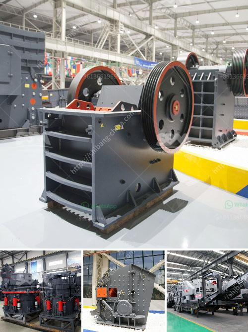

<h3>آلة معالجة البازلت</h3>
تلعب آلة معالجة البازلت دورًا حيويًا في صناعة البناء والبنية التحتية. تُستخدم البازلت في العديد من التطبيقات الهندسية والإنشائية بسبب خصائصها الممتازة مثل صلابتها وقوتها ومقاومتها للتآكل.

تعمل آلة معالجة البازلت على تحويل البازلت الخام إلى منتج قابل للاستخدام. تتضمن العملية عادة ثلاثة مراحل رئيسية: التكسير والطحن والتصنيف.

في المرحلة الأولى، تُسحق الكتل الكبيرة من البازلت إلى قطع صغيرة باستخدام آلة تكسير البازلت. تتم هذه العملية عادة باستخدام كسارات الفك أو الكسارات المخروطية أو الكسارات الصدمية.

ثم ينتقل البازلت المكسر إلى المرحلة التالية، وهي مرحلة الطحن. يتم طحن البازلت بواسطة آلة طحن البازلت حتى يتم الحصول على حجم الحبيبات المطلوب. يمكن استخدام مختلف أنواع الطواحين في هذه العملية، بما في ذلك طواحين الكرة وطواحين الأسطوانة وطواحين تأثير الرأسي.

في المرحلة الأخيرة، يتم تصنيف البازلت بحجم الحبيبات. تستخدم آلة تصنيف البازلت قاطعات هواء لفصل الحبيبات وتصنيفها وفقًا لحجمها. تعتمد عملية التصنيف على الجاذبية والقوى القطرية للحبيبات.

تعتبر ماكينة معالجة البازلت مفيدة بسبب العديد من المزايا التي توفرها للصناعة. أولاً، تساعد في زيادة كفاءة الإنتاج وتقليل التكلفة العامة للإنتاج. ثانيًا، تساعد في تحسين جودة المنتج النهائي وتوحيد الحجم والشكل. ثالثًا، تعزز التحكم في عملية التصنيع وتوفر مزيدًا من المرونة في إنتاج أحجام الحبيبات المختلفة.

بالإضافة إلى ذلك، تساهم آلة معالجة البازلت في خفض الاعتماد على البازلت الطبيعي وحفظ الموارد الطبيعية. يمكن تدوير البازلت المعالج واستخدامه مرة أخرى في صناعة البناء والطرق.

في الختام، تلعب آلة معالجة البازلت دورًا حاسمًا في تكرير البازلت وتحويله إلى منتج نهائي قابل للاستخدام في العديد من التطبيقات الهندسية والإنشائية. تمثل هذه الآلة تقدمًا تكنولوجيًا هامًا في تعزيز كفاءة الإنتاج والجودة والاستدامة في هذه الصناعة الحيوية.
<h3>Contact us</h3><ul><li><strong>Whatsapp:&nbsp;<a href="https://wa.me/8613661969651">+8613661969651</a></strong></li><li><a href="https://swt.shibang-china.com/?git&amp;zhl&amp;آلة معالجة البازلت"><strong>Online Service(chat now)</strong></a></li></ul><h3>Related</h3><ul><li><a href='قائمة مصانع الأسمنت في نيبال.md'>قائمة مصانع الأسمنت في نيبال</a></li><li><a href='مصنع كسارة الحجر الأبيض في الفلبين.md'>مصنع كسارة الحجر الأبيض في الفلبين</a></li><li><a href='تكلفة كسارة الفلسبار.md'>تكلفة كسارة الفلسبار</a></li><li><a href='آلات معالجة الأحجار الكريمة لإثيوبيا.md'>آلات معالجة الأحجار الكريمة لإثيوبيا</a></li><li><a href='طرق التعدين على الذهب الطبيعي في زيمبابوي.md'>طرق التعدين على الذهب الطبيعي في زيمبابوي</a></li></ul>