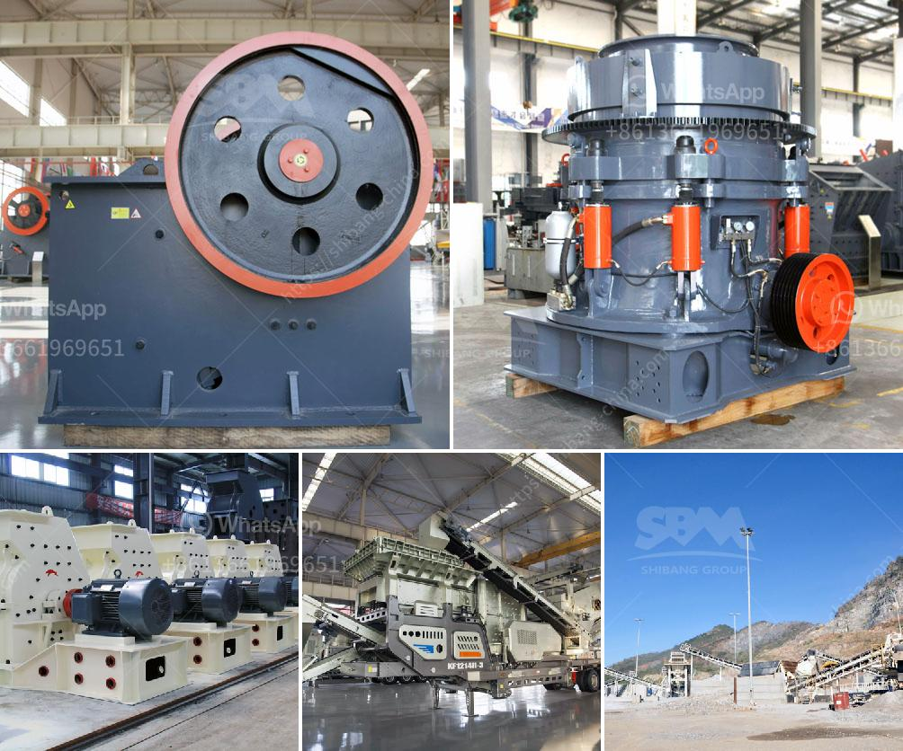

<h3>آلة معالجة البلانت</h3>
تعد آلة معالجة البلانت أحد الابتكارات التكنولوجية الحديثة التي تستخدم في صناعة ومعالجة المواد الغذائية، وبخاصة البلانت. يعود استخدام هذه الآلات إلى العديد من الفوائد والمزايا التي تقدمها للصناعة الغذائية.

تتميز آلة معالجة البلانت بمرونتها وقدرتها على معالجة الكميات الكبيرة من البلانت بشكل سريع وفعال. فهي تستخدم تقنيات متطورة تعتمد على الضغط والحرارة المناسبة للحصول على نتائج مثلى. يتم ضخ ضغط عالٍ على البلانت، مما يساعد على فتح الخلايا وتحرير العناصر القيمة في البلانت. تعمل الحرارة على تثبيت وتفعيل هذه العناصر.

تعد آلة معالجة البلانت إضافة ممتازة لصناعة الأغذية الصحية. فباستخدامها، يمكن استخلاص العناصر الغذائية من البلانت، مثل الألياف، والفيتامينات، والمعادن. كما تساهم في تحسين جودة المنتجات النهائية من مشروبات أو أطعمة باستخدام البلانت.

إلى جانب ذلك، توفر آلة معالجة البلانت الكثير من الوقت والجهد للمنتجين. فالعمل اليدوي التقليدي في معالجة البلانت يتطلب الكثير من الوقت والتركيز، وقد يكون غير فعال. ولكن باستخدام هذه الآلة الحديثة، يمكن تحقيق معالجة فعالة للبلانت بمجرد وضعها في الآلة، ويمكن إجراء العديد من دورات المعالجة في وقت قصير.

بالإضافة إلى ذلك، آلة معالجة البلانت تساهم في الحد من الهدر والفاقد للمواد. فمع عملها السريع والفعال، يمكن استخدام البلانت بالكامل دون إهدار أي جزء منه. هذا يؤدي إلى تحقيق أقصى استفادة من الموارد الطبيعية وتقليل التأثير على البيئة.

وفي النهاية، يمثل استخدام آلة معالجة البلانت تقدمًا هائلاً في صناعة الأغذية الصحية. فبفضل تلك التكنولوجيا المبتكرة، نستطيع الاستفادة من فوائد البلانت بشكل كامل وتحويلها إلى منتجات مميزة ذات قيمة غذائية عالية. بذلك، تساهم في تحسين صحة المستهلكين وتلبية الطلب المتزايد على الأغذية الصحية.
<h3>Contact us</h3><ul><li><strong>Whatsapp:&nbsp;<a href="https://wa.me/8613661969651">+8613661969651</a></strong></li><li><a href="https://swt.shibang-china.com/?git&amp;zhl&amp;آلة معالجة البلانت"><strong>Online Service(chat now)</strong></a></li></ul><h3>Related</h3><ul><li><a href='سعر مطحنة المطرقة للطين.md'>سعر مطحنة المطرقة للطين</a></li><li><a href='مطحنة طحن ألمانية.md'>مطحنة طحن ألمانية</a></li><li><a href='سعر كسارة متنقلة خام الكروم الرئيسية.md'>سعر كسارة متنقلة خام الكروم الرئيسية</a></li><li><a href='بيع كسارة الحجر.md'>بيع كسارة الحجر</a></li><li><a href='شاشة هزازة صينية.md'>شاشة هزازة صينية</a></li></ul>