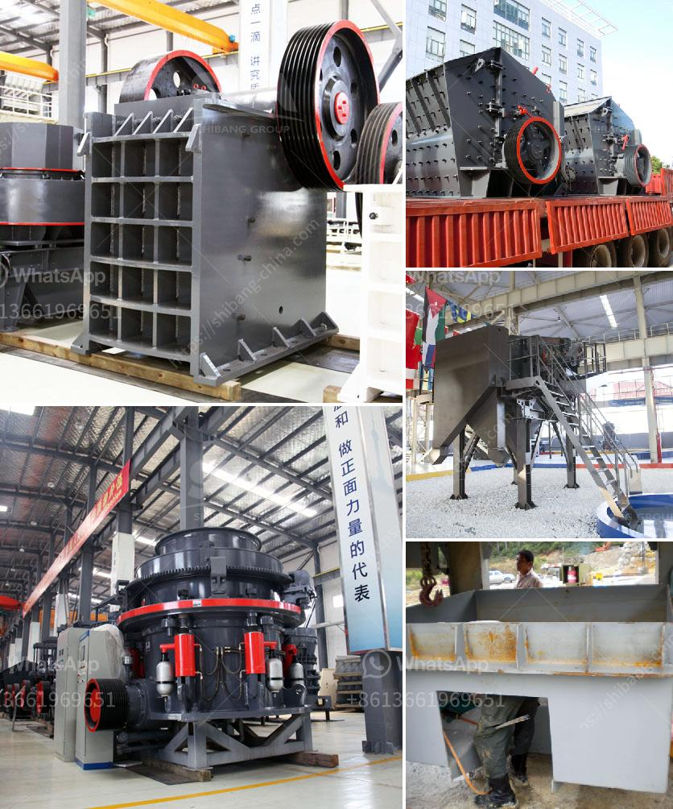

<h3>آلة معالجة الجبس بسعة طن واحد</h3>
تعتبر آلة معالجة الجبس بسعة طن واحد من الآلات الحديثة والمتطورة التي تستخدم في صناعة البناء والتشييد. تعمل هذه الآلة على تصنيع الجبس الجاهز وتحويله إلى صفائح أو بلوكات جاهزة للاستخدام في الأعمال البنائية.

تتميز آلة معالجة الجبس بسعة طن واحد بأنها تعمل بكفاءة عالية وبسرعة مناسبة، مما يساهم في زيادة الإنتاجية وتقليل تكاليف العمل والوقت. تتكون الآلة من عدة مراحل أساسية تتضمن تكسير الجبس الخام وتنقيته ومعالجته للوصول إلى الشكل النهائي.

تبدأ عملية معالجة الجبس بتحميل الجبس الخام في الماكينة، حيث يتم تجهيزها بمحركات قوية لتكسير الجبس وفصله عن الشوائب والشوائب الأخرى. يتم تحويل الجبس بعد ذلك إلى صفائح أو بلوكات باستخدام قوالب خاصة تمرر عبرها المادة، وتعمل آلات الضغط على ضغط الجبس ليأخذ الشكل النهائي المطلوب.

تعتبر آلة معالجة الجبس بسعة طن واحد صديقة للبيئة، حيث يتم استخدامها في عملية تدوير الجبس المستخدم للحفاظ على الموارد الطبيعية والحفاظ على البيئة. إلى جانب ذلك، تعمل هذه الآلة بطريقة ذكية وأوتوماتيكية، مما يجعلها سهلة الاستخدام ولا تحتاج إلى مهارات فنية متقدمة لتشغيلها.

تستخدم آلة معالجة الجبس بسعة طن واحد في مختلف أنواع الأعمال البنائية، بما في ذلك تجهيز الجدران الداخلية والخارجية والتشطيبات النهائية. كما يستخدم الجبس في صناعة الديكور والتصميم الداخلي لإنشاء أشكال فنية متنوعة.

باختصار، تعتبر آلة معالجة الجبس بسعة طن واحد من الآلات الحديثة والمتطورة التي تلبي متطلبات صناعة البناء والتشييد. توفر هذه الآلة الكفاءة والدقة في معالجة الجبس وتحويله إلى صفائح أو بلوكات جاهزة للاستخدام. كما أنها تساهم في زيادة الإنتاجية وتوفير الوقت والتكاليف، وتعتبر صديقة للبيئة وسهلة الاستخدام.
<h3>Contact us</h3><ul><li><strong>Whatsapp:&nbsp;<a href="https://wa.me/8613661969651">+8613661969651</a></strong></li><li><a href="https://swt.shibang-china.com/?git&amp;zhl&amp;آلة معالجة الجبس بسعة طن واحد"><strong>Online Service(chat now)</strong></a></li></ul><h3>Related</h3><ul><li><a href='كيفية صنع مسحوق التلك الصناعي.md'>كيفية صنع مسحوق التلك الصناعي</a></li><li><a href='مطحنة الأسطوانة بيرينج.md'>مطحنة الأسطوانة بيرينج</a></li><li><a href='مصنع مطحنة ريموند في الهند.md'>مصنع مطحنة ريموند في الهند</a></li><li><a href='موزعون لمعدات المحاجر والتعدين في الصين.md'>موزعون لمعدات المحاجر والتعدين في الصين</a></li><li><a href='آلات تكسير الحجر في المملكة المتحدة.md'>آلات تكسير الحجر في المملكة المتحدة</a></li></ul>