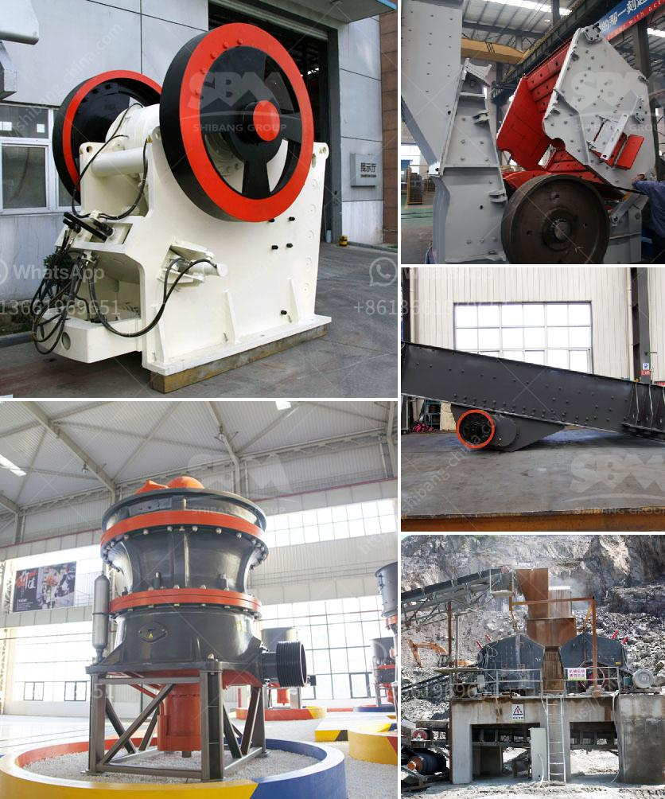

<h3>آلة معالجة الذهب في الصين</h3>
معالجة الذهب من أهم الصناعات اللازمة في قطاع التعدين، وتعد الصين واحدة من أكبر الدول المنتجة لهذا المعدن الثمين. تتمتع الصين بالخبرة والتكنولوجيا المتطورة في استخراج ومعالجة الذهب، وتهتم بتطوير آلات متطورة لهذا الغرض.

تتم معالجة الذهب في الصين باستخدام آلات ومعدات متطورة تتضمن عدة مراحل. تبدأ هذه العملية بتفتيت خام الذهب وسحقه إلى حجم صغير يسمح بفصل الجزيئات الذهبية بسهولة. يتم تحويل الخام إلى حل عن طريق تدفق الماء عليه، الأمر الذي يقلل من حجم الجسيمات ويساهم في فصل المعادن الثقيلة عن المعادن الخفيفة.

بعد ذلك، يتم تنقية الحل من الشوائب والمعادن الأخرى باستخدام عمليات كيميائية معقدة ومتقدمة. يستخدم السيانيد في هذه العملية بشكل شائع، حيث يتفاعل مع الذهب ويساعد في تجزئته عن الشوائب. يتم فصل الماء الناتج عن عملية التنقية لاحقًا لاستخراج الذهب الخالص.

لتسريع عملية معالجة الذهب، تم ابتكار آلات متطورة في الصين تتيح تنفيذ كل هذه المراحل بشكل أسرع وأكثر كفاءة. تعتبر الآلات الذكية ومنظومات الروبوتات الذكية مثالاً على التطور التكنولوجي الذي تشهده الصناعة. يتم برمجة هذه الآلات للقيام بالمهام المتعلقة بمعالجة الذهب بدقة وفعالية عالية.

بعض هذه الآلات تعمل بنظام التحكم الرقمي بالكمبيوتر (CNC)، حيث يتم برمجتها للقيام بالعديد من العمليات مثل السحق والفصل والتنقية بدقة وبدون تدخل بشري مباشر. يتم تحديد كل خطوة في معالجة الذهب عبر برمجة الجهاز وتتم متابعتها بدقة من قبل الآلة. 

بفضل هذه الآلات المتطورة، أصبحت عمليات معالجة الذهب في الصين أكثر كفاءة وسرعة، مما يعزز إنتاجية الصناعة ويقلل التكاليف. ولذلك، فإن آلة معالجة الذهب في الصين تلعب دورًا حيويًا في تعزيز الاقتصاد المحلي وتلبية الطلب العالمي على الذهب.
<h3>Contact us</h3><ul><li><strong>Whatsapp:&nbsp;<a href="https://wa.me/8613661969651">+8613661969651</a></strong></li><li><a href="https://swt.shibang-china.com/?git&amp;zhl&amp;آلة معالجة الذهب في الصين"><strong>Online Service(chat now)</strong></a></li></ul><h3>Related</h3><ul><li><a href='مطاحن الكرة في جنوب أفريقيا.md'>مطاحن الكرة في جنوب أفريقيا</a></li><li><a href='سعر آلة طحن المطحنة.md'>سعر آلة طحن المطحنة</a></li><li><a href='كيفية إعداد خطة عمل لمصنع الكسارات.md'>كيفية إعداد خطة عمل لمصنع الكسارات</a></li><li><a href='سعر آلة كسارة المحجر.md'>سعر آلة كسارة المحجر</a></li><li><a href='تكلفة كسارة الفك 24x36.md'>تكلفة كسارة الفك 24x36</a></li></ul>