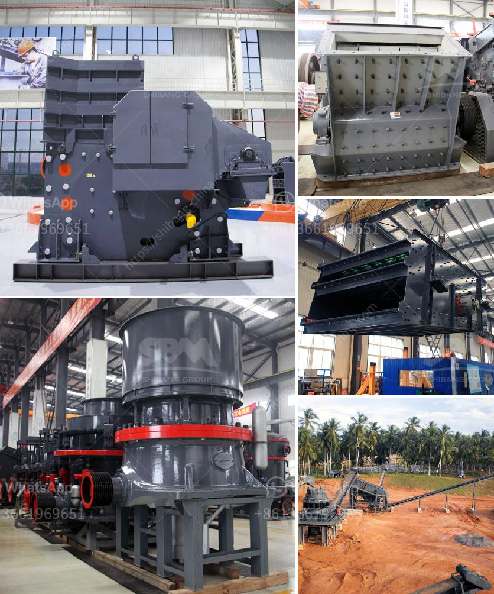

<h3>آلة معالجة الرماد الطائر</h3>
تعد آلة معالجة الرماد الطائر واحدة من أهم التقنيات في مجال إدارة النفايات الصناعية. يتم إنتاج الرماد الطائر كنتيجة لاحتراق الفحم أو النفط أو الغاز الطبيعي في محطات توليد الكهرباء ومحطات المعالجة الحرارية. عادةً ما يتم كون الرماد الطائر من مواد غير قابلة للاستخدام وتعتبر فائضًا في عملية الحرق.

توجد العديد من المشاكل البيئية المرتبطة بالتخلص من الرماد الطائر، حيث يحتوي على مواد ضارة مثل الزئبق والرصاص والكادميوم والسيلينيوم. وبالإضافة إلى ذلك، فإن طبيعته الناعمة والاستفسارية يمكن أن تتسبب في انتشاره في الجو وتلوث التربة والمياه، مما يؤثر سلباً على البيئة وصحة الإنسان.

تم تطوير آلة معالجة الرماد الطائر للتعامل مع هذه المشكلة. تتكون هذه الآلة عادةً من نظام للفصل الأولي للمواد الملوثة من الرماد، ثم يتم استخدام أساليب متقدمة لمعالجة وتنقية الرماد. بفضل تقنيات الترشيح الذكية والمعالجة الكيميائية، يمكن أن تزيل الآلة المعلنة معظم المواد الضارة الموجودة في الرماد وتحويلها إلى منتج قابل للاستخدام وغير ضار.

تعتبر آلة معالجة الرماد الطائر حلاً فعالًا لمشاكل التلوث الناجمة عن التخلص من الرماد. يمكن استخدام المنتج النهائي في مجالات مختلفة مثل صناعة الإسمنت وإنتاج الطوب والمواد البناء الأخرى. بالإضافة إلى ذلك، يمكن أيضًا استخدام الرماد المعالج كمادة خام ثانوية في صناعة السيراميك والزجاج والمعادن والأسمدة.

تعد آلة معالجة الرماد الطائر استثمارًا محسوبًا وجيدًا للشركات التي ترغب في تقليل التأثير البيئي لأنشطتها. كما أنها تساهم في تحسين فعالية استخدام الموارد وتقليل النفايات التي تنتجها عمليات الحرق. بالإضافة إلى ذلك، تمنح الأمان البيئي وتلبي معايير السلامة والنظافة في مصنع الإنتاج.

باختصار، تتيح آلة معالجة الرماد الطائر تحويل فائض المواد الضارة إلى منتجات صالحة للاستخدام وغير ضارة بالبيئة والصحة العامة. تعتبر هذه التقنية حلاً مستدامًا وفعالًا للتعامل مع مشكلة الرماد الطائر وتساهم في الحفاظ على البيئة وصحة المجتمع.
<h3>Contact us</h3><ul><li><strong>Whatsapp:&nbsp;<a href="https://wa.me/8613661969651">+8613661969651</a></strong></li><li><a href="https://swt.shibang-china.com/?git&amp;zhl&amp;آلة معالجة الرماد الطائر"><strong>Online Service(chat now)</strong></a></li></ul><h3>Related</h3><ul><li><a href='آلة صغيرة لصنع المسحوق.md'>آلة صغيرة لصنع المسحوق</a></li><li><a href='مصنع طحن الحجر الألماني.md'>مصنع طحن الحجر الألماني</a></li><li><a href='آلات كسارة المحجر في إيطاليا.md'>آلات كسارة المحجر في إيطاليا</a></li><li><a href='سعر كسارة الطين.md'>سعر كسارة الطين</a></li><li><a href='تقدير تكلفة مصنع الأسمنت في الهند.md'>تقدير تكلفة مصنع الأسمنت في الهند</a></li></ul>