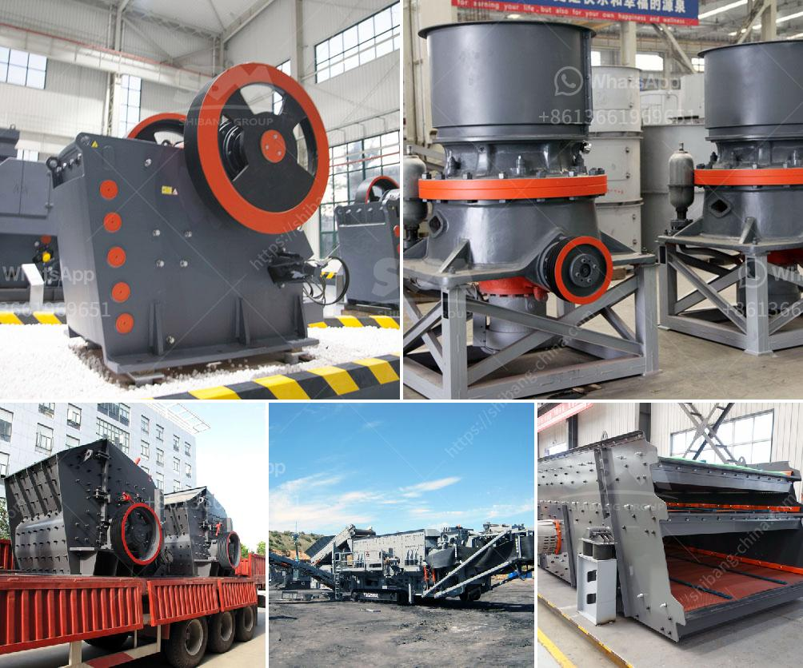

<h3>آلة معالجة الكاولين في المصنع</h3>
تعتبر آلة معالجة الكاولين من الآلات الحديثة التي تستخدم في صناعة السيراميك والزجاج والطلاء والمواد الكيميائية الأخرى. تستخدم هذه الآلة لطحن وتنقية الكاولين الخام، وهو معدن يُستخرج من الصخور الرسوبية.

في المصنع، تمر عملية معالجة الكاولين بعدة مراحل رئيسية. الخطوة الأولى هي سحق الكاولين الخام باستخدام الكسارات، لتجهيزه للطحن اللاحق. وعادة ما يستخدم الكاولين الخام الذي يحتوي على نسبة عالية من الماء.

تتم الخطوة التالية باستخدام المطاحن الدوارة. تستخدم المطاحن الدوارة عادةً لطحن المواد الخام إلى مسحوق ناعم. وتتكون هذه المطاحن من أسطوانة طويلة تدور حول محورها الرأسي. وتقوم بطحن الكاولين بواسطة الكرات المعدنية الموجودة داخل الأسطوانة.

بعد طحن الكاولين، يتم تنقية الجسيمات عن طريق التصنيف. تستخدم آلة التصنيف لفصل الجسيمات الكبيرة والخشنة عن الجسيمات الدقيقة والناعمة. يتم ذلك عن طريق تمرير الطين المجمع من المطحنة الدوارة من خلال سلسلة من الشاشات المختلفة.

ثم يتم تجفيف الكاولين المنقى بواسطة آلة التجفيف. يستخدم جهاز التجفيف طريقة تدفق الهواء الساخن لتجفيف الكاولين المعالج، حيث يتم تشغيل الهواء الساخن في مدخل الجهاز وخروجه من الفتحات الموجودة في الجهة المقابلة، مما يتيح للكاولين أن يتجف بسرعة.

وفي النهاية، يتم تخزين الكاولين المجفف في مستودعات خاصة تحتوي على مراقبة حرارية ورطوبة للحفاظ على جودة المنتج. من هناك، يمكن شحن الكاولين إلى العملاء للاستخدام في صناعات مختلفة.

قد تختلف خطوات معالجة الكاولين قليلاً من مصنع لآخر، وتعتمد على المتطلبات النهائية للمنتج. ومع ذلك، فإن المعالجة الأساسية للكاولين تبقى نفسها في معظم الحالات.

في الختام، تُعتبر آلة معالجة الكاولين مرحلة هامة في عملية إنتاج المنتج النهائي. فهي تحول الكاولين الخام غير المعالج إلى مسحوق ناعم جاهز للاستخدام في صناعات مختلفة. تنتج هذه الآلة نتائج ذات جودة عالية وتعزز فعالية العمل في مصانع التصنيع.
<h3>Contact us</h3><ul><li><strong>Whatsapp:&nbsp;<a href="https://wa.me/8613661969651">+8613661969651</a></strong></li><li><a href="https://swt.shibang-china.com/?git&amp;zhl&amp;آلة معالجة الكاولين في المصنع"><strong>Online Service(chat now)</strong></a></li></ul><h3>Related</h3><ul><li><a href='آلات وتجهيزات تسمين الجير.md'>آلات وتجهيزات تسمين الجير</a></li><li><a href='نظام طحن الحجر الجيري.md'>نظام طحن الحجر الجيري</a></li><li><a href='كسارة الحجر للبيع في الإمارات.md'>كسارة الحجر للبيع في الإمارات</a></li><li><a href='مصنع كسارة مستعمل في الإمارات.md'>مصنع كسارة مستعمل في الإمارات</a></li><li><a href='كسارة حجر بجرار.md'>كسارة حجر بجرار</a></li></ul>