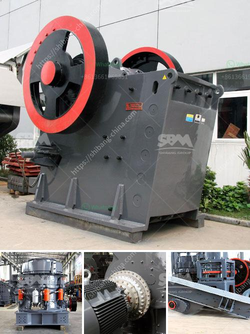

<h3>آلة معالجة النحاس</h3>
تعتبر آلة معالجة النحاس أحد الأدوات الحديثة والمهمة في صناعة المعادن. تستخدم هذه الآلة لتحويل خام النحاس إلى مادة قابلة للاستخدام في عدة صناعات مختلفة، مثل الصناعة الكهربائية والصناعة الإلكترونية وصناعة البناء.

تتكون آلة معالجة النحاس من عدة أجزاء رئيسية. الجزء الأول هو المطحنة، وهي المكون الذي يستخدم لكسر الخام وطحنه إلى جسيمات صغيرة. تتم هذه العملية بواسطة استخدام الكرات المعدنية الصغيرة التي تدور وتصدم الخام.

بعد عملية الطحن، يتم فصل النحاس عن المواد الأخرى الموجودة في الخام. يتم استخدام آلة فصل مغناطيسي لإزالة المواد المغناطيسية، مثل الحديد والصلب، من المزيج. ثم يتم استخدام آلة فصل الجاذبية لفصل النحاس عن المواد الأخرى المتبقية. عملية الفصل الجاذبية تقوم على تطبيق قوة الجاذبية على المزيج والتحكم فيها بواسطة آلة الفصل للحصول على مادة النحاس النقية.

بعد عملية الفصل، يتم تنقية النحاس لإزالة أية شوائب ممكنة. تستخدم آلة التنقية الكيميائية وتكون بنظام يستخدم مواد كيميائية خاصة لتنقية المعدن.

في النهاية، يتم استخدام آلة تشكيل النحاس لإعادة تشكيل النحاس إلى قوالب أو أشكال مختلفة حسب الاحتياج. يتم ذلك عن طريق التدفئة والضغط لتشكيل النحاس وجعله جاهزًا للاستخدام في صناعة الأسلاك الكهربائية أو صناعة التجهيزات الكهربائية الأخرى.

باختصار، آلة معالجة النحاس هي أداة حديثة ومتقدمة في صناعة المعادن. تعمل على تحويل خام النحاس إلى مادة قابلة للاستخدام عن طريق عملية الطحن والفصل والتنقية والتشكيل. هذه الآلة لها دور هام في صناعة النحاس وتساهم في توفير المواد اللازمة للعديد من الصناعات الحديثة.
<h3>Contact us</h3><ul><li><strong>Whatsapp:&nbsp;<a href="https://wa.me/8613661969651">+8613661969651</a></strong></li><li><a href="https://swt.shibang-china.com/?git&amp;zhl&amp;آلة معالجة النحاس"><strong>Online Service(chat now)</strong></a></li></ul><h3>Related</h3><ul><li><a href='مصنع غسيل وفرز للتأجير في جنوب أفريقيا.md'>مصنع غسيل وفرز للتأجير في جنوب أفريقيا</a></li><li><a href='طحن الكرة الصين.md'>طحن الكرة الصين</a></li><li><a href='موزعو معدات تكسير extec.md'>موزعو معدات تكسير extec</a></li><li><a href='تقرير مشروع مصنع الكرة الصغيرة بتنسيق PDF.md'>تقرير مشروع مصنع الكرة الصغيرة بتنسيق PDF</a></li><li><a href='كسارة تأثير في المملكة العربية السعودية.md'>كسارة تأثير في المملكة العربية السعودية</a></li></ul>