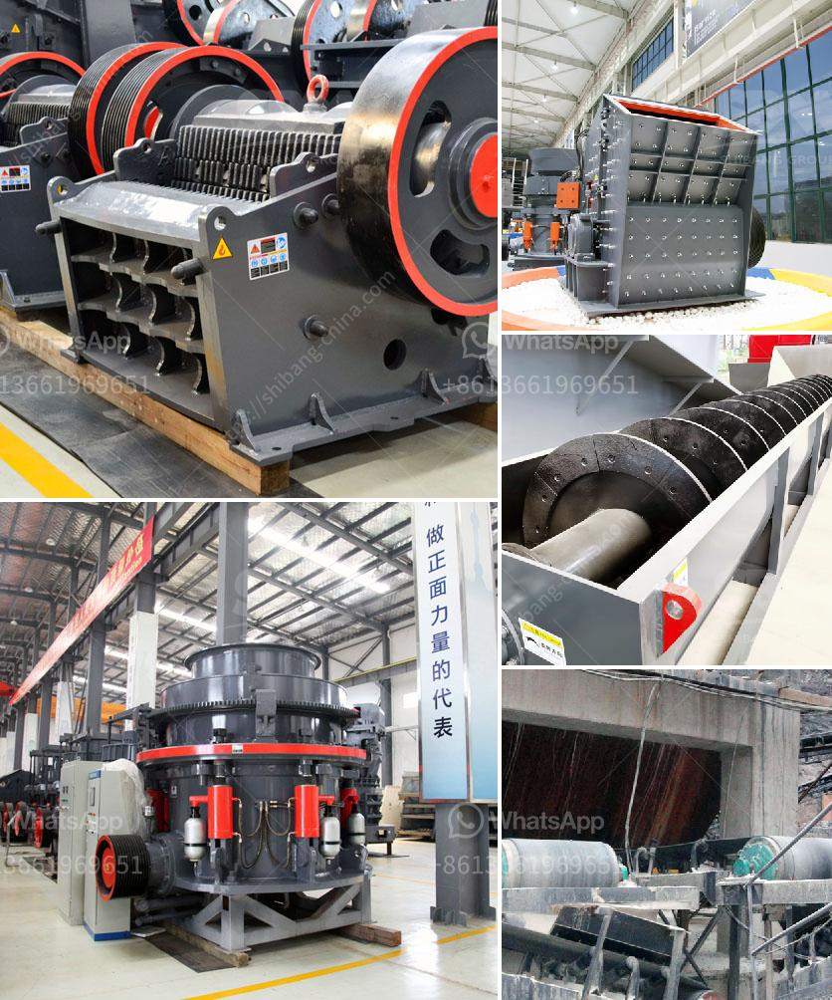

<h3>آلة معالجة خام المنغنيز بسعر</h3>
تعتبر آلة معالجة خام المنغنيز أحد الأجهزة الهامة في صناعة التعدين ومعالجة المعادن. تستخدم هذه الآلة لاستخلاص خام المنغنيز من الصخور ومعالجته إلى منتج نهائي قابل للاستخدام في مجموعة واسعة من التطبيقات الصناعية.

تعمل آلة معالجة خام المنغنيز عن طريق تكسير الخام الخام وتفتيته إلى حبيبات صغيرة. يتم ذلك عادة باستخدام كسارة فكية أو طاحونة كروية. بعد ذلك، يتم فصل الخام المكسور بواسطة تقنيات الفصل الجاذبية أو الكهرومغناطيسية أو الطفو. يتم تجهيز الخام المعالج من خلال سلسلة من المراحل مثل الغسيل والتعويم والترشيح والجفاف لإزالة الشوائب والشوائب الأخرى من المنتج النهائي.

تعد هذه الآلة مفيدة جداً في صناعة الصلب والبطاريات وغيرها من التطبيقات الصناعية. فمنتجات خام المنغنيز تعتبر مكوناً أساسياً في صناعة الصلب. تستخدم الصلبات التي تحتوي على المنغنيز في صناعة السفن والجسور والمباني والمعدات الثقيلة. بالإضافة إلى ذلك، يتم استخدام المنغنيز في صناعة البطاريات والصناعات الكيميائية وصناعة الألواح الإلكترونية.

تتراوح أسعار آلات معالجة خام المنغنيز بين 200 و 400 دولار، وتعتمد التكلفة على عوامل مثل الحجم والسعة والجودة والوظائف المختلفة المتاحة. من المهم اختيار آلة معالجة مناسبة وذات جودة عالية لضمان الحصول على منتجات نهائية مرغوبة.

إجمالاً، تعتبر آلة معالجة خام المنغنيز جهازًا أساسيًا في عمليات استخلاص وتصنيع المنغنيز، وتلعب دوراً حاسمًا في تلبية الطلب المستمر على المنتجات المعدنية. تتيح هذه الآلة إمكانية استخدام المنغنيز في مجموعة واسعة من التطبيقات الصناعية المختلفة، ومن المتوقع أن تستمر في الازدياد في الطلب في المستقبل بناءً على التطورات التكنولوجية والنمو الاقتصادي.
<h3>Contact us</h3><ul><li><strong>Whatsapp:&nbsp;<a href="https://wa.me/8613661969651">+8613661969651</a></strong></li><li><a href="https://swt.shibang-china.com/?git&amp;zhl&amp;آلة معالجة خام المنغنيز بسعر"><strong>Online Service(chat now)</strong></a></li></ul><h3>Related</h3><ul><li><a href='مطحنة محمولة في أستراليا بيرث.md'>مطحنة محمولة في أستراليا بيرث</a></li><li><a href='طحن الرمل السيليكا.md'>طحن الرمل السيليكا</a></li><li><a href='تكلفة كسارة الحجر.md'>تكلفة كسارة الحجر</a></li><li><a href='آلة مسحوق الجير السريع.md'>آلة مسحوق الجير السريع</a></li><li><a href='مطاحن هامر زراعية مستعملة.md'>مطاحن هامر زراعية مستعملة</a></li></ul>