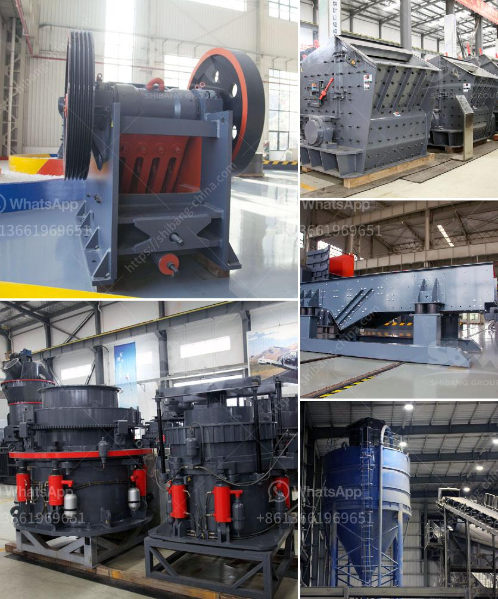

<h3>آلة ميكرونيزر الحجر الجيري مطحنة ميكرونيزر</h3>
تتمتع آلة ميكرونيزر الحجر الجيري بأهمية كبيرة في صناعة البناء والهندسة المدنية. فهي تستخدم لتحويل الحجر الجيري إلى مسحوق ناعم يمكن استخدامه في إنتاج الأسمنت والخرسانة والطلاء والأسمدة ومنتجات أخرى.

تتميز هذه الآلة بقدرتها على طحن الحجر الجيري بشكل دقيق وسريع. فهي تعمل عن طريق تدفق المواد في فجوة بين مجموعتين من الأسطوانات المضغوطة المغناطيسيا. يتم سحق المواد الموجودة في الفجوة بفعل القوة المتولدة عن التداخل بين الأسطوانات. تتميز هذه الآلة بسهولة التشغيل والتحكم، وقابليتها للتعديل بحيث يمكن تغيير قوة الطحن وتحقيق الحجم المطلوب للمسحوق.

يتم استخدام آلة ميكرونيزر الحجر الجيري بشكل واسع في مصانع الأسمنت ومصانع الخرسانة. ففي صناعة الأسمنت، يتم طحن الحجر الجيري وخليطه مع المواد الأخرى لإنتاج الكلنكر، وهو المكون الرئيسي في صناعة الأسمنت. أما في صناعة الخرسانة، فتعتبر الآلة أحد العوامل المهمة في إنتاج مواد البناء ذات الجودة العالية والأداء الممتاز.

بالإضافة إلى ذلك، تستخدم آلة ميكرونيزر الحجر الجيري أيضًا في صناعة الطلاء والمواد الكيميائية والأسمدة. ففي صناعة الطلاء، يتم استخدام المسحوق الناعم لإنتاج ألوان مختلفة وتعزيز الأداء والمتانة. أما في صناعة الأسمدة، فتعتبر الآلة أساسية لطحن الحجارة الجيرية وتحويلها إلى صورة معدنية يمكن استخدامها في إنتاج الأسمدة الزراعية.

باختصار، آلة ميكرونيزر الحجر الجيري تلعب دورًا حيويًا في صناعة البناء والهندسة المدنية. فهي تساهم في إنتاج المواد اللازمة للبناء بجودة عالية وفعالية في الأداء. كما أنها تقدم مزايا عديدة مثل سهولة التشغيل والتحكم. إن استخدام هذه الآلة يساهم في تعزيز عمليات الإنتاج وتحقيق نتائج مرضية في العديد من الصناعات المختلفة.
<h3>Contact us</h3><ul><li><strong>Whatsapp:&nbsp;<a href="https://wa.me/8613661969651">+8613661969651</a></strong></li><li><a href="https://swt.shibang-china.com/?git&amp;zhl&amp;آلة ميكرونيزر الحجر الجيري مطحنة ميكرونيزر"><strong>Online Service(chat now)</strong></a></li></ul><h3>Related</h3><ul><li><a href='معدات فحص الرمال للبيع في جنوب أفريقيا.md'>معدات فحص الرمال للبيع في جنوب أفريقيا</a></li><li><a href='مطحنة البنتونيت المستعملة من اليد الثانية.md'>مطحنة البنتونيت المستعملة من اليد الثانية</a></li><li><a href='تكاليف مطاحن الكرة.md'>تكاليف مطاحن الكرة</a></li><li><a href='سعر مطحنة الكرة في باكستان.md'>سعر مطحنة الكرة في باكستان</a></li><li><a href='مصنع DMS للماس المستعمل للبيع في كيمبرلي.md'>مصنع DMS للماس المستعمل للبيع في كيمبرلي</a></li></ul>