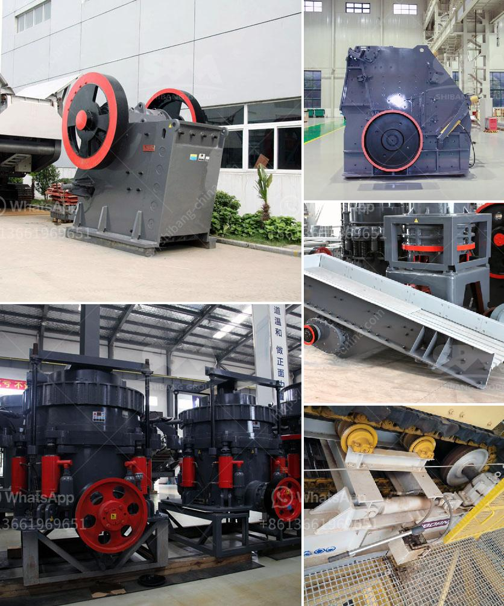

<h3>آلة نقل حجر الكوارتز</h3>
تُعد آلة نقل حجر الكوارتز أحد الآلات المستخدمة في صناعة التعدين والبناء لنقل ونقل الحجارة الثقيلة من الموقع إلى المكان المراد. يعد حجر الكوارتز واحدًا من أكثر أنواع الأحجار المستخدمة في البناء بسبب صلابته ومتانته، ويستخدم على نطاق واسع في الأعمال الهندسية والديكور والحرفية.

تأتي آلة نقل حجر الكوارتز بتصميم قوي ومتين لتتحمل الأحمال الثقيلة والظروف القاسية في مواقع التعدين والبناء. يتم استخدام مفصلات قوية لضمان الاستقرار والثبات أثناء التحميل والتفريغ، ويتم تزويدها بعجلات كبيرة ومتينة لتسهيل الحركة عبر التضاريس الوعرة.

توجد عدة أنواع من آلات نقل حجر الكوارتز، بما في ذلك الحزام الناقل والشاحنات النصف مقطورة والشاحنات الثقيلة. يُعتبر الحزام الناقل الخيار الأكثر شيوعًا واسعة الاستخدام في صناعة التعدين، حيث تستخدم لنقل الحجارة من المنجم إلى ورشة العمل أو من مكان لآخر داخل الموقع. يوفر الحزام الناقل طريقة سهلة وفعالة من حيث التكلفة لنقل الحجارة بكميات كبيرة.

يستخدم الشاحنات النصف مقطورة والشاحنات الثقيلة عندما يكون هناك حاجة لنقل حجر الكوارتز عبر مسافات طويلة. يُعتبر استخدام الشاحنات النصف مقطورة أكثر شيوعًا نظرًا لقدرتها على نقل كميات كبيرة من الحجارة في وقت واحد. تتميز الشاحنات الثقيلة بقدرتها على التعامل مع الحمولات الأكبر ونقلها عبر المسافات البعيدة، وهي غالبًا ما تستخدم في مشاريع البناء الضخمة والمناجم الكبيرة.

بالاعتماد على الحاجة والميزانية، يمكن اختيار الآلة المناسبة لنقل حجر الكوارتز. بغض النظر عن النوع المختار، فإن استخدام آلة نقل حجر الكوارتز يعزز كفاءة العمل ويوفر الجهد في نقل الحجارة الثقيلة، مما يعزز القدرة على استخدامها في مجموعة متنوعة من التطبيقات في مواقع البناء وصناعة البناء.

باختصار، آلة نقل حجر الكوارتز هي أداة أساسية في صناعة التعدين والبناء لنقل الحجارة الثقيلة بكفاءة وسهولة. تأتي بأنواع مختلفة وتصميمات قوية لتلبية احتياجات المشروعات المختلفة. يمكن الاعتماد عليها في تحسين عمليات البناء ونقل الحجارة، مما يساهم في تنفيذ المشاريع بفعالية واقتصادية.
<h3>Contact us</h3><ul><li><strong>Whatsapp:&nbsp;<a href="https://wa.me/8613661969651">+8613661969651</a></strong></li><li><a href="https://swt.shibang-china.com/?git&amp;zhl&amp;آلة نقل حجر الكوارتز"><strong>Online Service(chat now)</strong></a></li></ul><h3>Related</h3><ul><li><a href='كسارة الكرةست في كينيا صنعت في الصين.md'>كسارة الكرةست في كينيا صنعت في الصين</a></li><li><a href='آلة ميكرونيزر الحجر الجيري مطحنة ميكرونيزر.md'>آلة ميكرونيزر الحجر الجيري مطحنة ميكرونيزر</a></li><li><a href='آلة سحق البلاد.md'>آلة سحق البلاد</a></li><li><a href='آلة كسارة الحجر الصينية.md'>آلة كسارة الحجر الصينية</a></li><li><a href='مصنعين لمصانع الأسمنت في الهند.md'>مصنعين لمصانع الأسمنت في الهند</a></li></ul>