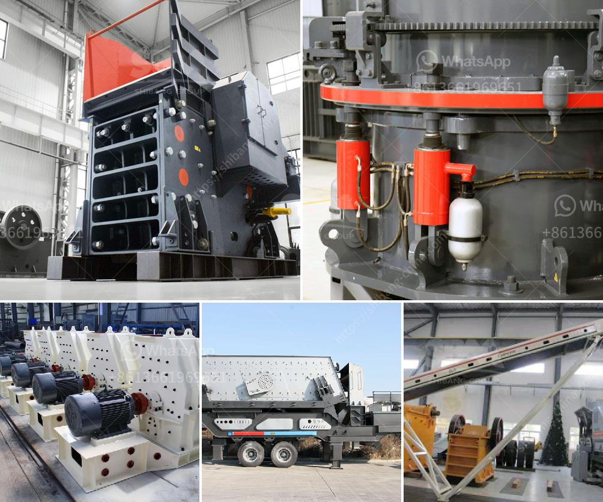

<h3>أجزاء آلة الطحن ووظائفها</h3>
تعد آلة الطحن أحد أهم الأدوات المستخدمة في صناعة التصنيع والتشغيل. فهي تستخدم لاستخلاص مواد معينة من الأجسام الكبيرة وتحويلها إلى جسيمات صغيرة ومنتظمة الحجم. تستخدم آلات الطحن في مختلف الصناعات مثل صناعة الأغذية والمشروبات، والمواد الكيميائية، وصناعة البلاستيك، وغيرها.

تتكون آلة الطحن من عدة أجزاء مهمة تعمل معًا لتحقيق الغرض المطلوب. ومن أهم هذه الأجزاء:

1- المحرك: يعد المحرك واحدًا من أهم الأجزاء في آلة الطحن، حيث يوفر القوة اللازمة لتشغيل الجهاز وحركة المغزل.

2- المغزل: يعد المغزل الجزء المسؤول عن حركة قطع العمل وتحريكها في الاتجاه الصحيح. يتم تضمين شفرات القطع أو الأدوات اللازمة في المغزل لتقوم بعملية الطحن.

3- سطح العمل: يتم وضع قطع العمل أو المواد المراد طحنها على سطح عمل الجهاز المعد لذلك. يجب أن يكون سطح العمل مستويًا ومتينًا للتعامل مع القوى العالية التي تنشأ أثناء عملية الطحن.

4- نظام التحكم: يتم تحكم آلة الطحن بواسطة نظام التحكم الذي يتحكم في حركة المحرك والمغزل والقطع في الاتجاه المطلوب وبسرعة محددة. يتم الاعتماد على أنظمة التحكم الرقمية في العديد من آلات الطحن الحديثة لضمان دقة العمل.

تعد وظيفة آلة الطحن تحويل المواد الكبيرة إلى جسيمات صغيرة ومنتظمة الحجم. يتم ذلك عن طريق حركة القطع في اتجاه معاكس وبسرعة محددة. يتم تغيير شكل القطع (مثل الشفرات أو الأدوات) وجدول العمل وفقًا للغرض المطلوب، سواء كان ذلك للحصول على أشكال محددة أو للحصول على حجم أصغر من المواد الأولية.

تستخدم آلات الطحن في العديد من التطبيقات. على سبيل المثال، يتم استخدامها في صناعات الأغذية والمشروبات لطحن الحبوب والبهارات. أما في صناعة البلاستيك، فتستخدم آلات الطحن لتفتيت البلاستيك المستعاد وتحويله إلى حبيبات قابلة لإعادة الاستخدام. وكذلك في صناعة الأدوية والمواد الكيميائية، حيث تستخدم لطحن المواد الكيميائية وخلطها ببعضها البعض.

إن وظيفة وأجزاء آلة الطحن تسهم في التحسين المستمر لعمليات التصنيع والتشغيل. فهي تساعد في تحويل المواد الخام إلى مواد نهائية مستخدمة في العديد من المنتجات التي نستخدمها يوميًا. وبفضل التطور التكنولوجي، أصبحت آلات الطحن أكثر دقة وفعالية من أي وقت مضى، مما يساهم في تحسين جودة المنتجات وتقليل الهدر والتكاليف الإنتاجية.
<h3>Contact us</h3><ul><li><strong>Whatsapp:&nbsp;<a href="https://wa.me/8613661969651">+8613661969651</a></strong></li><li><a href="https://swt.shibang-china.com/?git&amp;zhl&amp;أجزاء آلة الطحن ووظائفها"><strong>Online Service(chat now)</strong></a></li></ul><h3>Related</h3><ul><li><a href='معدات مطحنة الكرة.md'>معدات مطحنة الكرة</a></li><li><a href='عمليات سحق الركام.md'>عمليات سحق الركام</a></li><li><a href='سعر كسارة الفك.md'>سعر كسارة الفك</a></li><li><a href='مصنع معالجة الحجر الجيري المحمول.md'>مصنع معالجة الحجر الجيري المحمول</a></li><li><a href='وكيل كسارة الفحم في إندونيسيا.md'>وكيل كسارة الفحم في إندونيسيا</a></li></ul>