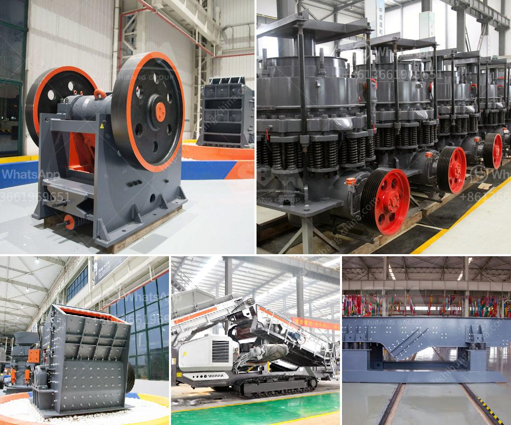

<h3>أحجام كسارة الفك الحجر الجيري</h3>
جميعنا نعلم أن الحجر الجيري يعتبر من المواد الهامة في صناعة البناء والإنشاء. ويتطلب استخدام كسارة الفك لكسر الحجر الجيري إلى قطع صغيرة بحجم مناسب للإستخدام في عملية البناء.

تعتبر كسارة الفك آلة تستخدم لسحق المواد الصلبة والصلبة الناعمة بمقاومة الضغط التي لا تتجاوز 320 ميجا باسكال. وتتكون الكسارة من إطار ثقيل يحمل فكين متحركين وثابتين بزاوية. ساحة العمل هي الفجوة بين الفك المتحرك والثابت، حيث يتم تطبيق القوة على المواد لسحقها.

تعد أحجام كسارة الفك المستخدمة لكسر الحجر الجيري تتراوح عادةً بين 200 و 400 ملم. ويعتمد حجم الكسارة المطلوبة على حجم الحجر الجيري والتطبيق النهائي للمنتج المكسور.

عندما يكون حجم الحجر الجيري أقل من 200 ملم، فإن كسارة الفك ستعمل بكفاءة في سحقها إلى قطع صغيرة ومناسبة للاستخدام المطلوب. وبالمثل، عندما يكون حجم الحجر الجيري أكبر من 400 ملم، قد تكون هناك حاجة إلى كسارة أكبر القدرة.

تعود الكفاءة في كسارة الفك إلى عوامل عديدة، بما في ذلك تصميم الكسارة، وقوة المحرك، وسرعة الفك المتحرك. وبطبيعة الحال، يمكن أن تتغير المواصفات والميزات المتاحة في كسارة الفك حسب الاحتياجات والمتطلبات المحددة لعملية التكسير.

باختصار، يمكن القول إن حجم كسارة الفك المستخدمة في سحق الحجر الجيري عادةً يتراوح بين 200 و 400 ملم. وتعتمد الحجم النهائي للكسارة المستخدمة على حجم الحجر الجيري والتطبيق النهائي المطلوب. وتعتبر الكفاءة في كسارة الفك من العوامل المهمة التي يجب اخذها في الاعتبار عند اختيار الكسارة المناسبة لعملية التكسير.
<h3>Contact us</h3><ul><li><strong>Whatsapp:&nbsp;<a href="https://wa.me/8613661969651">+8613661969651</a></strong></li><li><a href="https://swt.shibang-china.com/?git&amp;zhl&amp;أحجام كسارة الفك الحجر الجيري"><strong>Online Service(chat now)</strong></a></li></ul><h3>Related</h3><ul><li><a href='آلات صنع الألواح الجبسية من تركيا.md'>آلات صنع الألواح الجبسية من تركيا</a></li><li><a href='مطحنة الكرة في الصناعة.md'>مطحنة الكرة في الصناعة</a></li><li><a href='مصنع معالجة كروشر في ماليزيا.md'>مصنع معالجة كروشر في ماليزيا</a></li><li><a href='قائمة أسعار كسارات الفك.md'>قائمة أسعار كسارات الفك</a></li><li><a href='آلات مطاحن المطرقة في إندونيسيا.md'>آلات مطاحن المطرقة في إندونيسيا</a></li></ul>