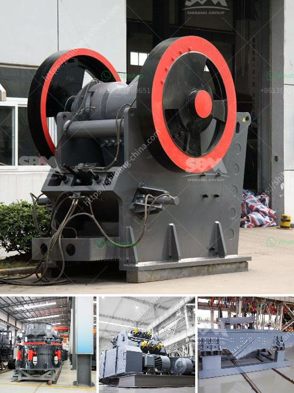

<h3>أحزمة ناقلة الشيفرون في الفلبين</h3>
تُعتبر الفلبين واحدة من أجمل الوجهات السياحية في جنوب شرق آسيا، حيث تتميز بطبيعتها الخلابة وشواطئها الرائعة. ومن أبرز المعالم السياحية التي تتمتع بها الفلبين، نجد أحزمة ناقلة الشيفرون، التي تعتبر واحدة من أهم الجذب السياحي في البلاد.

تعتبر أحزمة ناقلة الشيفرون منطقة ساحلية تقع في جزيرة تيرل، وتبلغ مساحتها حوالي 13,000 هكتار. تتميز بتضاريسها المذهلة وتشكيلها الفريد من نوعه، حيث تتكون من تلال رملية طولية وموازية للساحل، تشكل موقعًا مدهشًا للاستكشاف والاستمتاع بالثروة البيئية.

تعتبر رمال أحزمة ناقلة الشيفرون مختلفة عن أي شاطئ آخر في العالم، حيث تشكل حبيبات الرمل الصغيرة نمطًا معقدًا يشبه الشيفرون. وتتغير تشكيلة الألوان والتصاميم مع المصادفة وحركة الرياح والأمواج، مما يجعل المنظر مدهشًا وعملاقًا للعيان.

تضم أحزمة ناقلة الشيفرون أيضًا مجموعة متنوعة من الأنواع النباتية والحيوانية التي تعيش في المنطقة. وتعتبر هذه المحمية موطنًا لأنواع نادرة ومهددة بالانقراض، مما يعزز أهمية المحافظة على هذه البيئة الرقيقة وحمايتها من التهديدات البشرية.

تُعتبر نشاطات التنزه والرحلات البيئية والغوص من أبرز الأنشطة التي يمكن ممارستها في أحزمة ناقلة الشيفرون. يمكن للزوار استكشاف هذه المحمية المذهلة عبر المسارات المخصصة للمشاة، والتمتع بالمناظر الطبيعية الخلابة والحياة البرية الفريدة.

وعلاوة على ذلك، فإن السياح لديهم الفرصة للاستمتاع بمجموعة واسعة من الأنشطة المائية في المنطقة، مثل الغوص والغطس في الشعاب المرجانية الغنية بالألوان والكائنات البحرية المثيرة للإعجاب.

بشكل عام، يمكن القول إن أحزمة ناقلة الشيفرون في الفلبين تعتبر وجهة سياحية مميزة تقدم للزوار تجربة فريدة ولا تنسى. حيث تجمع بين جمال طبيعي خلاب وأنشطة مثيرة، مما يجعلها واحدة من أهم المعالم السياحية في البلاد وتستحق الزيارة والاستكشاف.
<h3>Contact us</h3><ul><li><strong>Whatsapp:&nbsp;<a href="https://wa.me/8613661969651">+8613661969651</a></strong></li><li><a href="https://swt.shibang-china.com/?git&amp;zhl&amp;أحزمة ناقلة الشيفرون في الفلبين"><strong>Online Service(chat now)</strong></a></li></ul><h3>Related</h3><ul><li><a href='مصانع VSI في الإمارات.md'>مصانع VSI في الإمارات</a></li><li><a href='رسم مطحنة رايموند.md'>رسم مطحنة رايموند</a></li><li><a href='آلة الكالسيوم كاربونات الحجر.md'>آلة الكالسيوم كاربونات الحجر</a></li><li><a href='سحق الخرسانة والحديد.md'>سحق الخرسانة والحديد</a></li><li><a href='كسارة فكية ثابتة للبيع.md'>كسارة فكية ثابتة للبيع</a></li></ul>