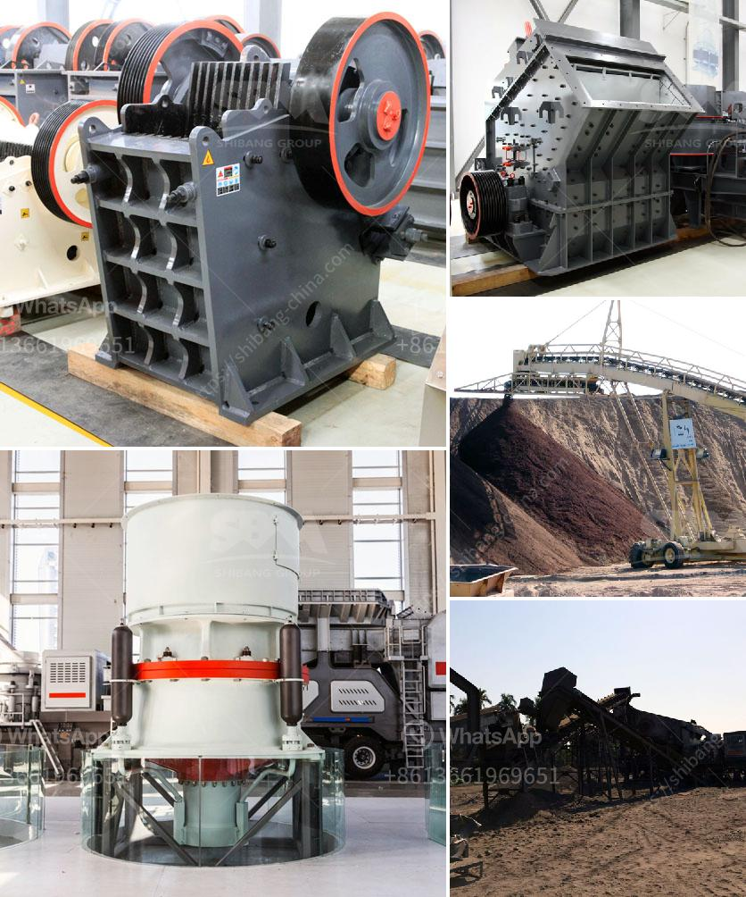

<h3>أرض الجرانيت الأسود للبيع في تاميل نادو</h3>
تاميل نادو هي واحدة من الولايات الهندية الجميلة والمثيرة للاهتمام. وتعد جبال تيروفالي، وهي سلسلة جبال رائعة تقع في تاميل نادو، من أهم المعالم الطبيعية في المنطقة. وتمتاز هذه الجبال بالجرانيت الأسود الفريد، الذي يجعلها وجهة مشهورة للمسافرين والمستثمرين على حد سواء.

يعتبر الجرانيت الأسود من المواد الطبيعية الفريدة والثمينة، حيث يعزز الديكور الداخلي والخارجي لأي مسكن أو مبنى. فإنه يتميز بلونه الغامق الجميل ونمطه المميز، بالإضافة إلى صلابته العالية ومقاومته للتأثيرات البيئية. ومن هنا، فإن الجرانيت الأسود من تاميل نادو يحظى بطلب كبير من المشترين من جميع أنحاء العالم.

تُعرف أراضي الجرانيت الأسود في تاميل نادو بجودتها العالية ومتانتها القوية. وبالتالي، يتم شراء هذه الأراضي من قبل الأفراد والشركات والمستثمرين الذين يرغبون في استغلال هذا المورد الطبيعي النادر لأغراض مختلفة، بدءًا من بناء المباني وصولاً إلى صناعة الأثاث. وبالإضافة لذلك، يمكن استخدام الجرانيت الأسود لتطبيقات أخرى مثل الأرضيات والجدران الداخلية والخارجية والسلالم ومستلزمات الحمام.

يعتبر سوق الجرانيت الأسود في تاميل نادو حيوياً ومزدهراً. وتوجد العديد من شركات المحاجر والموردين المحليين والدوليين الذين يقدمون الجرانيت الأسود ذو الجودة العالية. وبفضل الطلب المستمر على هذه المادة، لا تزال الأراضي المحاطة بسلسلة جبال تيروفالي هي وجهة رئيسية لعشاق الجمال الطبيعي والمهتمين بالاستثمار.

إن امتلاك قطعة أرض من الجرانيت الأسود في تاميل نادو يعتبر فرصة استثمارية مثالية لأنها ستزيد قيمتها مع مرور الوقت. حيث أن الجرانيت الأسود يعتبر من الموارد المحدودة والمطلوبة، وبالتالي فهو قادر على توفير عوائد مالية جيدة في المستقبل.

بالنظر إلى كل ما سبق، يمكن القول بأن أرض الجرانيت الأسود للبيع في تاميل نادو هي فرصة رائعة للمستثمرين والأفراد على حد سواء. فإن استغلال المواد الطبيعية الثمينة مثل الجرانيت الأسود ليس فقط يعزز التنمية الاقتصادية في المنطقة، ولكنه أيضًا يتيح الفرصة للسياح والمسافرين للتمتع بالجمال الطبيعي الفريد الذي يوفره هذا المكان الرائع.
<h3>Contact us</h3><ul><li><strong>Whatsapp:&nbsp;<a href="https://wa.me/8613661969651">+8613661969651</a></strong></li><li><a href="https://swt.shibang-china.com/?git&amp;zhl&amp;أرض الجرانيت الأسود للبيع في تاميل نادو"><strong>Online Service(chat now)</strong></a></li></ul><h3>Related</h3><ul><li><a href='إغلاق محطة الكسارة.md'>إغلاق محطة الكسارة</a></li><li><a href='كسارة متنقلة القطرة.md'>كسارة متنقلة القطرة</a></li><li><a href='آلات مستخدمة في مصنع الفحم المسحوق.md'>آلات مستخدمة في مصنع الفحم المسحوق</a></li><li><a href='تجار كسارات الحجر الكوارتز.md'>تجار كسارات الحجر الكوارتز</a></li><li><a href='السحق النبات هو.md'>السحق النبات هو</a></li></ul>