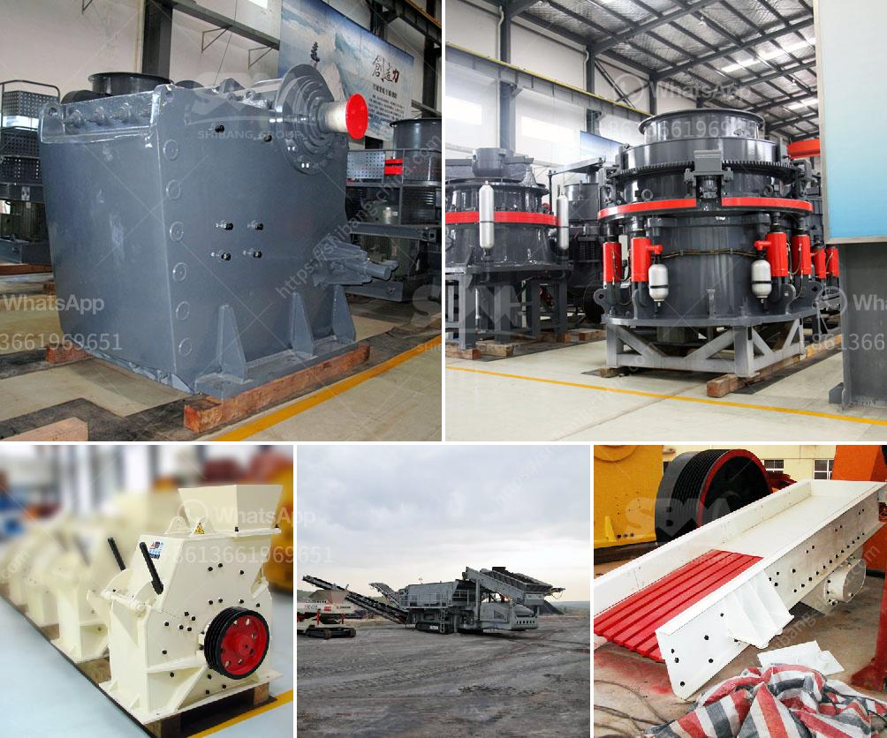

<h3>أرض متاحة لمحجر الحجر</h3>
تشكل صناعة الحجر من أهم الصناعات التي تلعب دورًا حاسمًا في البناء والتشييد. وتتطلب عملية استخراج الحجر وتصنيعه مواقع مناسبة تحتوي على صخور بجودة عالية وبكمية كافية لتلبية الاحتياجات المتزايدة. وفي هذا السياق، توجد أرض متاحة لمحجر الحجر تعتبر فرصة مثالية لاستغلالها في هذه الصناعة.

تتوافر في هذه الأرض العديد من الميزات التي تجعلها ملائمة لإقامة محجر الحجر. قد يكون أهم هذه الميزات هو وجود تكوين صخري ذي نوعية عالية، يتميز بمتانة وقوة تحمل عالية، مما يجعل الحجر الناتج منه مثاليًا للاستخدام في البناء والتشييد. كما أن كمية الحجر المتاحة في هذه الأرض وفيرة وتكفي لتغطية الطلب المحلي وتصدير الفائض إلى أسواق أخرى.

تعتبر هذه الأرض أيضًا موقعًا ملائمًا من الناحية الجغرافية، حيث تقع في منطقة مركزية وسهلة الوصول إليها. هذا يعني أنه يمكن نقل الحجر بسهولة إلى المواقع البنائية بتكلفة أقل، مما يسهم في تقديم المنتج بأسعار تنافسية. بالإضافة إلى ذلك، تتوفر البنى التحتية اللازمة في المنطقة، بما في ذلك الطرق وخدمات الكهرباء والمياه، مما يضمن سهولة تشغيل المحجر وزيادة الكفاءة والإنتاجية.

بالنظر إلى هذه الفرصة المتاحة، يمكن لإقامة محجر الحجر على هذه الأرض أن تسهم في تحقيق العديد من الفوائد الاقتصادية والاجتماعية. فعلى الصعيد الاقتصادي، ستقوم هذه الصناعة بتوفير فرص عمل للسكان المحليين، بالإضافة إلى زيادة العوائد المالية للمنطقة من خلال تصدير الحجر إلى الأسواق العالمية. كما ستعمل هذه الصناعة على تعزيز التنمية الاقتصادية في المنطقة، حيث ستشجع الاستثمارات وتطوير البنى التحتية الأخرى.

وبالنسبة للفوائد الاجتماعية، فإن إقامة محجر الحجر ستساهم في توفير مواد البناء ذات الجودة في المنطقة، مما يؤدي إلى تحسين الحياة العمرانية والبنية التحتية. ستقدم أيضًا المساهمات في المشاريع البيئية، مثل صنع الطوب البنائي الصديق للبيئة والاستفادة الأمثل من الموارد المحلية.

في الختام، يُمكن القول إن هذه الأرض المتاحة لمحجر الحجر تتمتع بميزات استثنائية تجعلها خيارًا ممتازًا للاستثمار في هذه الصناعة الحيوية. وبالنظر إلى الفرص الاقتصادية والاجتماعية التي ستوفرها هذه الأرض، يجب على المستثمرين والأطراف ذات العلاقة اتخاذ كافة الإجراءات اللازمة للاستفادة من هذا الإمكان الفريد وتطوير هذا المحجر بأفضل الطرق الممكنة.
<h3>Contact us</h3><ul><li><strong>Whatsapp:&nbsp;<a href="https://wa.me/8613661969651">+8613661969651</a></strong></li><li><a href="https://swt.shibang-china.com/?git&amp;zhl&amp;أرض متاحة لمحجر الحجر"><strong>Online Service(chat now)</strong></a></li></ul><h3>Related</h3><ul><li><a href='آلات تعدين الذهب مستعملة.md'>آلات تعدين الذهب مستعملة</a></li><li><a href='آلة طحن لكربونات الكالسيوم من ألمانيا.md'>آلة طحن لكربونات الكالسيوم من ألمانيا</a></li><li><a href='مصانع مطاحن الأسمنت.md'>مصانع مطاحن الأسمنت</a></li><li><a href='سعات مطحنة الأسطوانة العمودية.md'>سعات مطحنة الأسطوانة العمودية</a></li><li><a href='شركة تصنيع آلات كسارة الرخام.md'>شركة تصنيع آلات كسارة الرخام</a></li></ul>