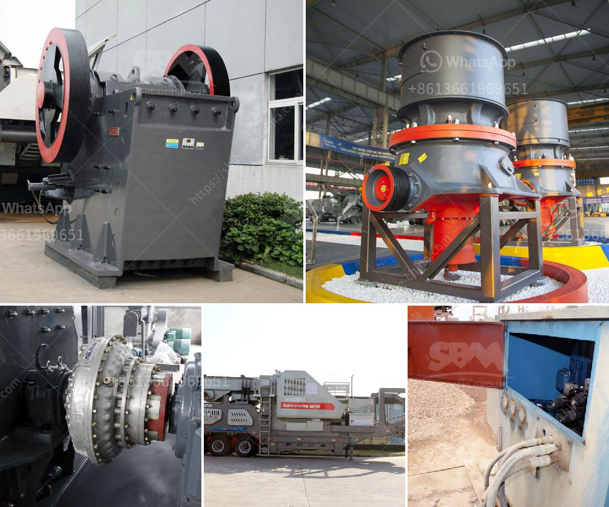

<h3>أرغب في شراء آلة كسارة البلاستيك</h3>
إذا كنت تفكر في شراء آلة كسارة البلاستيك، فأنت تتجه في الاتجاه الصحيح. تعتبر كسارات البلاستيك من أهم الأدوات لإعادة تدوير البلاستيك واستخدامه مرة أخرى في عدة صناعات. في هذه المقالة، سنناقش بعض النقاط التي يجب مراعاتها قبل اتخاذ قرار الشراء.

قبل القفز في شراء آلة كسارة البلاستيك، يجب أن تعرف الغرض من شراءها واحتياجاتك. هل تخطط لتدوير البلاستيك في منزلك أو احتياجك يفوق ذلك؟ يعتمد حجم الآلة والطاقة المطلوبة على كمية البلاستيك التي ترغب في معالجتها، لذلك يجب أن تكون واضحًا في الهدف الذي تسعى لتحقيقه.

ثانيًا، يجب أن تقارن بين أنواع مختلفة من كسارات البلاستيك المتاحة في السوق. هل تفضل الآلات اليدوية أم الآلات الكهربائية؟ الآلات اليدوية عادة تكون أرخص في التكلفة وتحتاج إلى جهد يدوي لتشغيلها، في حين أن الآلات الكهربائية تعمل بالطاقة الكهربائية وتكون أكثر سهولة في الاستخدام. قم بقراءة تقييمات المستخدمين والاستعراضات عبر الإنترنت لمعرفة الفروق بين الأنواع المختلفة.

ثالثًا، يجب عليك أن تنظر في متطلبات الصيانة والغيار. تحتاج الآلات الكهربائية إلى صيانة دورية وقد تحتاج إلى تغيير بعض الأجزاء بمرور الوقت. تأكد من أن قطع الغيار متوفرة في السوق وكذلك خدمات الصيانة قبل الشراء.

رابعًا، تأكد من أن الآلة تفي بالمعايير والتصاريح البيئية والصحية اللازمة. يجب أن تكون الآلة مصممة لتعمل بكفاءة وتقلل من الانبعاثات الضارة بالبيئة.

وأخيرًا، قم بمقارنة الأسعار وطرق الدفع المختلفة المتاحة. ابحث عن الشركات الموثوقة واطلب عروض أسعار من عدة مصادر لتضمن أنك تحصل على أفضل قيمة مقابل ما تدفعه. تذكر أن الأسعار قد تختلف حسب حجم الآلة والعلامة التجارية.

باختصار، معرفة احتياجاتك ومقارنة أنواع الآلات والاطلاع على تقييمات المستخدمين والاستعراضات والتأكد من التزامها بالمعايير البيئية والصحية ومقارنة الأسعار سيكون لديك أفضل فرصة لشراء آلة كسارة بلاستيك تناسب احتياجاتك. استثمارك في آلة كسارة البلاستيك سيكون خطوة رائعة نحو حماية البيئة والمساهمة في دورك في إعادة تدوير البلاستيك وتحسين الاستدامة.
<h3>Contact us</h3><ul><li><strong>Whatsapp:&nbsp;<a href="https://wa.me/8613661969651">+8613661969651</a></strong></li><li><a href="https://swt.shibang-china.com/?git&amp;zhl&amp;أرغب في شراء آلة كسارة البلاستيك"><strong>Online Service(chat now)</strong></a></li></ul><h3>Related</h3><ul><li><a href='شركة تصنيع آلات كسارة الفك.md'>شركة تصنيع آلات كسارة الفك</a></li><li><a href='تكلفة سيور النقل.md'>تكلفة سيور النقل</a></li><li><a href='كسارات في المملكة العربية السعودية.md'>كسارات في المملكة العربية السعودية</a></li><li><a href='كسارة للبيع في نيبال.md'>كسارة للبيع في نيبال</a></li><li><a href='مصنع تكسير محمول للبيع في جنوب أفريقيا.md'>مصنع تكسير محمول للبيع في جنوب أفريقيا</a></li></ul>