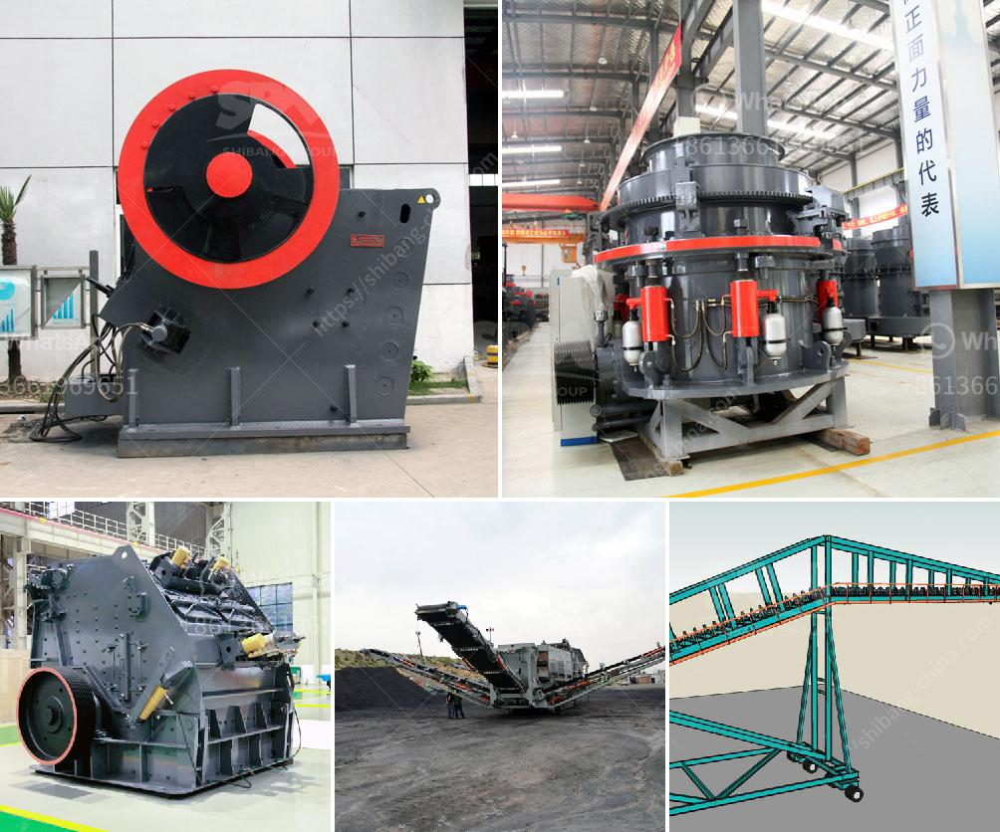

<h3>أريد شراء آلة كسارة في باكستان</h3>
تعد آلة الكسارة من الأدوات الأساسية التي يحتاجها العديد من الأشخاص في مختلف الصناعات والقطاعات، سواء كانوا يعملون في مجال البناء أو التعدين أو النفط والغاز، إلخ. وفي باكستان، تعد شراء آلة كسارة قرارًا استثماريًا هامًا للعديد من الشركات والأفراد.

تتوفر العديد من الأنواع المختلفة من آلات الكسارة في باكستان، وتشمل آلات الكسارة الفكية والتصادمية والمخروطية. تعتمد الاختيار على نوع الصخور أو المواد التي ستتم معالجتها وحجمها ونوع الإنتاج المطلوب.

أحد الأشياء الرئيسية التي يجب مراعاتها عند شراء آلة كسارة هي الجودة. يجب أن تكون الآلة مصنوعة من مواد عالية الجودة وأن تتمتع بمتانة عالية لتتحمل الاستخدام المكثف وتقليل التكاليف الصيانة. يجب أيضًا أن تكون الآلة ذات قدرة عالية على الإنتاج لتلبية احتياجات العمل.

وبالإضافة إلى ذلك، يجب أن يتم اختيار آلة الكسارة الصحيحة وفقًا للبيئة العملية. يجب أن تكون الآلة قادرة على تحمل الظروف الجوية والبيئية في باكستان، مثل الحرارة العالية والرطوبة المرتفعة.

بعد تحديد المتطلبات واختيار الآلة المناسبة، يجب أن يتم التواصل مع الشركات المصنعة أو الموردين الموثوق بهم في باكستان لشراء الآلة. يجب أن يتم دراسة عروض الأسعار ومقارنة الخيارات المتاحة قبل اتخاذ القرار النهائي. يمكن الاستفادة من الخبرة والمعرفة السابقة للعملاء الآخرين في قطاع الصناعة للحصول على توصيات ومشورة.

بالاعتماد على الميزانية المتاحة، يمكن شراء آلة كسارة بأسعار متفاوتة. يتأثر السعر بالعديد من العوامل مثل الحجم والموديل والخصائص التقنية والعلامة التجارية. يجب أن يتم تحديد الميزانية المخصصة بعناية للحصول على أفضل جودة ممكنة دون تجاوز الحد المحدد.

في الختام، شراء آلة كسارة في باكستان هو استثمار مهم يتطلب البحث والدراسة المسبقة. يتعين اختيار الآلة المناسبة وفقًا للمتطلبات والبيئة العملية والميزانية. يجب أن يتم التواصل مع المصنعين أو الموردين الموثوق بهم للحصول على أفضل صفقة ممكنة. من الضروري أن تكون الآلة عالية الجودة وذات كفاءة عالية لتلبية احتياجات العمل وتحقيق النجاح في الصناعة.
<h3>Contact us</h3><ul><li><strong>Whatsapp:&nbsp;<a href="https://wa.me/8613661969651">+8613661969651</a></strong></li><li><a href="https://swt.shibang-china.com/?git&amp;zhl&amp;أريد شراء آلة كسارة في باكستان"><strong>Online Service(chat now)</strong></a></li></ul><h3>Related</h3><ul><li><a href='صور مطحنة الكرات Ceramics.md'>صور مطحنة الكرات Ceramics</a></li><li><a href='مصانع طحن الأحجار في تايلاند.md'>مصانع طحن الأحجار في تايلاند</a></li><li><a href='آلات تكسير وفرز.md'>آلات تكسير وفرز</a></li><li><a href='عملية كولمان للطحن.md'>عملية كولمان للطحن</a></li><li><a href='كسارة الحجر للبيع الفلبين.md'>كسارة الحجر للبيع الفلبين</a></li></ul>