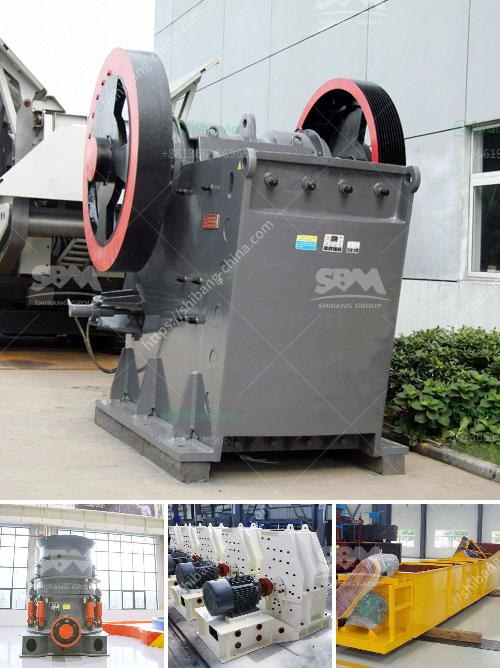

<h3>أريد شراء كسارة البوزولان</h3>
تعتبر كسارة البوزولان عبارة عن آلة تستخدم في معالجة البوزولان، وهو نوع من الفحم الحجري المشتعل المستخدم في صناعة مواد البناء من خلال إضافته إلى الخرسانة. يُعتبر البوزولان مساهماً هاماً في تعزيز خواص الخرسانة مثل المتانة والمقاومة الكيميائية والحرارية.

عندما يكون لديك مشروع في صناعة البناء وترغب في استخدام البوزولان في خلطات الخرسانة الخاصة بك، يصبح الحصول على كسارة البوزولان ضرورياً لتحقيق أقصى قدر من الكفاءة والجودة. يمكنك العثور على مجموعة واسعة من أنواع كسارات البوزولان في السوق، ولكن من الأفضل أن تحدد تحديدًا احتياجاتك ومتطلبات مشروعك قبل الشراء.

أهم ما يجب مراعاته عند اختيار كسارة البوزولان هو الكفاءة والقدرة التي يمكن للآلة توفيرها. ينبغي أن تكون الكسارة قادرة على معالجة كميات كبيرة من البوزولان في وقت قصير، مما يحسن كفاءة الإنتاج ويقلل من تكاليف العمالة. بالإضافة إلى ذلك، يجب أن تكون الكسارة قوية ومتينة، بحيث تستطيع تحمل التشغيل الطويل والثقيل دون تلف، مما يعني عدم الحاجة إلى تكاليف الصيانة المتكررة.

علاوة على ذلك، يجب أن تنتج الكسارة حجمًا متناسبًا من البوزولان المفروم وفقًا لمتطلبات المشروع. فبعض الكسارات تنتج حبيبات صغيرة جداً يمكن استخدامها في مشاريع صغيرة، بينما توفر أنواع أخرى حبيبات أكبر لمشاريع أكبر. إذا كنت تعمل في صناعة البناء التجارية، قد تفضل الاستثمار في كسارة قادرة على إنتاج مجموعات متنوعة من البوزولان لتلبية احتياجاتك المتنوعة.

للحصول على أفضل قيمة مقابل المال، ينبغي البحث عن الشركات المشهورة والموثوقة في صناعة كسارات البوزولان. استفسر عن تقييمات العملاء السابقين واستخرج أدلة على جودة المنتجات وما إذا كانت الشركة تقدم دعمًا فنيًا قويًا بعد البيع.

في النهاية، يجب أن تناسب الكسارة التي ترغب في شرائها متطلبات مشروعك، من حيث الكفاءة، القدرة، وجودة الإنتاج. قم بعمل مقارنة شاملة بين العروض المتاحة في السوق، ولا تتردد في استشارة الخبراء قبل اتخاذ قرار الشراء النهائي.
<h3>Contact us</h3><ul><li><strong>Whatsapp:&nbsp;<a href="https://wa.me/8613661969651">+8613661969651</a></strong></li><li><a href="https://swt.shibang-china.com/?git&amp;zhl&amp;أريد شراء كسارة البوزولان"><strong>Online Service(chat now)</strong></a></li></ul><h3>Related</h3><ul><li><a href='آلة كسارة صغيرة للبيع في زيمبابوي.md'>آلة كسارة صغيرة للبيع في زيمبابوي</a></li><li><a href='مصنع معالجة الباريت.md'>مصنع معالجة الباريت</a></li><li><a href='كيفية تصحيح كسارة مخروطية.md'>كيفية تصحيح كسارة مخروطية</a></li><li><a href='حساب قطر كرة الطحن لمطحنة الكرة.md'>حساب قطر كرة الطحن لمطحنة الكرة</a></li><li><a href='كسارة الحصى للبيع في كينيا.md'>كسارة الحصى للبيع في كينيا</a></li></ul>