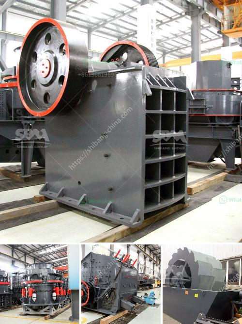

<h3>أسطوانات لكسارات في بوغوتا</h3>
تقع بوغوتا، عاصمة كولومبيا، في قلب أمريكا الجنوبية، حيث تعد من أكبر المدن في المنطقة. توجد العديد من الصناعات في بوغوتا، ومن بينها صناعة البناء والتشييد التي تشهد نموًا مستدامًا في الآونة الأخيرة. ومن أهم الأجزاء التي تلعب دورًا حاسمًا في صناعة البناء هي أسطوانات الكسارات.

تعد أسطوانات الكسارات آلات هامة في عملية التكسير والفصل في صناعة البناء. فهي تستخدم لسحق المواد الخام الكبيرة وتحويلها إلى حجمٍ صغيرٍ يمكن استخدامه في مجموعة متنوعة من التطبيقات. تتمتع أسطوانات الكسارات بقوة ضغط عالية، وتعمل عن طريق تطبيق قوة ميكانيكية على المادة المراد سحقها.

واحدة من أهم الشركات المتخصصة في صناعة أسطوانات الكسارات في بوغوتا هي شركة "بوغوتا للمعدات الثقيلة". تقدم الشركة مجموعة واسعة من أسطوانات الكسارات التي تلبي متطلبات العملاء المحليين والعالميين. تعتمد أسطوانات الكسارات المصنوعة في بوغوتا على أحدث التقنيات والابتكارات في المجال، مما يجعلها قادرة على تحقيق أعلى مستوى من الأداء والكفاءة.

إن استخدام أسطوانات الكسارات يوفر العديد من الفوائد للمقاولين وشركات البناء. فبفضل قدرتها على سحق المواد الخام بسرعة وفعالية، يتمكن المستخدمون من توفير الكثير من الوقت والموارد. كما ان استخدام أسطوانات الكسارات يسهل عملية التخلص من النفايات وإعادة التدوير، مما يساعد في حماية البيئة.

يمكن استخدام أسطوانات الكسارات في العديد من التطبيقات في صناعة البناء. فهي تستخدم على نطاق واسع في سحق الصخور والحجارة، وتكسير الأسفلت والخرسانة، واستخراج المعادن، وكذلك في تصنيع الركام الصناعي. مع تزايد الطلب على البنية التحتية والتطوير العمراني في بوغوتا، يزداد الاعتماد على أسطوانات الكسارات لتلبية احتياجات السوق.

في النهاية، تعد أسطوانات الكسارات للبناء في بوغوتا أدوات حيوية للصناعة، حيث تساعد في توفير الكثير من الجهود والموارد. بفضل تطور التكنولوجيا والابتكار في هذا المجال، يمكن تحقيق أفضل أداء وكفاءة بأسعار معقولة. إن الاستثمار في أسطوانات الكسارات هو استثمار ذكي لكل مقاول وشركة بناء تسعى للنجاح والتميز في صناعة البناء في بوغوتا.
<h3>Contact us</h3><ul><li><strong>Whatsapp:&nbsp;<a href="https://wa.me/8613661969651">+8613661969651</a></strong></li><li><a href="https://swt.shibang-china.com/?git&amp;zhl&amp;أسطوانات لكسارات في بوغوتا"><strong>Online Service(chat now)</strong></a></li></ul><h3>Related</h3><ul><li><a href='آلة كسارة الحجر 250 400.md'>آلة كسارة الحجر 250 400</a></li><li><a href='تكنولوجيا معالجة خام الباريت.md'>تكنولوجيا معالجة خام الباريت</a></li><li><a href='غسالة مواد خام جرايستون مستعملة.md'>غسالة مواد خام جرايستون مستعملة</a></li><li><a href='تعدين البازلت.md'>تعدين البازلت</a></li><li><a href='آلة المحجر للبيع.md'>آلة المحجر للبيع</a></li></ul>