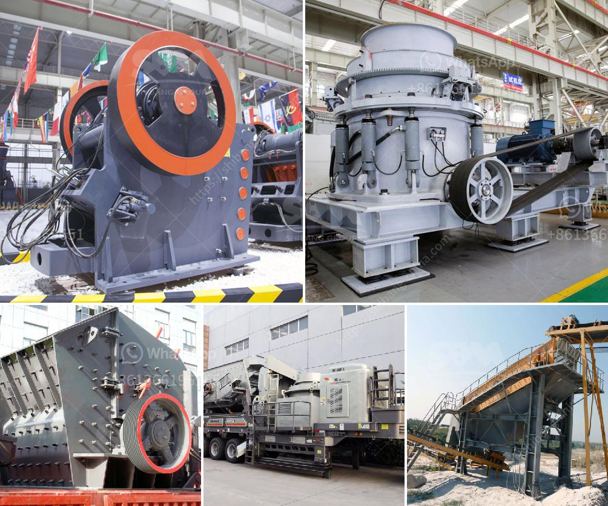

<h3>أسعار آلات المحجر</h3>
تعتبر آلات المحجر أحد العوامل الرئيسية في صناعة التعدين والبناء، حيث تستخدم في عمليات استخراج وتجهيز المواد الخام. وتشمل هذه الآلات الحفارات الثقيلة والكسارات وآلات الفرز والشاحنات المتنقلة وغيرها. وتتفاوت أسعار هذه الآلات بناءً على النوع والحجم والماركة والعمر وحالة الآلة.

تقوم شركات تصنيع الآلات في عادة بتقديم قائمة بأسعار منتجاتها، ويمكن للعملاء اختيار ما يتناسب مع احتياجاتهم وميزانياتهم. فمثلاً، قد تبدأ أسعار الحفارات الثقيلة في حدود 200 ألف دولار وتصل إلى ملايين الدولارات للحفارات الأكبر حجمًا والأكثر تقدمًا تقنيًا. وأما الكسارات الصغيرة فلا تكون بسعر أعلى من 400 ألف دولار. وتعتمد أسعار الآلات المستعملة على الحالة والعمر، حيث يُقدر سعر بعض الآلات المستعملة بنحو النصف من سعرها الأصلي.

يجب أن يأخذ المشترون في الاعتبار عدة عوامل أثناء اختيار وشراء آلات المحجر. من بين هذه العوامل السعر ومتطلبات المشروع وكفاءة وأداء الآلة وصيانتها وقطع الغيار وتوفر الخدمات الفنية. علاوة على ذلك، يجب أيضًا التأكد من تطابق المواصفات والمعايير المحلية والعالمية المطلوبة في المشروع.

نظرًا لتعدد الماركات والموديلات المتاحة في سوق آلات المحجر، فإنه من الأفضل للمشترين أن يقوموا بإجراء بحث وتقييم متأني قبل شراء أي آلة، والحصول على مشورة من الخبراء وتوجيهات الشركات المصنعة. يجب أن يتم اختيار الآلات التي تلبي متطلبات المشروع وتوفر الأداء والجودة المطلوبة، كما يجب أن تتناسب مع الميزانية المخصصة للمشروع.

باختصار، يتراوح سعر آلات المحجر ما بين 200 و400 ألف دولار، وتتفاوت الأسعار بناءً على النوع والحجم والعلامة التجارية والعمر وحالة الآلة. يجب على المشترين إجراء بحث وتقييم دقيق قبل شراء أي آلة للتأكد من اختيار الآلة المناسبة ذات الأداء المطلوب والتي تتناسب مع الميزانية المحددة.
<h3>Contact us</h3><ul><li><strong>Whatsapp:&nbsp;<a href="https://wa.me/8613661969651">+8613661969651</a></strong></li><li><a href="https://swt.shibang-china.com/?git&amp;zhl&amp;أسعار آلات المحجر"><strong>Online Service(chat now)</strong></a></li></ul><h3>Related</h3><ul><li><a href='آلة طحن الرخام.md'>آلة طحن الرخام</a></li><li><a href='شاشات وكسارات الركام.md'>شاشات وكسارات الركام</a></li><li><a href='محجر مستعمل بشكل معقول في نيجيريا.md'>محجر مستعمل بشكل معقول في نيجيريا</a></li><li><a href='تبيع شاشات الاهتزاز للحصى والرمل.md'>تبيع شاشات الاهتزاز للحصى والرمل</a></li><li><a href='آلات الأسطوانة للطحن.md'>آلات الأسطوانة للطحن</a></li></ul>