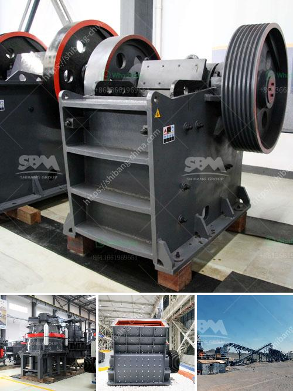

<h3>أسعار آلات تكسير الحجر في زيمبابوي</h3>
تعد زيمبابوي واحدة من الدول الأفريقية الرائدة في مجال التعدين، وتتميز بموارد طبيعية غنية تشمل الذهب والنحاس والبوكسيت والفحم والحجر الجيري. وبالتالي، فإن اقتصاد البلاد يعتمد بشكل كبير على صناعة التعدين وتكرير المعادن.

إن آلات تكسير الحجر تلعب دورًا حاسمًا في صناعة التعدين والبناء، حيث تستخدم لتحطيم الصخور الكبيرة إلى قطع صغيرة قابلة للاستخدام في مختلف التطبيقات. من بين هذه الآلات، تعتبر كسارات الحجر من الأكثر استخدامًا وانتشارًا في زيمبابوي وغيرها من البلدان.

تختلف أسعار آلات تكسير الحجر في زيمبابوي بناءً على عوامل متعددة، بما في ذلك الحجم والسعة والمواصفات المطلوبة. يمتلك البائعون والمصنعون العديد من الطرز والأحجام المختلفة من الكسارات، والتي يتم تصنيعها باستخدام تكنولوجيا متقدمة وعالية الجودة.

فيما يلي متوسط ​​الأسعار المتوقعة لآلات تكسير الحجر في زيمبابوي:

- آلات تكسير الحجر المتوسطة الحجم التي تستخدم في المشاريع الصغيرة قد يتراوح سعرها ما بين 5,000 دولار و 10,000 دولار.

- آلات تكسير الحجر كبيرة الحجم وذات السعة العالية، التي تستخدم في المشاريع الكبيرة مثل تكسير الصخور الصلبة، يمكن أن يتراوح سعرها ما بين 20,000 دولار و 50,000 دولار.

يجب أن يتم اختيار آلات تكسير الحجر وفقًا لاحتياجات المشروع وميزانية المشتري. من الجدير بالذكر أن الأسعار المذكورة ليست نهائية ويمكن أن تتغير بناءً على العروض والأوضاع الاقتصادية.

بصفة عامة، فإن تكنولوجيا تكسير الحجر في زيمبابوي تتطور باستمرار لتلبية احتياجات الصناعة. ومع ذلك، فإنه ينبغي على الزبائن أن ينظروا إلى حصولهم على آلات عالية الجودة وذات كفاءة عالية، لضمان تحقيق التكلفة والأداء المثلى في عمليات التكسير.

بشكل عام، إذا كنت تنوي شراء آلة تكسير الحجر في زيمبابوي، فإن من المستحسن مراجعة البائعين والمصنعين المحليين والتشاور معهم للحصول على معلومات مفصلة حول المواصفات والأسعار المحددة للآلات.

باستخدام آلات تكسير الحجر عالية الجودة والأداء، يمكن لصناعة التعدين في زيمبابوي أن تستمر في النمو والتطور وتساهم في تعزيز اقتصاد البلاد وتوفير فرص العمل للسكان المحليين.
<h3>Contact us</h3><ul><li><strong>Whatsapp:&nbsp;<a href="https://wa.me/8613661969651">+8613661969651</a></strong></li><li><a href="https://swt.shibang-china.com/?git&amp;zhl&amp;أسعار آلات تكسير الحجر في زيمبابوي"><strong>Online Service(chat now)</strong></a></li></ul><h3>Related</h3><ul><li><a href='مصنع تكسير الدولوميت في بهاروتش.md'>مصنع تكسير الدولوميت في بهاروتش</a></li><li><a href='أفضل آلة سحق الكوارتز في الهند.md'>أفضل آلة سحق الكوارتز في الهند</a></li><li><a href='كسارة صخور صغيرة.md'>كسارة صخور صغيرة</a></li><li><a href='وحدة إنتاج مطحنة الرمل في كيرالا.md'>وحدة إنتاج مطحنة الرمل في كيرالا</a></li><li><a href='كسارة النحاس للبيع في ماليزيا.md'>كسارة النحاس للبيع في ماليزيا</a></li></ul>