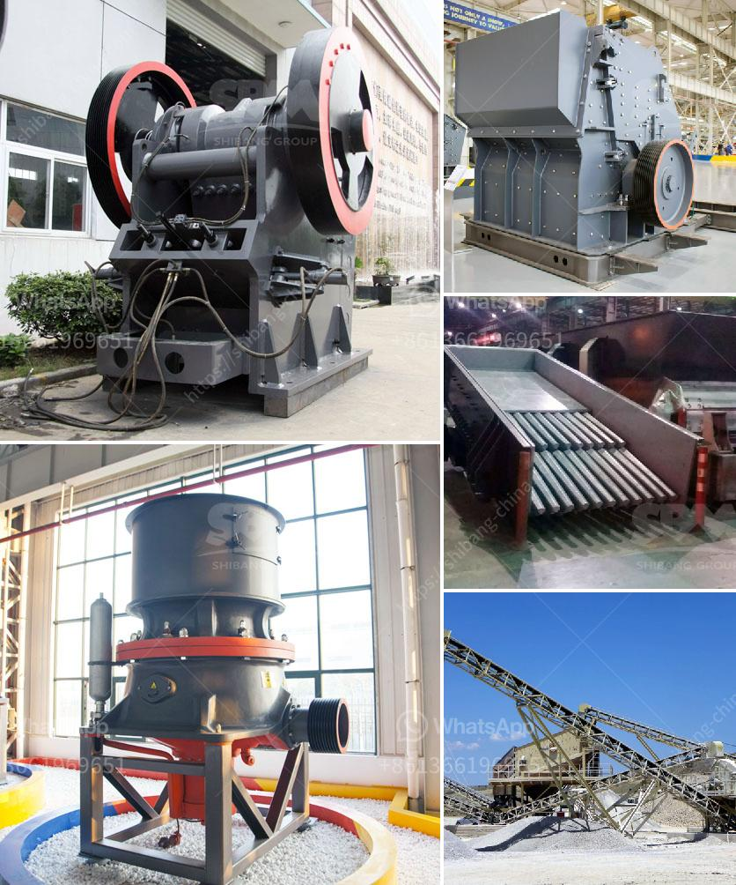

<h3>أسعار آلات كسارة الأسمنت في الهند</h3>
تعد الهند من أهم الدول في صناعة الأسمنت في العالم. وتزدهر صناعة البناء والتشييد في الهند، مما يزيد من الطلب على الأسمنت وبالتالي على آلات كسارة الأسمنت.

تتعدد أنواع آلات كسارة الأسمنت المتوفرة في السوق الهندية، وتتراوح أسعارها بين 200 و 400 دولار. تختلف الأسعار حسب النوع والحجم والمواصفات التقنية للآلة.

تعتبر آلات كسارة الأسمنت ذات أسعار معقولة، خاصةً مقارنةً بالأسعار العالية التي تستدعيها آلات البناء الأخرى. وذلك لأن صناعة الأسمنت تعتبر صناعة حيوية في الهند وتتطلب إمدادات مستمرة من الآلات.

وبغض النظر عن الأسعار المنخفضة، فإن آلات كسارة الأسمنت في الهند مصنوعة من مواد عالية الجودة وتحترم المعايير الصناعية العالمية. وتتمتع هذه الآلات بسهولة الاستخدام والصيانة، مما يسهل على العمال في قطاع البناء تشغيلها واستخدامها بكفاءة.

تعمل آلات كسارة الأسمنت على تحطيم وطحن الصخور الكبيرة إلى حجم صغير، وذلك بواسطة محرك كهربائي قوي يعمل بالتيار المتردد. ويتم استخدامها في إنتاج الأسمنت الخام والأسمنت المطحون.

وتُعتبر أسعار آلات كسارة الأسمنت في السوق الهندية مواتية وتنافسية. ويمكن العثور على مجموعة واسعة من الموردين الموثوق بهم والمصنعين المحليين والعالميين الذين يقدمون مجموعة متنوعة من الخيارات والماركات.

بخلاصة، يمكن القول أن آلات كسارة الأسمنت في الهند تتميز بأسعارها المعقولة وجودتها العالية. ويمكن للعملاء من جميع أنحاء العالم الحصول على هذه الآلات بسهولة وبأسعار تنافسية، من خلال الاستعانة بالموردين الموثوق بهم في الهند.
<h3>Contact us</h3><ul><li><strong>Whatsapp:&nbsp;<a href="https://wa.me/8613661969651">+8613661969651</a></strong></li><li><a href="https://swt.shibang-china.com/?git&amp;zhl&amp;أسعار آلات كسارة الأسمنت في الهند"><strong>Online Service(chat now)</strong></a></li></ul><h3>Related</h3><ul><li><a href='كسارة الحجر المحمولة اللوحة المزدوجة.md'>كسارة الحجر المحمولة اللوحة المزدوجة</a></li><li><a href='تكنولوجيا معالجة خام الباريت.md'>تكنولوجيا معالجة خام الباريت</a></li><li><a href='مصنع كامل لكسارة الحجر الجرانيت.md'>مصنع كامل لكسارة الحجر الجرانيت</a></li><li><a href='تكلفة مشروع وحدة طحن الكلنكر.md'>تكلفة مشروع وحدة طحن الكلنكر</a></li><li><a href='تكلفة مشروع طحن التلك.md'>تكلفة مشروع طحن التلك</a></li></ul>