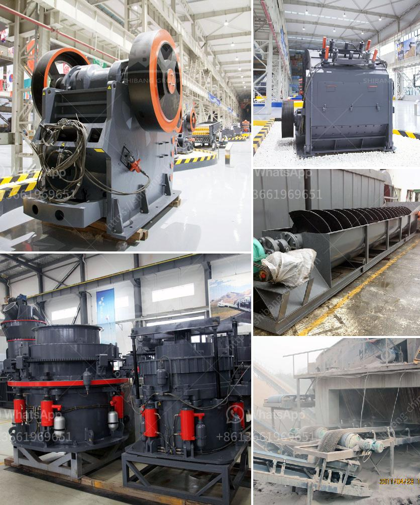

<h3>أسعار آلة كسارة الحجر</h3>
تعتبر آلة كسارة الحجر من المعدات الهامة والضرورية في صناعة البناء والتشييد. تستخدم هذه الآلات لكسر وطحن الأحجار الكبيرة إلى قطع صغيرة قابلة للاستخدام في البناء والأعمال الإنشائية. تتوفر آلة كسارة الحجر في العديد من الأحجام والموديلات ويختلف سعرها اعتمادًا على الحجم والاستخدام المطلوب.

في السوق، يمكن العثور على آلة كسارة الحجر بأسعار تتراوح بين 200 و400 دولارًا. يجب ملاحظة أن هذه الأسعار هي متوسطة وقد تختلف بناءً على عوامل إضافية مثل العلامة التجارية والجودة والقوة الإنتاجية والاحتياجات الخاصة للمشروع.

إذا كنت تبحث عن كسارة حجر صغيرة الحجم للاستخدام المنزلي أو المشاريع الصغيرة، فإن الأسعار عادة ما تكون في النطاق الأدنى من هذه المجموعة. قد تجد بعض الكسارات التي تعمل باليد بأسعار أقل، ولكن من المهم ملاحظة أنها قد تكون غير فعالة كفاية لتلبية احتياجات المشروع.

من جانب آخر، إذا كنت بحاجة إلى كسارة حجر كبيرة الحجم للاستخدام الصناعي أو في مشاريع البناء الكبيرة، فمن الممكن أن تجد الأسعار تصل إلى الحد العلوي من النطاق المذكور. قد يكون للآلة مواصفات مختلفة مثل السرعة والموثوقية وسعة الإنتاج التي تؤثر في السعر.

عند اختيار آلة كسارة الحجر، يجب أن تقوم بالبحث والنظر في العديد من العوامل. على سبيل المثال، يجب التحقق من سمعة الشركة المصنعة ومدى جودة منتجها وامتلاكها للشهادات اللازمة. يجب أيضًا مراجعة المواصفات الفنية للآلة للتأكد من أنها تلبي احتياجات المشروع الخاص بك.

من الواضح أن أسعار آلة كسارة الحجر تختلف وفقًا للعديد من العوامل المختلفة. يجب عليك أن تقوم بدراسة احتياجاتك واعتبارات المشروع قبل اتخاذ أي قرار. قد تجد أنه من الأفضل دفع أكثر لشراء آلة ذات جودة عالية وموثوقة لتلبية احتياجاتك بشكل أفضل ولفترة أطول.
<h3>Contact us</h3><ul><li><strong>Whatsapp:&nbsp;<a href="https://wa.me/8613661969651">+8613661969651</a></strong></li><li><a href="https://swt.shibang-china.com/?git&amp;zhl&amp;أسعار آلة كسارة الحجر"><strong>Online Service(chat now)</strong></a></li></ul><h3>Related</h3><ul><li><a href='كسارات الحجر في بيلين.md'>كسارات الحجر في بيلين</a></li><li><a href='مصنع غسيل الفحم المتنقل في جنوب أفريقيا.md'>مصنع غسيل الفحم المتنقل في جنوب أفريقيا</a></li><li><a href='آلة طحن وخلط الكوارتز.md'>آلة طحن وخلط الكوارتز</a></li><li><a href='آلة كسارة الحجر التركية.md'>آلة كسارة الحجر التركية</a></li><li><a href='قائمة معدات وآلات التعدين عن الذهب.md'>قائمة معدات وآلات التعدين عن الذهب</a></li></ul>