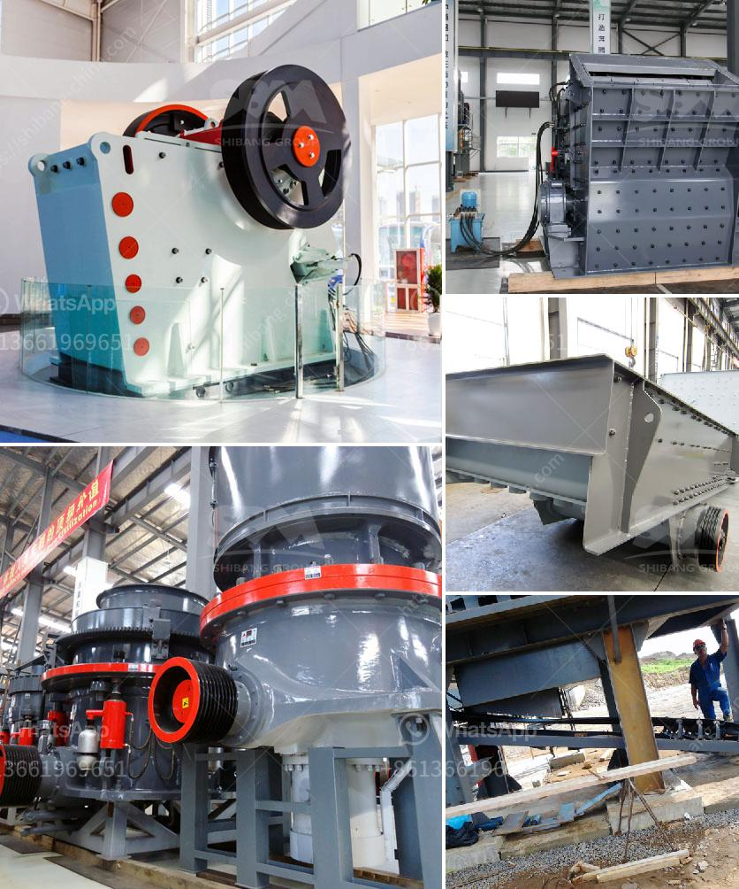

<h3>أسعار أحزمة الناقل</h3>
تعتبر أحزمة الناقل أداة أساسية في عمليات النقل والتصنيع في العديد من الصناعات. تستخدم هذه الأحزمة لنقل المواد والبضائع من مكان إلى آخر بكفاءة عالية. تختلف أسعار أحزمة الناقل بشكل كبير حسب مجموعة من العوامل المحددة.

أحد العوامل التي تؤثر في أسعار أحزمة الناقل هي نوعية المادة المستخدمة في صناعتها. يتم تصنيع الأحزمة من مواد مختلفة مثل النسيج والمعدن والمطاط. الأحزمة المصنوعة من المطاط غالبًا ما تكون أرخص من تلك المصنوعة من المعدن، ولكنها قد تتعرض للتلف بسرعة أكبر. بينما تكون الأحزمة المصنوعة من المعدن أكثر متانة وقوة، لكن يكون سعرها أعلى.

عوامل أخرى تؤثر في أسعار الأحزمة تتعلق بالحجم والطول المطلوب. يمكن أن تكون الأحزمة ذات الأحجام الصغيرة أرخص من تلك التي تتطلب أحجامًا أكبر. كما أن الأحزمة ذات الطول الأطول تكون أكثر تكلفة من تلك ذات الطول القصير.

كما يؤثر الطلب والعرض في أسعار أحزمة الناقل. عندما يكون الطلب على الأحزمة مرتفعًا فيسبب نقصًا في العرض، فإن الأسعار ترتفع عادةً. بالمقابل، عندما يكون العرض أكبر من الطلب، فإن الأسعار تنخفض.

علاوة على ذلك، تختلف أسعار أحزمة الناقل من بلد لآخر. يتأثر السعر بتكلفة المواد الخام، تكلفة العمالة وتكنولوجيا الإنتاج المستخدمة في كل بلد. قد تجد أن الأسعار في البلدان النامية أقل من تلك في البلدان المتقدمة.

في النهاية، يجب أخذ جميع هذه العوامل في الاعتبار عند مقارنة أسعار أحزمة الناقل. على الرغم من أن أسعارها تتفاوت بشكل كبير، فإنها تعتبر استثمارًا ضروريًا للشركات التي تعتمد على نظام النقل الآلي لتشغيل أعمالها بكفاءة وفعالية.
<h3>Contact us</h3><ul><li><strong>Whatsapp:&nbsp;<a href="https://wa.me/8613661969651">+8613661969651</a></strong></li><li><a href="https://swt.shibang-china.com/?git&amp;zhl&amp;أسعار أحزمة الناقل"><strong>Online Service(chat now)</strong></a></li></ul><h3>Related</h3><ul><li><a href='اقتراح مشروع تجاري لكسارة الحجر.md'>اقتراح مشروع تجاري لكسارة الحجر</a></li><li><a href='كسارات رئيسية للبيع على Alibaba.md'>كسارات رئيسية للبيع على Alibaba</a></li><li><a href='تخطيط مصنع الأسمنت الصغير بتنسيق PDF.md'>تخطيط مصنع الأسمنت الصغير بتنسيق PDF</a></li><li><a href='آلة صنع مسحوق الكوارتز.md'>آلة صنع مسحوق الكوارتز</a></li><li><a href='كسارة الهامر العمودية.md'>كسارة الهامر العمودية</a></li></ul>