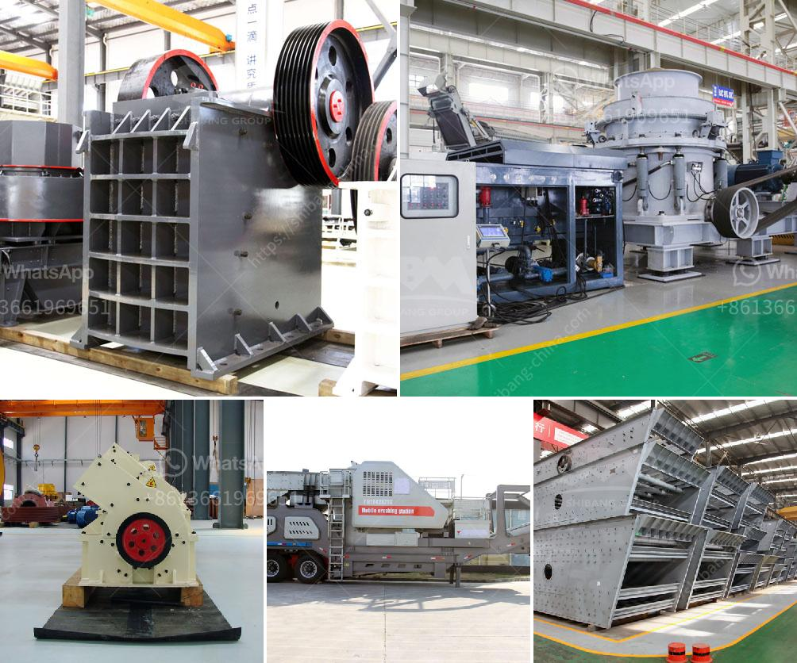

<h3>أسعار السيور الناقلة في ماليزيا</h3>
تعتبر السيور الناقلة أداة أساسية في صناعة النقل والتصنيع في ماليزيا. فهي تستخدم لنقل المواد الخام والسلع النهائية من مكان لآخر بطريقة فعالة وموثوقة. وبالتالي، يعتبر معرفة أسعار السيور الناقلة في ماليزيا أمرًا هامًا للغاية للشركات والمشروعات التجارية.

تتنوع أسعار السيور الناقلة في ماليزيا بناءً على العديد من العوامل المختلفة. أولاً وقبل كل شيء، تختلف التكاليف بناءً على نوع السيور المستخدمة. فهناك عدة أنواع مختلفة من السيور الناقلة مثل السيور الناقلة المطاطية والبلاستيكية والمعدنية. تختلف أسعار هذه الأنواع على أساس الجودة والمتانة وقدرتها على تحمل الضغط والوزن.

ثانيًا، يتأثر سعر السيور الناقلة بحجم وقدرة السيور. فبالطبع، كلما زاد حجم السيور وقدرتها على حمل البضائع الثقيلة والكمية الأكبر، زادت التكلفة. وهذا يعتمد بشكل كبير على احتياجات المشروع أو الصناعة التي تستخدم السيور الناقلة.

ثالثًا، تتأثر أسعار السيور الناقلة في ماليزيا بالعوامل الاقتصادية والعرض والطلب في السوق. ففي بعض الأحيان، يمكن أن تتأثر الأسعار بسبب عوامل خارجة عن السيطرة مثل ارتفاع أسعار المواد الخام المستخدمة في صناعة السيور أو زيادة التكاليف العامة للشركات.

بشكل عام، يمكن أن تتراوح أسعار السيور الناقلة في ماليزيا من 100 إلى 1000 رنجت ماليزي (MYR) للمتر الواحد. ولكن كما ذكرت سابقًا، فإن الأسعار قد تختلف بناءً على العوامل المذكورة أعلاه. وبالتالي، من المهم القيام بدراسة شاملة للسوق ومقارنة الأسعار والخدمات المقدمة من قبل مختلف الشركات المصنعة والموردين قبل اتخاذ قرار الشراء.

باختصار، السيور الناقلة تعتبر جزءًا أساسيًا من صناعة النقل والتصنيع في ماليزيا. أسعارها تتفاوت بناءً على نوع السيور وحجمها وعوامل أخرى كالعرض والطلب والتكاليف العامة. من المهم مراعاة جميع هذه العوامل عند الاختيار وشراء السيور الناقلة لضمان الأداء الجيد والقيمة المضافة للشركة أو المشروع.
<h3>Contact us</h3><ul><li><strong>Whatsapp:&nbsp;<a href="https://wa.me/8613661969651">+8613661969651</a></strong></li><li><a href="https://swt.shibang-china.com/?git&amp;zhl&amp;أسعار السيور الناقلة في ماليزيا"><strong>Online Service(chat now)</strong></a></li></ul><h3>Related</h3><ul><li><a href='تكلفة أعمال المحجر في الهند.md'>تكلفة أعمال المحجر في الهند</a></li><li><a href='معدات المحجر للسكك الحديدية.md'>معدات المحجر للسكك الحديدية</a></li><li><a href='شركة تصنيع كسارات الحجر.md'>شركة تصنيع كسارات الحجر</a></li><li><a href='وحدة معالجة الحجر الجيري بالمنغنيز.md'>وحدة معالجة الحجر الجيري بالمنغنيز</a></li><li><a href='كم تكلف تراخيص التعدين على الذهب في نيجيريا.md'>كم تكلف تراخيص التعدين على الذهب في نيجيريا</a></li></ul>