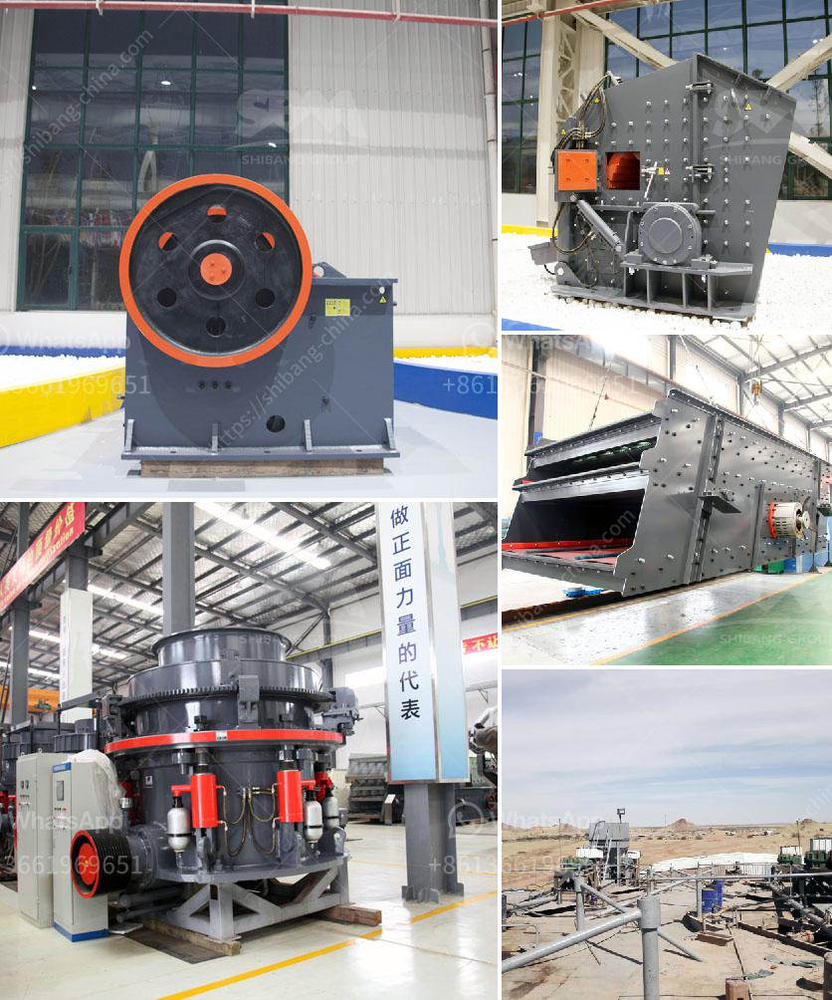

<h3>أسعار الشاشات الاهتزازية</h3>
تعد الشاشات الاهتزازية من أحدث التقنيات في عالم الشاشات، إذ تمتاز بمزايا فائقة تعزز تجربة المشاهدة وتوفر راحة واستمتاعاً أكبر للمستخدمين.

تتراوح أسعار الشاشات الاهتزازية عادة بين 200 و 400 دولار، وذلك يعتمد على الحجم والمواصفات الأخرى للشاشة. فعلى سبيل المثال، الشاشات الصغيرة بحجم 32 بوصة ستكون أرخص من الشاشات الكبيرة التي تصل إلى 65 بوصة أو أكثر.

من بين المميزات التي توفرها الشاشات الاهتزازية هي دقتها العالية ووضوح الصورة. فهي تدعم تقنية العرض بالدقة العالية (HD) والدقة الكاملة (Full HD) وحتى تقنية الدقة الفائقة (4K) في بعض الحالات. هذا يعني أن الألوان ستكون أكثر وضوحاً ونقاءً وتفصيلاً على الشاشة. بالإضافة إلى ذلك، تقدم الشاشات الاهتزازية زوايا رؤية واسعة تصل إلى 178 درجة، لذا يمكن للمشاهدين في أي مكان في الغرفة مشاهدة الشاشة بكل وضوح ومتعة.

تأتي الشاشات الاهتزازية أيضًا مع سرعة تحديث عالية تعزز تجربة العرض، حيث تصل سرعة التحديث إلى 240 هيرتز. هذا يتيح تحرك سلس وسلس مما يقلل من ظاهرة الوهلة ويمنح تجربة تشغيل أكثر إثارة.

لا يقتصر دور الشاشات الاهتزازية على عرض الأفلام والبرامج التلفزيونية فقط، بل يمكن استخدامها أيضًا للألعاب الإلكترونية. تساعد الشاشات الاهتزازية على تحسين تجربة اللعب، حيث تقدم تأثيرات صوتية وبصرية أكثر واقعية وحيوية. كما تدعم الشاشات الاهتزازية تقنية HDR للصور ومحتوى الفيديو، وهذا يعزز التباين بين الألوان الفاتحة والداكنة، مما يخلق تأثيرًا مثيرًا وواقعيًا أكبر في الصور والأفلام.

باختصار، يمكن القول إن الشاشات الاهتزازية تقدم تجربة مشاهدة ممتعة ومثيرة على المستويين البصري والسمعي. يبدو أن أسعارها في نطاق 200 إلى 400 دولار معقولة نسبيًا مقارنة بالمزايا التي تقدمها. ولذا، فإن شراء شاشة اهتزازية في هذا النطاق السعري يعد استثمارًا جيدًا لمن يرغب في تحسين تجربة المشاهدة أو اللعب.
<h3>Contact us</h3><ul><li><strong>Whatsapp:&nbsp;<a href="https://wa.me/8613661969651">+8613661969651</a></strong></li><li><a href="https://swt.shibang-china.com/?git&amp;zhl&amp;أسعار الشاشات الاهتزازية"><strong>Online Service(chat now)</strong></a></li></ul><h3>Related</h3><ul><li><a href='مصنع مسحوق لوح الجبس في إثيوبيا.md'>مصنع مسحوق لوح الجبس في إثيوبيا</a></li><li><a href='كسارة مخروطية جديدة تمامًا للبيع في الهند.md'>كسارة مخروطية جديدة تمامًا للبيع في الهند</a></li><li><a href='أنواع كسارة الحصى.md'>أنواع كسارة الحصى</a></li><li><a href='مصانع غسيل الذهب للبيع في غانا.md'>مصانع غسيل الذهب للبيع في غانا</a></li><li><a href='آلة تكسير الحجر نيجيريا.md'>آلة تكسير الحجر نيجيريا</a></li></ul>