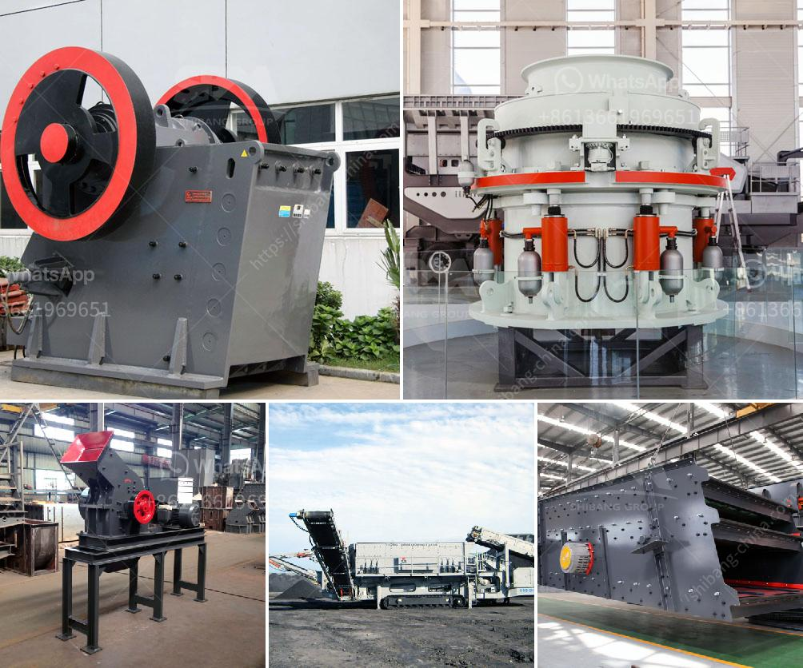

<h3>أسعار كسارات الجرانيت</h3>
تعد كسارات الجرانيت أحد العناصر الأساسية في عملية التكسير وتجهيز الجرانيت. وتتفاوت أسعار هذه الكسارات بناءً على العديد من العوامل المختلفة.

تعد جودة الكسارة وحجمها من بين العوامل الرئيسية التي تؤثر في تحديد سعرها. وتحتوي الكسارات الكبيرة وذات الجودة العالية على سعر أعلى من الكسارات الصغيرة والمنخفضة الجودة. فالكسارات الكبيرة والمتطورة تتطلب تكنولوجيا أكثر تقدمًا ومواد ذات جودة عالية لتمكينها من القيام بعملية التكسير بكفاءة وفعالية وأمان. وبالتالي، فإنها تكلف أكثر من الكسارات الصغيرة التي تعمل بسعة أقل وبجودة أقل.

عوامل أخرى قد تؤثر على سعر الكسارة هي العلامة التجارية والسوق المستهدفة. فهناك بعض الشركات المعروفة جيدًا في صناعة الكسارات ومعروفة بجودة منتجاتها وخدماتها الممتازة. وبالتالي، فإن هذه الشركات قد تضع أسعارًا أعلى قليلاً بالمقارنة مع الشركات الأخرى. وعلى العكس، هناك العديد من الشركات الأخرى التي تقدم كسارات بأسعار أقل للتنافس في السوق.

من الجدير بالذكر أنه بجانب سعر الكسارة نفسها، ينبغي أيضًا مراعاة تكلفة التشغيل والصيانة. فبعض الكسارات قد تكون أرخص في الشراء، ولكنها تتطلب تكاليف عالية للصيانة واستهلاك الطاقة. وبالتالي، فإن تكاليف التشغيل والصيانة يجب أن تأخذ في الاعتبار عند اتخاذ القرار بشأن الكسارة المناسبة للاستخدام المطلوب.

باختصار، فإن أسعار كسارات الجرانيت تتفاوت بناءً على الجودة والحجم والعلامة التجارية وتكاليف التشغيل والصيانة. ولذلك، فمن المهم أخذ جميع هذه العوامل في الاعتبار عندما يتعلق الأمر بشراء كسارة الجرانيت الخاصة بك لضمان حصولك على الجهاز الذي يلبي احتياجاتك ومتطلباتك بأفضل سعر ممكن.
<h3>Contact us</h3><ul><li><strong>Whatsapp:&nbsp;<a href="https://wa.me/8613661969651">+8613661969651</a></strong></li><li><a href="https://swt.shibang-china.com/?git&amp;zhl&amp;أسعار كسارات الجرانيت"><strong>Online Service(chat now)</strong></a></li></ul><h3>Related</h3><ul><li><a href='آلة سحق البلاد.md'>آلة سحق البلاد</a></li><li><a href='كسارة محمولة مستعملة للبيع في جنوب أفريقيا.md'>كسارة محمولة مستعملة للبيع في جنوب أفريقيا</a></li><li><a href='مصنع DMS للماس المستعمل للبيع في كيمبرلي.md'>مصنع DMS للماس المستعمل للبيع في كيمبرلي</a></li><li><a href='تجهيزات تعدين الفحم للبيع في ألمانيا.md'>تجهيزات تعدين الفحم للبيع في ألمانيا</a></li><li><a href='شراء مصنع غسيل الرمل في سريلانكا.md'>شراء مصنع غسيل الرمل في سريلانكا</a></li></ul>