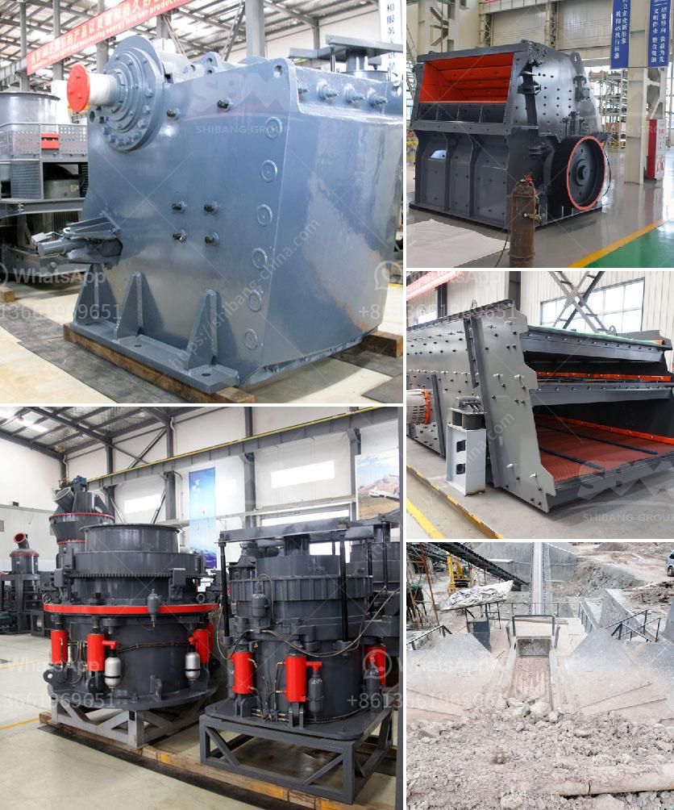

<h3>أسعار كسارات الجيرة</h3>
تعد كسارات الجيرة من المعدات الهامة في صناعة البناء، حيث تستخدم لسحق الحجارة وتحويلها إلى مواد أساسية للبناء مثل الركام والحصى. وتختلف أسعار كسارات الجيرة من بلد إلى آخر ومن  نوع إلى آخر وفقًا للحجم والقدرة والتكنولوجيا المستخدمة في الكسارة.

قد تتراوح أسعار كسارات الجيرة بين 200 إلى 400 دولار في السوق العالمية. وتتأثر الأسعار بعوامل عدة مثل الماركة والجودة والموديل وقوة المحرك المستخدم وسعة الإنتاج ومستوى التكنولوجيا.

عند شراء كسارة الجيرة، يجب مراعاة بعض العوامل الأساسية مثل القوة المقدرة للمحرك، حيث يجب أن يكون المحرك قويًا بما يكفي لتحمل الأحمال الثقيلة وضمان استمرارية الإنتاج. كما يجب مراعاة سعة الإنتاج المطلوبة لأعمال البناء واختيار الكسارة التي تلبي احتياجات المشروع.

بالإضافة إلى ذلك، تلعب جودة الكسارات أيضًا دورًا هاما في تحديد الأسعار. فعلى سبيل المثال، قد يتم استخدام مواد مختلفة في تصنيع الكسارة مثل الفولاذ عالي الجودة وهذا يؤدي إلى زيادة في التكلفة. كما يؤثر استخدام التكنولوجيا الحديثة في الكسارة على الأسعار؛ حيث أن التكنولوجيا الأكثر تطورًا تعني زيادة في التكلفة.

يجب أيضًا أن نأخذ في الاعتبار التكاليف الإضافية لشراء ملحقات الكسارة مثل حزام النقل، والمغذي الاهتزازي، وعربة الغربلة وأجهزة الفرز. فقد ترفع هذه الملحقات تكلفة الكسارة بشكل عام.

في الختام، فإن أسعار كسارات الجيرة تتفاوت بناءً على العوامل المذكورة سابقًا. يجب على المشتري أن يقوم بدراسة احتياجه وتحديد الميزانية المتاحة قبل شراء الكسارة، والتأكد من أن الكسارة ستلبي توقعاته من ناحية الأداء والجودة.
<h3>Contact us</h3><ul><li><strong>Whatsapp:&nbsp;<a href="https://wa.me/8613661969651">+8613661969651</a></strong></li><li><a href="https://swt.shibang-china.com/?git&amp;zhl&amp;أسعار كسارات الجيرة"><strong>Online Service(chat now)</strong></a></li></ul><h3>Related</h3><ul><li><a href='دراسة جدوى لإنشاء محجر.md'>دراسة جدوى لإنشاء محجر</a></li><li><a href='كسارة الحجر الجيري مستعملة.md'>كسارة الحجر الجيري مستعملة</a></li><li><a href='سعر مصنع التكسير.md'>سعر مصنع التكسير</a></li><li><a href='آلة سحق جوز الهند.md'>آلة سحق جوز الهند</a></li><li><a href='مورد مصنع التكسير والفرز في الصين.md'>مورد مصنع التكسير والفرز في الصين</a></li></ul>