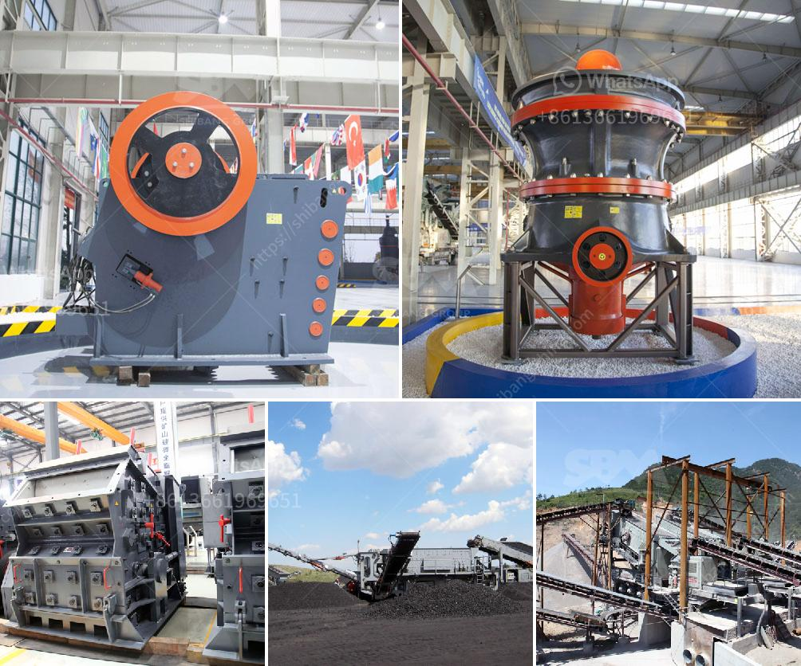

<h3>أسعار كسارات الحجر الصغيرة</h3>
تعتبر كسارات الحجر الصغيرة أدوات هامة في صناعة البناء والبنية التحتية، حيث تستخدم لسحق الحجارة الكبيرة إلى قطع صغيرة تستخدم في إنشاء المباني والطرق والجسور والألواح الأسمنتية وغيرها من المشاريع. ومن المهم أن تكون هذه الكسارات بأسعار معقولة لتكون متاحة للشركات والأفراد على حد سواء.

تتراوح أسعار كسارات الحجر الصغيرة عادةً بين 200 و 400 دولار للوحدة الواحدة، وهذا يعتمد على الحجم والمواصفات المحددة للكسارة. تتوفر كسارات الحجر الصغيرة بأحجام مختلفة، حيث تختلف في الطاقة الانتاجية وقوة المحرك وأحجام الأحجار التي يمكنها سحقها. قد تكون الكسارات الصغيرة ذات الأسعار الأعلى مجهزة بمحركات أقوى وتتميز بقدرة سحق أعلى وأكبر جهد ميكانيكي.

إضافة إلى ذلك، تختلف أسعار الكسارات الصغيرة أيضًا حسب العلامة التجارية والجودة. هناك العديد من الشركات المصنعة المعروفة التي تتخصص في إنتاج كسارات الحجر الصغيرة ذات الجودة العالية، وعادةً ما تكون أسعارها أعلى بقليل من تلك التي تقدم من قبل الشركات ذات الجودة المنخفضة.

وبشكل عام، يعتبر سعر الكسارة الصغيرة بمدى بين 200 و 400 دولار جيدًا ومعقولًا، خاصة إذا ما تم احتساب الجودة والكفاءة والاستدامة في الاعتبار. قد تكون هذه الكسارات ذات صيانة ميسورة واستهلاك منخفض للطاقة وتعزز الإنتاجية. بالإضافة إلى ذلك، تتوفر العديد من الخيارات في السوق، وبالتالي يمكن للمشترين اختيار الكسارة التي تناسب احتياجاتهم وميزانياتهم بشكل جيد.

من الجدير بالذكر أن تصنيع الكسارات الصغيرة يتطلب تكنولوجيا ومعدات متقدمة، مما يؤثر على أسعارها. كما تتأثر الأسعار أيضًا بتكاليف الشحن والتأمين والرسوم الجمركية وعوامل أخرى. ومع ذلك، يمكن للمشترين أن يجدوا العديد من العروض المناسبة والخيارات المناسبة لهم في السوق.

باختصار، تعتبر كسارات الحجر الصغيرة أدوات أساسية في صناعة البناء والبنية التحتية. وتتراوح أسعارها عادة بين 200 و 400 دولار للوحدة الواحدة، بعد الأخذ في الاعتبار الجودة والكفاءة والاستدامة. حيث يمكن للمشترين اختيار الأفضل من بين العديد من العروض المتاحة في السوق، وفقًا لاحتياجاتهم وميزانياتهم.
<h3>Contact us</h3><ul><li><strong>Whatsapp:&nbsp;<a href="https://wa.me/8613661969651">+8613661969651</a></strong></li><li><a href="https://swt.shibang-china.com/?git&amp;zhl&amp;أسعار كسارات الحجر الصغيرة"><strong>Online Service(chat now)</strong></a></li></ul><h3>Related</h3><ul><li><a href='مصنع زينيث للسحق.md'>مصنع زينيث للسحق</a></li><li><a href='آلة غسيل الرمل في المملكة العربية السعودية.md'>آلة غسيل الرمل في المملكة العربية السعودية</a></li><li><a href='مطحنة هامر لطحن البولي إيثيلين منخفض الكثافة.md'>مطحنة هامر لطحن البولي إيثيلين منخفض الكثافة</a></li><li><a href='عملية تصنيع الإسمنت بالطريقة الرطبة.md'>عملية تصنيع الإسمنت بالطريقة الرطبة</a></li><li><a href='مطحنة الأسطوانة الجبس.md'>مطحنة الأسطوانة الجبس</a></li></ul>