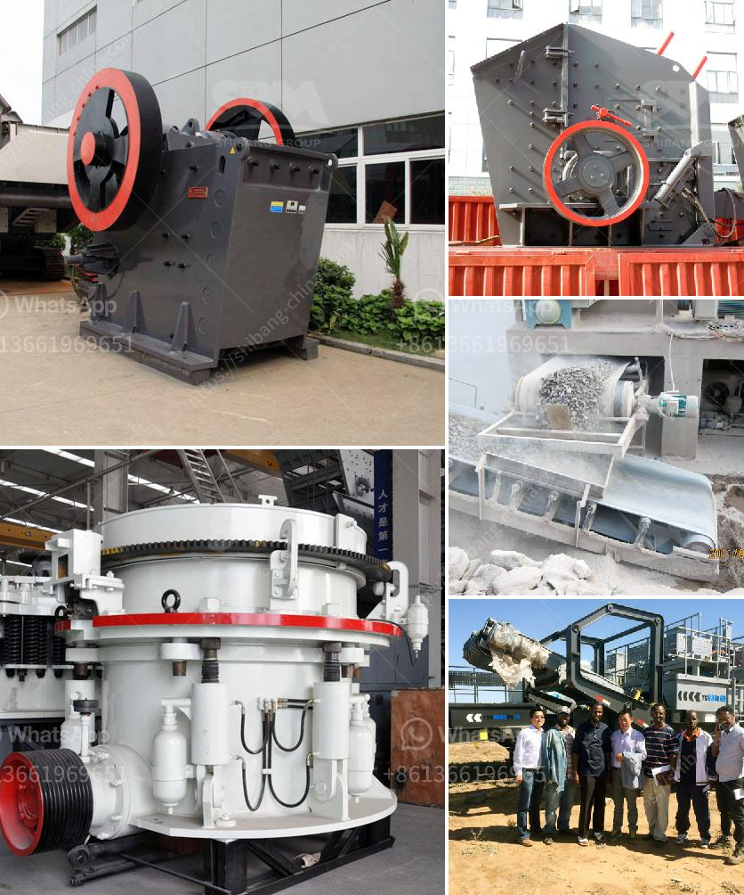

<h3>أسعار كسارات الخرسانة</h3>
تعد كسارات الخرسانة أدوات أساسية في صناعة البناء والإنشاءات، حيث تُستخدم لسحق وطحن الصخور والحجارة وتحويلها إلى مواد خام تُستخدم في إنتاج الخرسانة. تتأثر أسعار هذه الكسارات بعدة عوامل، وفيما يلي سنلقي نظرة على أهم هذه العوامل وتأثيرها على الأسعار.

- الحجم والقدرة: تتفاوت كسارات الخرسانة في حجمها وقدرتها الانتاجية. فكلما كانت الكسارة أكبر حجمًا وأكثر قدرة، كلما كانت أعلى في السعر. يعود ذلك إلى تكاليف تصنيع وصيانة الكسارات الأكبر حجمًا، فضلاً عن القدرة الأعلى التي تسمح بإنتاج كميات أكبر من المواد الخام بشكل أسرع.

- التكنولوجيا المستخدمة: تختلف أسعار كسارات الخرسانة حسب التكنولوجيا المستخدمة في تصنيعها. هناك العديد من التحسينات والابتكارات التكنولوجية التي قد تتضمنها بعض الكسارات مثل نظام التحكم الآلي ونظام تصفية الغبار، وهذا يؤثر على تكلفة الإنتاج وبالتالي على أسعارها.

- العوامل الاقتصادية والسوقية: تؤثر العوامل الاقتصادية والسوقية على أسعار كسارات الخرسانة بشكل كبير. يعتمد ذلك على الطلب والعرض في السوق والتوجهات الاقتصادية العامة. على سبيل المثال ، إذا كان هناك طلب عالي على الخرسانة وكانت هناك نقص في إمدادات الخرسانة المصنعة ، فمن المحتمل أن ترتفع أسعار كسارات الخرسانة بسبب الطلب العالي.

- الجودة والكفاءة: توفر بعض كسارات الخرسانة جودة عالية وكفاءة عالية في عملية التكسير وإنتاج المواد الخام. ومن المعروف أن الأدوات والمعدات ذات الجودة العالية تُعتبر أكثر استدامة وفعالية في العمل. وبناءً على ذلك ، قد تنعكس الجودة والكفاءة على أسعار هذه الكسارات.

في النهاية، يجدر بنا أن نلاحظ أن أسعار كسارات الخرسانة تتنوع وفقًا للمعايير المذكورة أعلاه. لذا ، قبل شراء مثل هذه الأدوات، يفضل للعملاء البحث ومقارنة الأسعار والمواصفات وفقًا لاحتياجاتهم ومتطلباتهم المحددة.
<h3>Contact us</h3><ul><li><strong>Whatsapp:&nbsp;<a href="https://wa.me/8613661969651">+8613661969651</a></strong></li><li><a href="https://swt.shibang-china.com/?git&amp;zhl&amp;أسعار كسارات الخرسانة"><strong>Online Service(chat now)</strong></a></li></ul><h3>Related</h3><ul><li><a href='آلة كسارة صغيرة للبيع في زيمبابوي.md'>آلة كسارة صغيرة للبيع في زيمبابوي</a></li><li><a href='سعة مطحنة الكرة 10 تف في ماليزيا.md'>سعة مطحنة الكرة 10 تف في ماليزيا</a></li><li><a href='كسارات كوبي في سنغافورة، الموردين.md'>كسارات كوبي في سنغافورة، الموردين</a></li><li><a href='مورد آلة كسارة الأسطوانة.md'>مورد آلة كسارة الأسطوانة</a></li><li><a href='سعر آلة الطحن في ماليزيا.md'>سعر آلة الطحن في ماليزيا</a></li></ul>