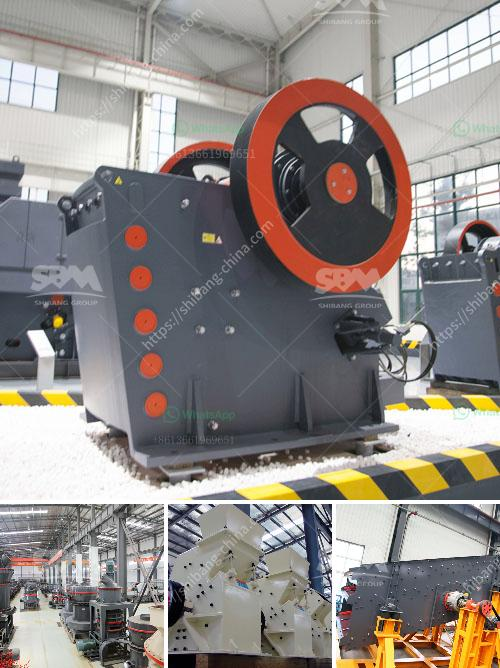

<h3>أسعار كسارات الفك في جنوب أفريقيا</h3>
تعد كسارات الفك أحد أهم المعدات المستخدمة في صناعة التعدين والبناء والبناء. تُستخدم هذه الكسارات بشكل متكرر لتكسير المواد الخام وتقسيمها إلى قطع صغيرة متناسقة، مما يتيح استخدامها في مختلف الصناعات. تعتبر جنوب أفريقيا، بتاريخها الثقافي الغني واحتياطياتها المعدنية الوفيرة، واحدة من الدول الرائدة في صناعة التعدين، وتتمتع جنوب أفريقيا بتوفر أجود أنواع الكسارات.

تختلف أسعار كسارات الفك في جنوب أفريقيا حسب العديد من العوامل، بما في ذلك جودة المعدات والسمات التقنية والمواد الخام المستخدمة في تصنيعها. بشكل عام، تتراوح أسعار كسارات الفك في جنوب أفريقيا بين 200 إلى 400 ألف راند جنوب أفريقي، وذلك اعتمادًا على الحجم والسعة والماركة والجودة.

تتوفر في السوق العديد من الماركات المشهورة لكسارات الفك في جنوب أفريقيا، مثل Metso وSandvik وTelsmith وأخرى. كل ماركة لها سمات تقنية مميزة ومميزات فريدة تجعلها تتميز عن الأخرى. يمكن للمشترين اختيار الطراز الأنسب وفقًا لاحتياجاتهم ومتطلباتهم.

تتفاوت أسعار الكسارات الفكية في جنوب أفريقيا أيضًا باختلاف أنواع المواد الخام التي تم تصنيعها منها. على سبيل المثال، تتميز الكسارات الفكية التي تستخدم في تكسير المواد الجافة بأنها أرخص من تلك التي تستخدم في تكسير المواد الرطبة. ومع ذلك، يتوجب على المشترين أخذ جميع العوامل في الاعتبار وتحديد المتطلبات الدقيقة والمتطلبات الموجودة قبل اتخاذ قرار الشراء.

بصفة عامة، فإن أسعار كسارات الفك في جنوب أفريقيا تعد معقولة مقارنة بالأسواق العالمية الأخرى. يمكن للمشترين أيضًا الاستفادة من تنافسية السوق للحصول على عروض ترويجية وخصومات في أسعار الكسارات.

انتشار كسارات الفك في جنوب أفريقيا يعكس اعتماد الصناعة المحلية على هذه المعدات الهامة. إذ يمكن استخدام الكسارات الفكية في العديد من المشاريع التنموية، بدءًا من بناء الطرق وانشاءات المباني، وانتهاءً بتعدين المعادن وتجهيز المواد وغيرها.

باختصار، تتوفر كسارات الفك بأسعار متنوعة في جنوب أفريقيا، وتعد مميزة من حيث الجودة والتقنية. المشترون يجب أن يأخذوا في الاعتبار ميزانيتهم ومتطلباتهم ويتعاونوا مع الشركات المصنعة الموثوقة والموزعين المحليين للحصول على الفوائد القصوى من هذه المعدات.
<h3>Contact us</h3><ul><li><strong>Whatsapp:&nbsp;<a href="https://wa.me/8613661969651">+8613661969651</a></strong></li><li><a href="https://swt.shibang-china.com/?git&amp;zhl&amp;أسعار كسارات الفك في جنوب أفريقيا"><strong>Online Service(chat now)</strong></a></li></ul><h3>Related</h3><ul><li><a href='آلة تعبئة مسحوق الجير.md'>آلة تعبئة مسحوق الجير</a></li><li><a href='مورد مصنع التكسير والفرز في الصين.md'>مورد مصنع التكسير والفرز في الصين</a></li><li><a href='صانع كسارة في مدينة سيبو.md'>صانع كسارة في مدينة سيبو</a></li><li><a href='الأحجار الكريمة الموجودة في نيجيريا.md'>الأحجار الكريمة الموجودة في نيجيريا</a></li><li><a href='حول شركة تكسير الفحم في إثيوبيا.md'>حول شركة تكسير الفحم في إثيوبيا</a></li></ul>