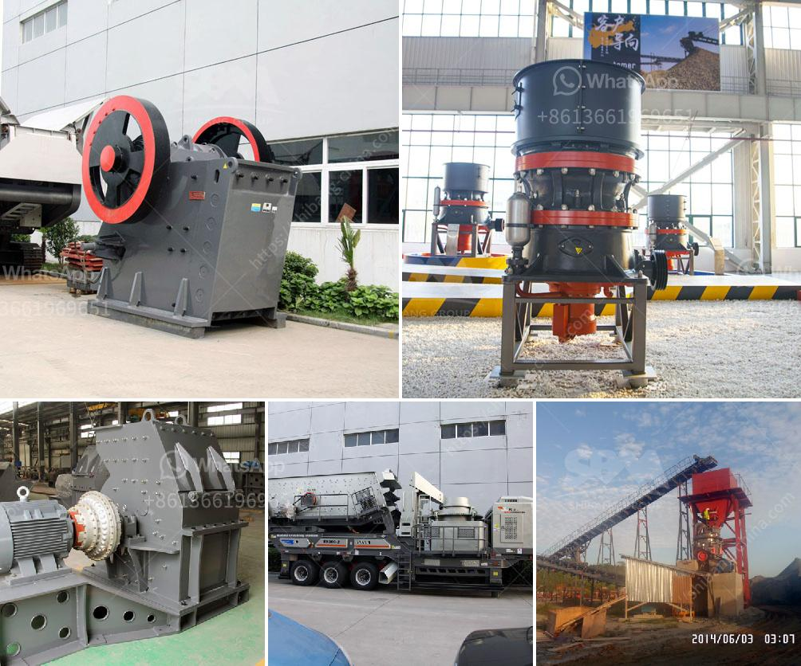

<h3>أسعار كسارات نيجيريا الجديدة</h3>
تتعدد الصناعات والقطاعات في نيجيريا، وتعتبر صناعة البناء والتشييد من أهم القطاعات التي تساهم في تنمية البلاد. وتعتمد البنية التحتية لأي مشروع بناء على استخدام الخرسانة والركام لتحقيق الاستقرار والصلابة. وتعتبر كسارات الحصى والزلط أدوات أساسية لإنتاج الركام في نيجيريا.

تتأثر أسعار كسارات الحصى والزلط بعدة عوامل مثل تكلفة المواد الخام وتكاليف الإنتاج وتكاليف النقل، إضافة إلى العرض والطلب في السوق المحلية. تتراوح أسعار الكسارات النيجيرية الجديدة في متوسط بين 200-400 نيرة نيجيرية للطن الواحد.

وتعتبر "داناتا سويتانترو" واحدة من أهم الشركات الرائدة في صناعة البناء في نيجيريا ولديها كسارات حديثة تعمل بتقنيات حديثة. تعمل الشركة على توفير البنية التحتية المطلوبة في عدة مشاريع حكومية وخاصة، وتقوم بإنتاج وتوريد الركام بأسعار تنافسية.

وبالإضافة إلى ذلك، تقوم عدة شركات صغيرة ومتوسطة بإنتاج الركام في نيجيريا. وتتميز هذه الشركات بأسعارها المنخفضة مقارنة بالشركات الكبيرة، حيث يمكن الحصول على الركام بأسعار مخفضة تتراوح بين 200-300 نيرة نيجيرية للطن الواحد.

وتعتبر أسعار الكسارات في نيجيريا مقبولة للعديد من العملاء، ويتم اعتمادها في حساب تكلفة أي مشروع بناء. وتحظى الشركات الرائدة بشهادة جودة عالية ومنافسة في السوق، مما يسهم في ثقة العملاء واختيارهم للشركات التي توفر جودة عالية وأسعار تنافسية.

في النهاية، يمكن القول أن أسعار كسارات الحصى والزلط في نيجيريا الجديدة تتراوح بين 200-400 نيرة نيجيرية للطن الواحد، وتعتمد على عوامل متعددة تشمل تكلفة المواد الخام وتكاليف الإنتاج وتكاليف النقل، إضافة إلى العرض والطلب في السوق المحلية. وتتمتع الشركات الرائدة بشهادة جودة عالية وتوفر ركام بأسعار تنافسية، مما يساهم في تأمين البنية التحتية المطلوبة في مشاريع البناء في نيجيريا.
<h3>Contact us</h3><ul><li><strong>Whatsapp:&nbsp;<a href="https://wa.me/8613661969651">+8613661969651</a></strong></li><li><a href="https://swt.shibang-china.com/?git&amp;zhl&amp;أسعار كسارات نيجيريا الجديدة"><strong>Online Service(chat now)</strong></a></li></ul><h3>Related</h3><ul><li><a href='مصنع أسمنت صغير بسعة 100 طن في اليوم.md'>مصنع أسمنت صغير بسعة 100 طن في اليوم</a></li><li><a href='كسارة صخور محمولة صغيرة.md'>كسارة صخور محمولة صغيرة</a></li><li><a href='معدات الطحن.md'>معدات الطحن</a></li><li><a href='سعة الكسارة المحمولة ٢٠٠ طن في الساعة.md'>سعة الكسارة المحمولة ٢٠٠ طن في الساعة</a></li><li><a href='شركة تصنيع مطحنة ريموند.md'>شركة تصنيع مطحنة ريموند</a></li></ul>