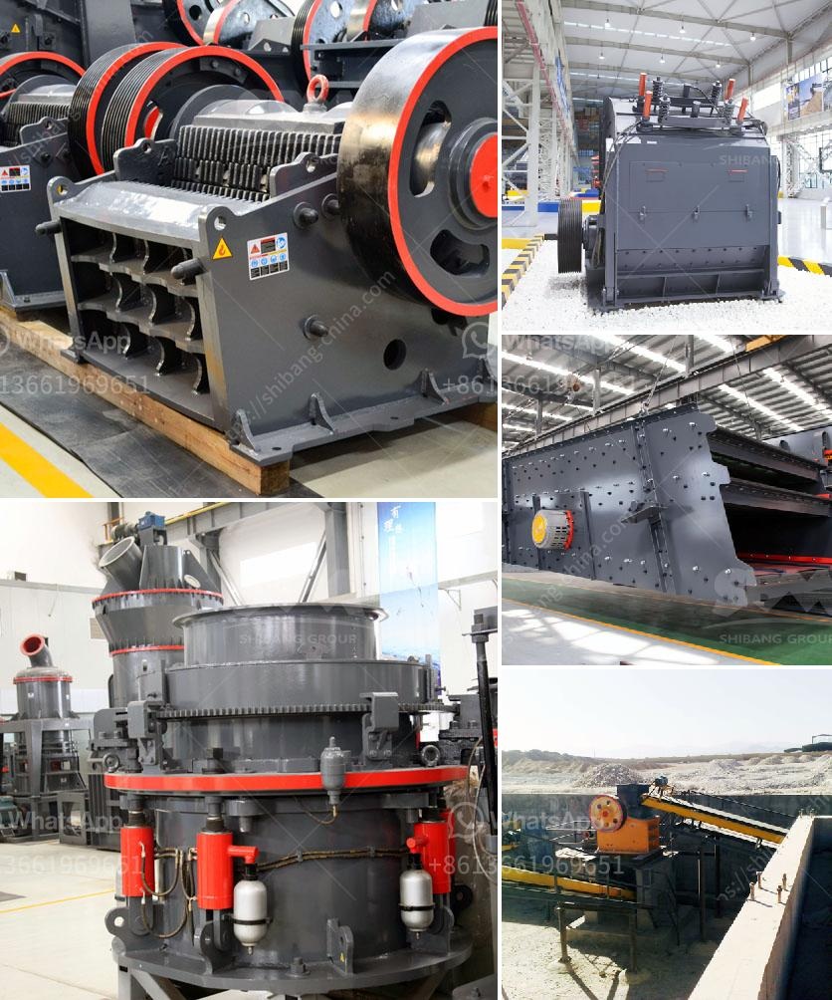

<h3>أسعار كسارة الحجر بسعة 500 طن في الساعة</h3>
تعد كسارة الحجر بسعة 500 طن في الساعة أحد معدات التكسير الهامة في صناعة البناء والتشييد. تسمح هذه الكسارة بتكسير الحجارة بسرعة كبيرة وكفاءة عالية، مما يجعلها مناسبة للاستخدام في المشاريع الكبيرة والمنشآت الصناعية.

تتفاوت أسعار كسارة الحجر بسعة 500 طن في الساعة حسب عدة عوامل، منها المواصفات التقنية للكسارة والجودة المطلوبة للمنتج النهائي، وطبيعة الموقع ومتطلبات العملاء. بشكل عام، تتراوح أسعارها في السوق بين مجموعة واسعة من الأرقام، وتختلف حسب الشركة المصنعة والبلد والعملة المحلية.

على سبيل المثال، يمكن أن تكون تكلفة كسارة الحجر بسعة 500 طن في الساعة تتراوح بين 100000 دولار إلى 500000 دولار. ومع ذلك، فإن هذه الأسعار قد تتغير بالطبع وفقًا للعوامل المذكورة سابقاً.

أحد العوامل التي تؤثر على السعر هو الجودة والموثوقية للمعدات. كما أن المواصفات التقنية للكسارة تلعب دورًا مهمًا في تحديد سعرها. الكسارات ذات الجودة العالية والتقنيات المتطورة والكفاءة العالية تكون عادة أكثر تكلفة من الكسارات ذات الجودة المنخفضة والتصميم البسيط.

بالإضافة إلى ذلك، تعتمد الأسعار أيضًا على تكاليف الشحن والتسليم. إذا كانت الكسارة تحتاج إلى شحن عبر الحدود أو على مسافة طويلة، فسوف يتم احتساب تكاليف النقل والشحن ضمن السعر الإجمالي.

يجب على العملاء الاهتمام بمشاورة الشركة المصنعة والموردة للكسارة قبل اتخاذ قرار الشراء. يجب أن يتم توضيح جميع المتطلبات والمواصفات المرغوبة، وذلك لكي يتمكن الشخص المعني من تقديم العرض الأكثر دقة وشفافية لأسعار الكسارة المناسبة.

في الختام، تعد كسارة الحجر بسعة 500 طن في الساعة أداة مهمة في صناعة البناء والتشييد. لا يمكن تحديد سعرها بشكل دقيق في هذا المقال، ويجب على العملاء البحث والاستفسار للحصول على عروض وتقديرات تجارية محددة وفقًا لاحتياجاتهم ومتطلباتهم المحددة.
<h3>Contact us</h3><ul><li><strong>Whatsapp:&nbsp;<a href="https://wa.me/8613661969651">+8613661969651</a></strong></li><li><a href="https://swt.shibang-china.com/?git&amp;zhl&amp;أسعار كسارة الحجر بسعة 500 طن في الساعة"><strong>Online Service(chat now)</strong></a></li></ul><h3>Related</h3><ul><li><a href='مطحنة رمل مستعملة في هولندا.md'>مطحنة رمل مستعملة في هولندا</a></li><li><a href='تأجير كسارة تأجير في غانا.md'>تأجير كسارة تأجير في غانا</a></li><li><a href='مطحنة تكسير فائقة الدقة لخام الذهب.md'>مطحنة تكسير فائقة الدقة لخام الذهب</a></li><li><a href='سحق الخرسانة والحديد.md'>سحق الخرسانة والحديد</a></li><li><a href='تجار في محطم الفحم وآلة طحن في الهند.md'>تجار في محطم الفحم وآلة طحن في الهند</a></li></ul>