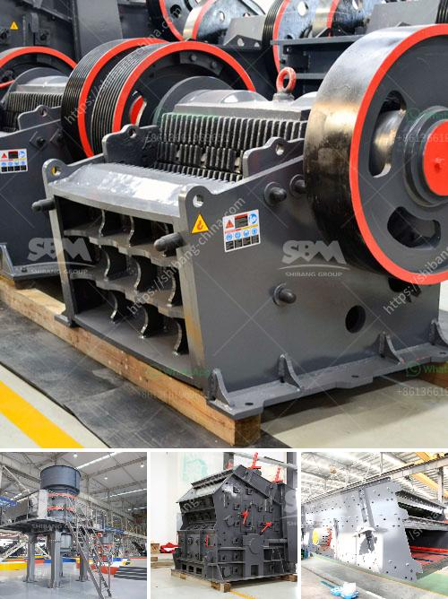

<h3>أسعار كسارة الحجر في إندونيسيا</h3>
تعد كسارة الحجر أحد الآلات المهمة في صناعة البناء والإنشاءات، حيث تستخدم لتكسير وطحن الأحجار الكبيرة وتحويلها إلى حجارة صغيرة قابلة للاستخدام في البناء. تتوفر كسارات الحجر في العديد من البلدان حول العالم، بما في ذلك إندونيسيا.

تعد إندونيسيا واحدة من أكبر الدول في جنوب شرق آسيا، وتشتهر بكثرة مواردها الطبيعية، بما في ذلك الأحجار الكبيرة المستخدمة في صناعة البناء. ومن هنا يترتب عليه أهمية وجود كسارات الحجر في البلاد.

تتنوع أسعار كسارات الحجر في إندونيسيا وفقًا للعديد من العوامل، مثل الحجم والقدرة والجودة. عمومًا، توجد كسارات الحجر بأحجام مختلفة في السوق، بدءًا من الصغيرة التي يمكن استخدامها في المشاريع الصغيرة مثل الأعمال المنزلية، وصولًا إلى الكبيرة التي يمكنها معالجة كميات كبيرة من الحجارة في المشاريع الكبيرة.

فيما يتعلق بالأسعار، تتراوح أسعار كسارات الحجر في إندونيسيا في المجمل بين 200 إلى 400 دولار أمريكي، وذلك حسب الحجم والمواصفات. قد تكون الأجهزة الأكبر حجما والتي تحتوي على مزايا إضافية مثل قدرة تكسير أعلى أو آلية تغذية تلقائية أغلى من الأجهزة الأصغر حجما والأقل مواصفات.

إضافة إلى ذلك، يجب أيضًا أخذ في الاعتبار تكاليف الصيانة والتشغيل لكسارة الحجر، فقد يتطلب ذلك توظيف أفراد مهرة لتشغيل الجهاز وإجراء الصيانة الدورية لضمان عمله السليم.

على الرغم من أنه قد يتراوح سعر كسارة الحجر بين 200 إلى 400 دولار أمريكي في إندونيسيا، إلا أنه يجب مراعاة العوامل الإضافية مثل تكاليف الصيانة والتشغيل. بشكل عام، يجب على المستثمرين والمهتمين بشراء كسارة الحجر دراسة السوق ومقارنة العروض المتاحة من مختلف البائعين للحصول على أفضل قيمة مقابل المال.

في الختام، تعتبر كسارة الحجر من الآلات المهمة في صناعة البناء، وتتوفر بأسعار متفاوتة في إندونيسيا. فيما يتعلق بالأسعار، تتكلف كسارة الحجر في المجمل بين 200 إلى 400 دولار أمريكي، بحسب الحجم والمواصفات. ومع ذلك، يجب على المستثمرين أخذ في الاعتبار أيضًا تكاليف الصيانة والتشغيل قبل الشراء.
<h3>Contact us</h3><ul><li><strong>Whatsapp:&nbsp;<a href="https://wa.me/8613661969651">+8613661969651</a></strong></li><li><a href="https://swt.shibang-china.com/?git&amp;zhl&amp;أسعار كسارة الحجر في إندونيسيا"><strong>Online Service(chat now)</strong></a></li></ul><h3>Related</h3><ul><li><a href='كسارة معالجة الحجر الجيري.md'>كسارة معالجة الحجر الجيري</a></li><li><a href='رسم بياني لعملية غسيل الرمال.md'>رسم بياني لعملية غسيل الرمال</a></li><li><a href='معدات تعدين الفحم في جنوب أفريقيا.md'>معدات تعدين الفحم في جنوب أفريقيا</a></li><li><a href='كسارة الحجر الجيري للبيع.md'>كسارة الحجر الجيري للبيع</a></li><li><a href='كسارة صناعية للبيع.md'>كسارة صناعية للبيع</a></li></ul>