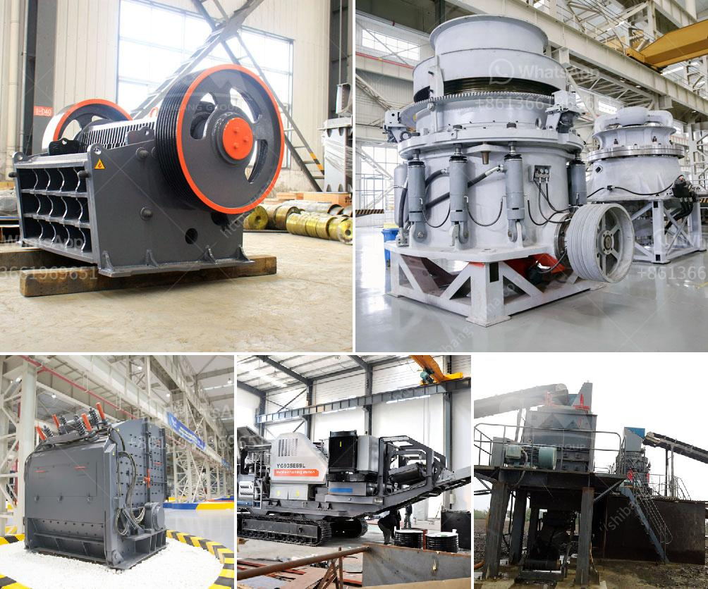

<h3>أسعار كسارة الحجر</h3>
كسارة الحجر هي آلة تستخدم لسحق الحجارة الكبيرة إلى حجم أصغر لاستخدامها في العديد من الأغراض المختلفة. تشمل هذه الأغراض إعادة تدوير الحجر المكسور في الإنشاءات والطرق والأعمال المدنية، وإنتاج المواد الخام للبناء والأساسات والجدران، وتصنيع الرمل والحصى.

تختلف أسعار كسارة الحجر وفقًا للعديد من العوامل مثل حجم الكسارة وقدرتها على سحق الحجارة، ونوعها (ثابتة أم متنقلة)، والبلدان المصنعة، ونوعية المواد المستخدمة في صناعتها. وبشكل عام، يمكن أن تتراوح أسعار كسارة الحجر من 200 إلى 400 دولار.

من الجدير بالذكر أن هذه الأسعار قد تختلف أيضًا حسب العرض والطلب في سوق الكسارات. في أوقات الطلب العالي، قد ترتفع الأسعار بسبب الطلب الزائد على الآلات، في حين يمكن أن تنخفض في أوقات الطلب المنخفض.

أسعار كسارة الحجر الثابتة عادة ما تكون أعلى من الكسارات المتنقلة بسبب تكاليف النقل والتركيب. كما أن تكلفة المواد المستخدمة في صناعة الكسارات عالية، مما ينعكس في السعر النهائي.

بصفة عامة، عند شراء كسارة الحجر، يجب أن يأخذ المشتري في الاعتبار عدة عوامل أخرى بالإضافة إلى السعر، مثل تجربة الشركة المصنعة في الصناعة، وخدمة العملاء والصيانة، وموثوقية الجهاز، وكفاءته العملية، وتكلفة التشغيل المقدرة. هذه العوامل يجب مراعاتها لضمان شراء آلة عالية الجودة والتي تتناسب مع احتياجات المشروع.

بالاختصار، أسعار كسارة الحجر تتفاوت وفقًا للعديد من العوامل. لذلك، ينبغي على المشتري أن يجري بحثًا مستفيضًا ومقارنة متعددة للخيارات المتاحة وتحليل تركيبة السعر والجودة، قبل إتمام عملية الشراء.
<h3>Contact us</h3><ul><li><strong>Whatsapp:&nbsp;<a href="https://wa.me/8613661969651">+8613661969651</a></strong></li><li><a href="https://swt.shibang-china.com/?git&amp;zhl&amp;أسعار كسارة الحجر"><strong>Online Service(chat now)</strong></a></li></ul><h3>Related</h3><ul><li><a href='تكلفة كسارة الحجر.md'>تكلفة كسارة الحجر</a></li><li><a href='سعر كسارة الحجر في الساعة.md'>سعر كسارة الحجر في الساعة</a></li><li><a href='مصنع تكسير الحجر الألماني.md'>مصنع تكسير الحجر الألماني</a></li><li><a href='كسارات مصنوعة في الفلبين الجنوبية.md'>كسارات مصنوعة في الفلبين الجنوبية</a></li><li><a href='معدات كسارة المحجر للبيع.md'>معدات كسارة المحجر للبيع</a></li></ul>