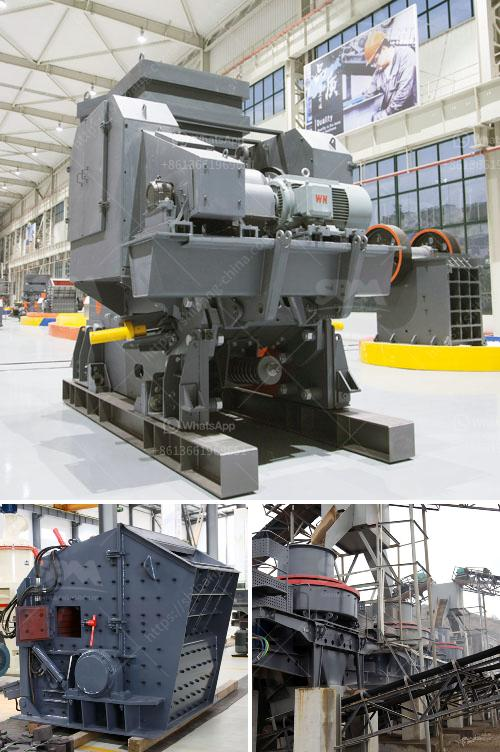

<h3>أسعار كسارة الفك</h3>
تُعد كسارة الفك أحد الأدوات المهمة في عمليات التكسير والتعدين، حيث تستخدم لتكسير المواد الخام إلى جزيئات صغيرة ومتجانسة. إنها تقوم بوظيفة الطحن والتكسير بفضل حركة فكيها المتتالية التي تسحب وتضغط المواد الخام.

1- الحجم والسعة: يؤثر حجم الكسارة وسعتها على سعرها. فكلما كانت الكسارة أصغر حجمًا وأقل سعة، زادت قدرتها على تكسير الصخور الصلبة وتحمل مواد أكثر صلابة، مما يعني زيادة مستوى الأداء وبالتالي ارتفاع السعر.

2- نوعية المواد: تختلف أسعار كسارة الفك بناءً على نوع المواد التي يمكنها تكسيرها. فهناك بعض الكسارات التي تستطيع تكسير المواد الصلبة والمتينة بسهولة، وهناك أخرى تكون مصممة لتكسير المواد الناعمة والهشة.

3- الميزات والتكنولوجيا: تعتمد أسعار كسارة الفك أيضًا على الميزات الإضافية والتقنيات المُستخدمة في التصنيع. قد تتضمن بعض الكسارات ميزات مثل التحكم عن بُعد، أو أنظمة الحماية من الاهتزازات الزائدة، وهذه الميزات قد تؤدي إلى ارتفاع تكلفة الجهاز.

4- العلامة التجارية والسوق: يعد العلامة التجارية وشهرتها عاملاً آخر يؤثر في أسعار كسارة الفك. فقد يكون لبعض العلامات التجارية مكانة قوية في السوق وتاريخ حافل في تصنيع أجهزة عالية الجودة، مما يجعلها أكثر قدرة على طرح أسعار مرتفعة مقارنة بالعلامات التجارية الأقل شهرة.

من الجدير بالذكر أنه لا يمكن تحديد سعر كسارة الفك بدقة بـ 200-400 كلمة، حيث تختلف الأسعار بشكل كبير حسب العوامل المذكورة وغيرها. يُفضل التواصل مع الشركات المصنعة المختلفة أو البحث في السوق لمعرفة المزيد عن أسعار الكسارات والخيارات المتاحة.
<h3>Contact us</h3><ul><li><strong>Whatsapp:&nbsp;<a href="https://wa.me/8613661969651">+8613661969651</a></strong></li><li><a href="https://swt.shibang-china.com/?git&amp;zhl&amp;أسعار كسارة الفك"><strong>Online Service(chat now)</strong></a></li></ul><h3>Related</h3><ul><li><a href='مصانع غسيل الكروم في جنوب أفريقيا.md'>مصانع غسيل الكروم في جنوب أفريقيا</a></li><li><a href='مطحنة طحن الحجر من ألمانيا.md'>مطحنة طحن الحجر من ألمانيا</a></li><li><a href='مطحنة الضغط العالي.md'>مطحنة الضغط العالي</a></li><li><a href='سعر رخيص لآلة تصنيع حبيبات الفحم.md'>سعر رخيص لآلة تصنيع حبيبات الفحم</a></li><li><a href='مصنع غسيل الفحم للبيع في جنوب أفريقيا.md'>مصنع غسيل الفحم للبيع في جنوب أفريقيا</a></li></ul>