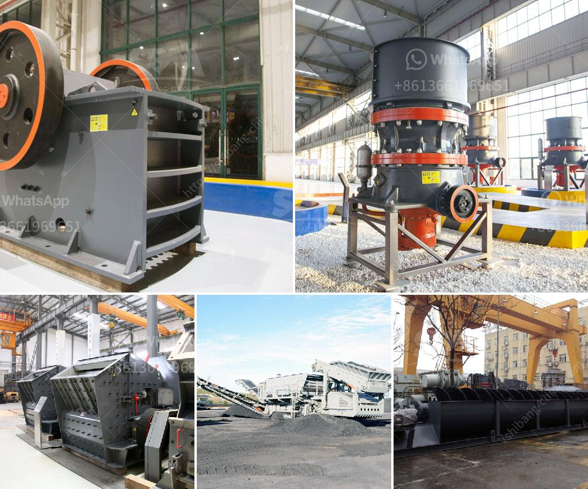

<h3>أسعار كسارة رمل السيليكا</h3>
تعتبر كسارة رمل السيليكا أحد العوامل الهامة في صناعة البناء، حيث يستخدم الرمل السيليكا في عدة تطبيقات مثل الخرسانة والزجاج والسيراميك والمواد الكيميائية. وتتأثر أسعار كسارة رمل السيليكا بعدة عوامل مثل الجودة والكمية المطلوبة ومكان الشراء.

يتراوح سعر كسارة رمل السيليكا عادةً بين 200 و 400 دولار للطن. ولكن يجب مراعاة أن هذه الأسعار تختلف من بلد لآخر وتتأثر بالعديد من العوامل الأخرى. ومن بين هذه العوامل، الجودة هي الأكثر أهمية.

فالجودة المطلوبة للرمل السيليكا تتحكم في سعره، إذا كان يستخرج من مناجم ذات جودة عالية ونقاء عالي، فإنه سيكون أكثر تكلفة. أيضًا، يتأثر سعر الرمل السيليكا بعملية الغربلة والتصنيف والتجهيز والتعبئة والتغليف، حيث يتطلب كل منها تكاليف إضافية.

بالإضافة إلى ذلك، يتم تأثير سعر الرمل السيليكا بالكمية المطلوبة. إذا كان الطلب على الكميات الكبيرة، فإنه يمكن أن يتم الحصول على تخفيض في السعر.

أيضًا، يجب مراعاة مكان الشراء عند حساب تكلفة الرمل السيليكا. قد تكون هناك اختلافات في الأسعار بين الدول المختلفة أو حتى بين الموردين في نفس الدولة.

في الختام، فإن أسعار كسارة رمل السيليكا تختلف وفقًا للعديد من العوامل. ولا يمكن تحديد سعر محدد بدون مراعاة هذه العوامل المتغيرة. لذلك، يجب على الأشخاص الراغبين في شراء الرمل السيليكا الاستشارة مع الخبراء والموردين الموثوقين، ومقارنة الأسعار والخدمات قبل اتخاذ قرار الشراء.

في النهاية، يجب على المشترين البحث عن التوازن المثلى بين الجودة والسعر حسب احتياجاتهم وميزانيتهم.
<h3>Contact us</h3><ul><li><strong>Whatsapp:&nbsp;<a href="https://wa.me/8613661969651">+8613661969651</a></strong></li><li><a href="https://swt.shibang-china.com/?git&amp;zhl&amp;أسعار كسارة رمل السيليكا"><strong>Online Service(chat now)</strong></a></li></ul><h3>Related</h3><ul><li><a href='كسارة مخروطية للبيع.md'>كسارة مخروطية للبيع</a></li><li><a href='معدات كسارة قشر الجوز.md'>معدات كسارة قشر الجوز</a></li><li><a href='كسارة صخور محمولة مستعملة للبيع.md'>كسارة صخور محمولة مستعملة للبيع</a></li><li><a href='سعر مطحنة ليما.md'>سعر مطحنة ليما</a></li><li><a href='مصانع معالجة الدولوميت من ألمانيا.md'>مصانع معالجة الدولوميت من ألمانيا</a></li></ul>