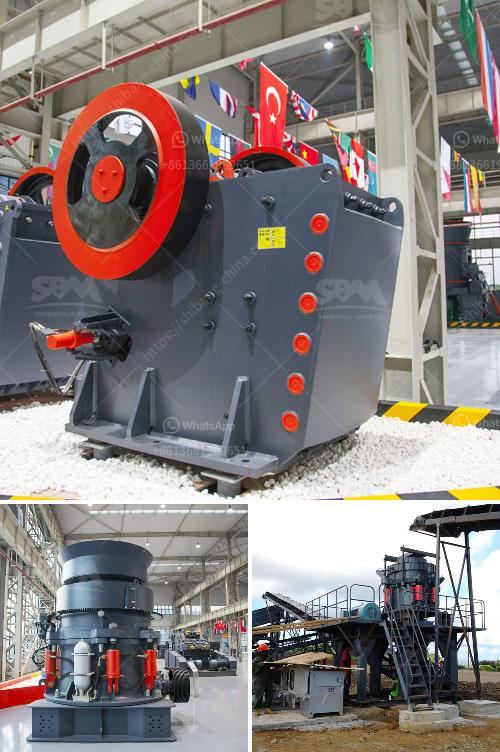

<h3>أسعار مصانع التكسير الكاملة لعلامة باكستر</h3>
مصانع التكسير الكاملة لعلامة باكستر (Baxter) هي معدات حديثة ومتطورة تستخدم في صناعة البناء والتشييد. تتوفر هذه المصانع بأحجام مختلفة تتراوح بين 200 و 400 طن في الساعة.

تعد مصانع التكسير الكاملة أحدث تقنية في مجال التكسير وتحبيب الحجارة والمواد الصلبة الأخرى. تتكون المصانع من العديد من الأجزاء الرئيسية مثل الفيدر، الكسارة الفكية، الكسارة المخروطية، الشاشة الاهتزازية، الناقل الرئيسي وغيرها من المعدات الهامة. جميع هذه الأجزاء مصممة بدقة لتحقيق أفضل أداء وأعلى كفاءة في عملية التكسير.

تتميز مصانع التكسير الكاملة لعلامة باكستر بالعديد من المزايا. تعمل هذه المصانع بكفاءة عالية وتمكن الشركات من زيادة إنتاجها بشكل كبير. كما تتميز أيضًا بتصميم مدمج وسهل التركيب والتشغيل، مما يجعلها مثالية للاستخدام في المواقع ذات المساحات الضيقة. بالإضافة إلى ذلك، تتميز بقدرتها على التكيف مع مختلف أنواع المواد والصخور المختلفة.

بالنسبة للأسعار، فإنها تتفاوت بناءً على حجم وسعة المصنع، وكذلك الميزات والخيارات المطلوبة. تتوفر مصانع التكسير الكاملة لعلامة باكستر بأسعار تتراوح بين عدة آلاف من الدولارات وتصل إلى مئات آلاف الدولارات. وبشكل عام، فإن تكيف المصانع وقدرتها على تحقيق أعلى كفاءة وجودة في العمل يبرر قيمتها العالية.

باختصار، تعتبر مصانع التكسير الكاملة لعلامة باكستر من أكثر المعدات تطورًا وكفاءة في مجال صناعة البناء والتشييد. تتميز بأداء عالي وسهولة التركيب والتشغيل وتوفر العديد من الخيارات لتلبية احتياجات الشركات المختلفة. على الرغم من أسعارها العالية، إلا أن فوائدها وقدرتها على زيادة إنتاجية الشركات وتحسين جودة المنتج يجعلها استثمارًا مثمرًا على المدى الطويل.
<h3>Contact us</h3><ul><li><strong>Whatsapp:&nbsp;<a href="https://wa.me/8613661969651">+8613661969651</a></strong></li><li><a href="https://swt.shibang-china.com/?git&amp;zhl&amp;أسعار مصانع التكسير الكاملة لعلامة باكستر"><strong>Online Service(chat now)</strong></a></li></ul><h3>Related</h3><ul><li><a href='محطة سحق تينوفا.md'>محطة سحق تينوفا</a></li><li><a href='مصنع معالجة البازلت.md'>مصنع معالجة البازلت</a></li><li><a href='قائمة أسعار كسارات الفك.md'>قائمة أسعار كسارات الفك</a></li><li><a href='كسارة الأسطوانة PG 610 x 400.md'>كسارة الأسطوانة PG 610 x 400</a></li><li><a href='معدات تنظيف الرمال في الصغيرة.md'>معدات تنظيف الرمال في الصغيرة</a></li></ul>