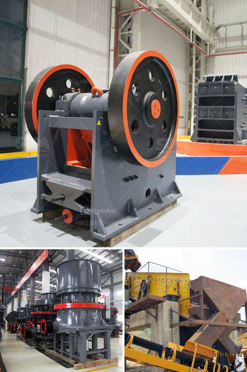

<h3>أسعار مصنع كسارة الحجر</h3>
تعتبر صناعة الكسارات من أهم الصناعات المعدنية التي تساهم في تكسير المواد الخام بغرض تصنيع المنتجات النهائية. وتعد كسارة الحجر من أهم أنواع الكسارات المستخدمة في تكسير الصخور والأحجار لإنتاج الركام والمواد الأساسية في مجال البناء والمقاولات.

تختلف أسعار مصنع كسارة الحجر بناءً على عدة عوامل مختلفة، ومن أهم هذه العوامل:

1. القدرة الإنتاجية: يعتبر حجم الإنتاج الذي يمكن أن يقوم به المصنع من أهم العوامل التي تؤثر على سعر المصنع. فكلما كانت القدرة الإنتاجية أكبر، ارتفعت تكلفة المصنع وبالتالي ارتفع سعره.

2. التقنية المستخدمة: تختلف التكنولوجيا المستخدمة في تصنيع مصانع الكسارة الحجرية وفقًا للشركة المنتجة ومستوى التطور التكنولوجي. فكلما كانت التقنية المستخدمة أحدث ومتطورة، زاد سعر المصنع.

3. المواد الخام: تلعب المواد الخام المستخدمة في تصنيع المصنع دورًا هامًا في تحديد السعر. فبعض المواد الخام أكثر تكلفة من غيرها، وبالتالي ستؤثر على سعر المصنع.

4. الحجم والوزن: يعتبر الحجم والوزن للمصنع من العوامل المؤثرة في سعره. فكلما كان الحجم والوزن أكبر، ارتفع السعر.

5. السوق والطلب: يؤثر الطلب والعرض في تحديد أسعار مصانع الكسارة الحجرية. في بعض الأحيان، عندما يكون هناك طلب كبير على المصانع، قد يزيد سعرها.

بشكل عام، يمكن القول أن أسعار مصانع الكسارة الحجرية تتراوح بين 200 و 400 دولار، وذلك بناءً على العوامل المذكورة أعلاه. ومن المهم أن نلاحظ أن هذه الأسعار قد تتغير بشكل مستمر وفقًا لتغيرات السوق والعرض والطلب.

في النهاية، يعتبر اختيار مصنع كسارة الحجر المناسب لا يعتمد فقط على السعر ولكن يجب أيضًا مراعاة الجودة والكفاءة والدقة في الأداء. ولذلك، يجب أن يتم دراسة المواصفات والمميزات الفنية للمصنع قبل اتخاذ القرار النهائي.
<h3>Contact us</h3><ul><li><strong>Whatsapp:&nbsp;<a href="https://wa.me/8613661969651">+8613661969651</a></strong></li><li><a href="https://swt.shibang-china.com/?git&amp;zhl&amp;أسعار مصنع كسارة الحجر"><strong>Online Service(chat now)</strong></a></li></ul><h3>Related</h3><ul><li><a href='مطاحن الكرة في جنوب أفريقيا.md'>مطاحن الكرة في جنوب أفريقيا</a></li><li><a href='سحق الحجر الأسود تايلاند.md'>سحق الحجر الأسود تايلاند</a></li><li><a href='معدات صنع الحصى.md'>معدات صنع الحصى</a></li><li><a href='مصنع تصنيع الدولوميت.md'>مصنع تصنيع الدولوميت</a></li><li><a href='شركة تصنيع كسارة الفك الدورانية في الهند.md'>شركة تصنيع كسارة الفك الدورانية في الهند</a></li></ul>