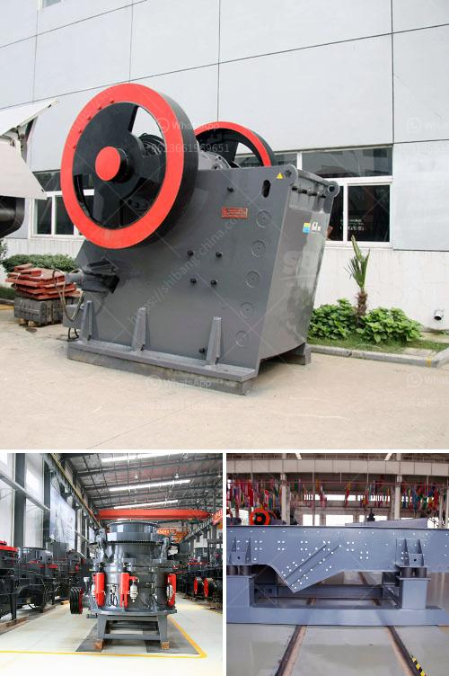

<h3>أسعار مصنع معالجة الكولتان</h3>
تعتبر أسعار مصانع معالجة الكولتان من أهم العوامل التي تؤثر على صناعة التعدين وتجهيز المعادن. يُعتبر الكولتان أحد المعادن النادرة والهامة والمطلوبة في عدة صناعات، مثل صناعة الالكترونيات والأجهزة الطبية.

تختلف أسعار مصانع معالجة الكولتان وفقًا لعدة عوامل، مثل موقع المصنع والتكنولوجيا المستخدمة في المعالجة والمرافق المتاحة. تعتبر بعض الدول الرائدة في صناعة التعدين ومعالجة الكولتان هي الكونغو الديمقراطية وأستراليا والبرازيل ورواندا.

قد يتطلب تأسيس مصنع معالجة الكولتان استثمارات كبيرة لشراء المعدات وتطوير التكنولوجيا المناسبة. على سبيل المثال، يجب تجهيز المصنع بأجهزة لفصل الكولتان عن الأوكسيدات الأخرى وإجراء عمليات تنقية وإعادة التدوير. كما يتطلب المصنع أيضًا توفير بنية تحتية مناسبة لتزويد المصنع بالموارد اللازمة، مثل الطاقة الكهربائية والمياه والموظفين الماهرين.

قد يؤثر سعر المصانع أيضًا على تكلفة المعدن المعالج النهائية. وبالتالي، يتأثر السوق بالعرض والطلب وتكاليف الإنتاج والأوضاع الجغرافية للدول المنتجة. هناك بعض التقديرات لأسعار المصانع، ولكنها تختلف لكل مصنع ودولة. ويتحكم أيضًا المستثمرون والشركات في تحديد الأسعار لتحقيق الربح المرجو.

في النهاية، يمكن القول أن أسعار مصانع معالجة الكولتان تعتمد على العديد من العوامل المختلفة وتختلف من دولة لأخرى ومن مصنع لآخر. يجب وضع في الاعتبار أن الطلب على الكولتان يزداد بشكل مستمر نظرًا لتوسع صناعة الأجهزة الإلكترونية وتطور التكنولوجيا. وبالتالي، فإن فهم أسعار مصانع معالجة الكولتان يساهم في تقدير القيمة الاقتصادية لهذا المعدن النادر ويساعد في تطوير هذه الصناعة.
<h3>Contact us</h3><ul><li><strong>Whatsapp:&nbsp;<a href="https://wa.me/8613661969651">+8613661969651</a></strong></li><li><a href="https://swt.shibang-china.com/?git&amp;zhl&amp;أسعار مصنع معالجة الكولتان"><strong>Online Service(chat now)</strong></a></li></ul><h3>Related</h3><ul><li><a href='مصنع دوامة للبيع لخام الكروم.md'>مصنع دوامة للبيع لخام الكروم</a></li><li><a href='آلة كسارة الحجر التركية.md'>آلة كسارة الحجر التركية</a></li><li><a href='مطحنة الكرة لكلنكر الإسمنت.md'>مطحنة الكرة لكلنكر الإسمنت</a></li><li><a href='مطحنة هامر في جنوب أفريقيا.md'>مطحنة هامر في جنوب أفريقيا</a></li><li><a href='أنا أبحث عن كسارة في ماليزيا.md'>أنا أبحث عن كسارة في ماليزيا</a></li></ul>