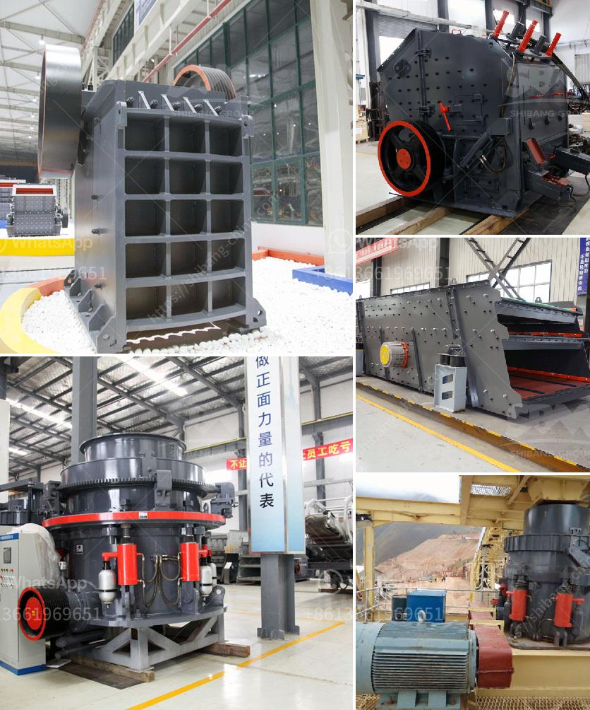

<h3>أسعار مطاحن الكرة الاسمنت</h3>
تعد مطاحن الكرة أحد الأجهزة الرئيسية المستخدمة في صناعة الأسمنت في جميع أنحاء العالم. وهي تستخدم لسحق وطحن المواد الخام اللازمة لإنتاج الأسمنت. فيما يلي سنلقي نظرة على أسعار مطاحن الكرة الاسمنت وعوامل تحديد تلك الأسعار.

تتفاوت أسعار مطاحن الكرة الاسمنت حسب حجم وسعة الآلة، والتكنولوجيا المستخدمة في صنعها، والعلامة التجارية. طبقًا لتقارير السوق، يتراوح سعر مطاحن الكرة الاسمنت الصغيرة بين ٢٠٠ إلى ٣٠٠ دولار، بينما تتراوح أسعار المطاحن الكبيرة والمتقدمة بين ٣٠٠ و ٥٠٠ ألف دولار.

1. الحجم والسعة: تتوفر مطاحن الكرة بمختلف الأحجام والسعات، مثل الصغيرة التي تستخدم في المختبرات والأعمال الصغيرة والمتوسطة، والكبيرة التي تستخدم في الأعمال الصناعية الكبيرة. الأجهزة الأكبر سعة عادة ما تكون أكثر تكلفة.

2. التكنولوجيا المستخدمة: هناك تقنيات مختلفة لصنع مطاحن الكرة الاسمنت، بعضها بسيط ويعتمد على تقنية تحدي المنافسة والأجهزة الأكثر تقدمًا التي تحتوي على نظام تحكم آلي متطور وتقنيات متقدمة للسحق والطحن. الأجهزة التي تستخدم تكنولوجيا أكثر تقدمًا عادة أغلى ثمنًا.

3. العلامة التجارية: تختلف أسعار مطاحن الكرة الاسمنت حسب العلامة التجارية. تعد العلامات التجارية الشهيرة والرائدة في الصناعة غالبًا أكثر تكلفة من العلامات التجارية الأقل شهرة. هذا يرجع إلى سمعة الشركة وجودتها ودقة تصنيع المنتجات.

علاوة على ذلك، قد تؤثر عوامل أخرى في تحديد أسعار مطاحن الكرة الاسمنت، مثل تكاليف الشحن والضرائب وتكاليف الصيانة والخدمة. يجب أيضًا أن يتم احتساب تكلفة قطع الغيار والصيانة المستقبلية عند تقدير تكلفة الجهاز على المدى الطويل.

باختصار، الأسعار التي يتم تطبيقها على مطاحن الكرة الاسمنت تعتمد على عدة عوامل مختلفة، مثل الحجم والسعة والتكنولوجيا والعلامة التجارية والفوائد المرتبطة بهذه الأجهزة. يجب على المشترين اختيار المطحنة المناسبة بناءً على احتياجاتهم وميزانيتهم، مع الأخذ في الاعتبار توصية المهندس المختص أو الخبير في صناعة الأسمنت.
<h3>Contact us</h3><ul><li><strong>Whatsapp:&nbsp;<a href="https://wa.me/8613661969651">+8613661969651</a></strong></li><li><a href="https://swt.shibang-china.com/?git&amp;zhl&amp;أسعار مطاحن الكرة الاسمنت"><strong>Online Service(chat now)</strong></a></li></ul><h3>Related</h3><ul><li><a href='آلات مصنع الحصى الكوارتز.md'>آلات مصنع الحصى الكوارتز</a></li><li><a href='آلة كسارة لصنع الرمل من الحجر.md'>آلة كسارة لصنع الرمل من الحجر</a></li><li><a href='مصانع تكسير الأحجار قرب الدوران.md'>مصانع تكسير الأحجار قرب الدوران</a></li><li><a href='مصنع تكسير خام البوكسيت.md'>مصنع تكسير خام البوكسيت</a></li><li><a href='آلة كسارة للبيع.md'>آلة كسارة للبيع</a></li></ul>