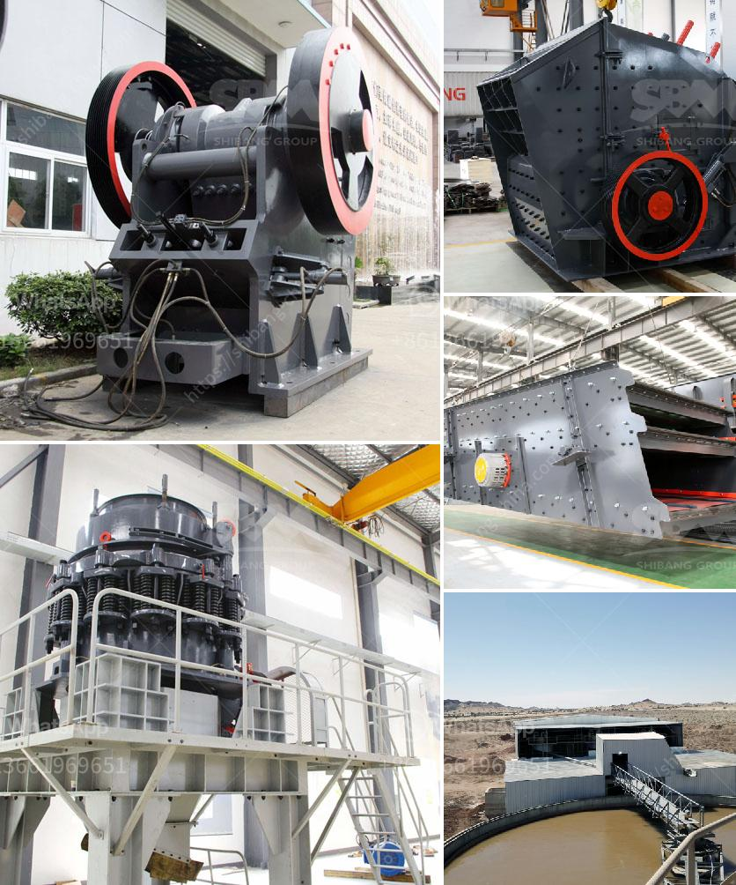

<h3>أسعار مطاحن الكرة في جنوب أفريقيا</h3>
مطاحن الكرة هي آلات تستخدم في عملية طحن المواد الخام في مصانع الاسمنت ومناجم الذهب والفحم والطين والخبث وغيرها. وتعتبر جنوب أفريقيا واحدة من الدول الرائدة عالمياً في صناعة التعدين والتصنيع، وبالتالي فإن أسعار مطاحن الكرة في جنوب أفريقيا هي موضوع هام يهم المستثمرين والشركات المصنعة والمستخدمين في هذا القطاع.

تلعب أسعار مطاحن الكرة دورًا مهمًا في عملية قرار الشراء والاستثمار في هذه الآلات. وتتأثر أسعارها بعوامل عدة، بما في ذلك حجم الآلة وسعتها وجودتها وتقنيتها. قد يؤدي ارتفاع الطلب على المطاحن إلى زيادة الأسعار، بينما قد يؤدي الانخفاض في الطلب إلى انخفاض الأسعار.

تعتبر جودة المطاحن من العوامل المؤثرة في تحديد الأسعار. فعلى سبيل المثال، إذا كانت المطاحن مصنوعة من مواد عالية الجودة وتتمتع بتقنيات متقدمة، فمن المرجح أن تكون أعلى في التكلفة بالمقارنة مع المطاحن التي تعتمد على مواد ذات جودة أقل وتقنيات أقل تطورًا.

الأسواق والشركات المصنعة هي أيضًا عوامل تؤثر في تحديد الأسعار. فقد توجد منافسة شديدة بين شركات تصنيع مطاحن الكرة في جنوب أفريقيا، مما يمكن أن يؤدي إلى انخفاض الأسعار بينهم. كما يمكن أن تتأثر الأسعار أيضًا باتجاهات السوق العالمية وتقلبات العرض والطلب، حيث يكون لها تأثير مباشر على أسعار المعدات.

تتراوح أسعار مطاحن الكرة في جنوب أفريقيا عادةً بين 200 إلى 400 ألف راند جنوب أفريقي. ولكن ينبغي الانتباه إلى أن هذه الأسعار قابلة للتغيير بناءً على العوامل المذكورة سابقًا. يجب أن تعتبر هذه الأسعار كمؤشر تقريبي فقط ولا تمثل الأسعار النهائية.

في الختام، تعد مطاحن الكرة من أهم المعدات التي تستخدم في قطاع التعدين والتصنيع في جنوب أفريقيا. قد تختلف أسعارها بناءً على العوامل المختلفة والتغيرات في السوق، وينبغي للمستثمرين والمشترين الاهتمام بالاستثمار في المطاحن عالية الجودة والتكنولوجيا المتقدمة لضمان أفضل النتائج والعوائد في عملياتهم التجارية.
<h3>Contact us</h3><ul><li><strong>Whatsapp:&nbsp;<a href="https://wa.me/8613661969651">+8613661969651</a></strong></li><li><a href="https://swt.shibang-china.com/?git&amp;zhl&amp;أسعار مطاحن الكرة في جنوب أفريقيا"><strong>Online Service(chat now)</strong></a></li></ul><h3>Related</h3><ul><li><a href='آفاق صناعة كسارة الجرانيت.md'>آفاق صناعة كسارة الجرانيت</a></li><li><a href='مطاحن الحجر الجيري المستخدمة في الفلبين.md'>مطاحن الحجر الجيري المستخدمة في الفلبين</a></li><li><a href='مبدأ عمل مطحنة الهامر.md'>مبدأ عمل مطحنة الهامر</a></li><li><a href='أسعار معدات المحجر.md'>أسعار معدات المحجر</a></li><li><a href='مطحنة رايموند في بورور.md'>مطحنة رايموند في بورور</a></li></ul>