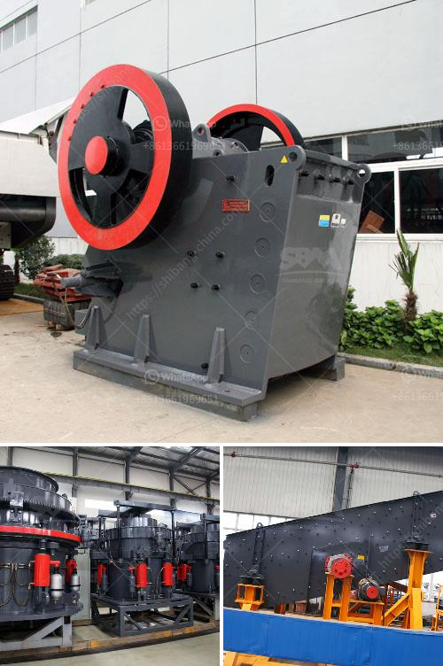

<h3>أسعار مطاحن المطرقة في الرأس الشرقي</h3>
تُعد مطاحن المطرقة من أهم المعدات الزراعية التي يعتمد عليها المزارعون في الرأس الشرقي. تستخدم هذه الماكينات لطحن الحبوب والأعلاف وتحويلها إلى مسحوق. وتعتبر منتجات مطاحن المطرقة ذات جودة عالية وقادرة على معالجة كميات كبيرة من المواد بكفاءة عالية.

تختلف أسعار مطاحن المطرقة في الرأس الشرقي حسب مواصفاتها وحجمها وجودتها. عادةً ما تكون تكلفة المطاحن التجارية الكبيرة أعلى من الطرز الصغيرة المنزلية. تبدأ الأسعار من حوالي 200 دولار إلى 400 دولار وقد يكون السعر أعلى في بعض الحالات بناءً على العلامة التجارية والتكنولوجيا المستخدمة.

بالإضافة إلى العوامل المادية، تلعب الميزات التقنية الأخرى دورًا في تحديد السعر. على سبيل المثال، الصوت والاهتزاز واستهلاك الطاقة وسهولة التشغيل والصيانة جميعها عوامل تؤثر على تكلفة مطاحن المطرقة. كما يمكن أن تتأثر الأسعار بتكاليف التوريد والضرائب والرسوم الجمركية في منطقة الرأس الشرقي.

يجب على المزارعين اختيار مطحنة المطرقة المناسبة وفقًا لاحتياجاتهم الخاصة ومتطلباتهم. قد يفضل بعض المزارعين المطاحن الصغيرة التي يمكن استخدامها في المنزل لطحن الحبوب القليلة، في حين يحتاج آخرون إلى مطاحن أكبر للتعامل مع كميات أعلى من الحبوب. كما أن بعض المزارعين يبتعدون عن المطاحن التقليدية ويستثمرون في المطاحن الحديثة التي تتميز بتكنولوجيا أعلى وأداء أقوى.

بشكل عام، فإن مطاحن المطرقة في الرأس الشرقي تؤدي دورًا هامًا في تحسين إنتاجية المزارعين وجودة المنتجات الزراعية. وبالتالي، فإن الاستثمار في مطحنة المطرقة المناسبة يمكن أن يعود بالفائدة على المزارعين من خلال زيادة الإنتاجية وتحسين الجودة وتوفير الوقت والجهد. علاوة على ذلك، فإن اختيار مطحنة ذات جودة عالية وعملية توفر تكاليف الصيانة والإصلاح على المدى الطويل.

بالاختصار، فإن أسعار مطاحن المطرقة في الرأس الشرقي تتراوح من 200 دولار إلى 400 دولار تقريبًا وتعتمد على الحجم والجودة والميزات التقنية. يجب على المزارعين اختيار مطحنة المطرقة المناسبة لتلبية احتياجاتهم وتحقيق أقصى استفادة منها.
<h3>Contact us</h3><ul><li><strong>Whatsapp:&nbsp;<a href="https://wa.me/8613661969651">+8613661969651</a></strong></li><li><a href="https://swt.shibang-china.com/?git&amp;zhl&amp;أسعار مطاحن المطرقة في الرأس الشرقي"><strong>Online Service(chat now)</strong></a></li></ul><h3>Related</h3><ul><li><a href='ناقل البناء للبيع.md'>ناقل البناء للبيع</a></li><li><a href='آلة صنع مسحوق الرخام.md'>آلة صنع مسحوق الرخام</a></li><li><a href='كسارة فكية صغيرة في المملكة المتحدة.md'>كسارة فكية صغيرة في المملكة المتحدة</a></li><li><a href='كسارة الحجر في أوغندا.md'>كسارة الحجر في أوغندا</a></li><li><a href='آلة كسارة الصخور في ماليزيا.md'>آلة كسارة الصخور في ماليزيا</a></li></ul>