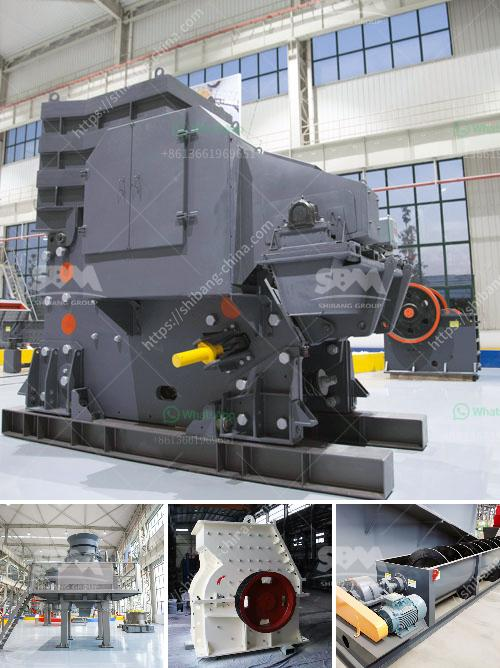

<h3>أسعار مطاحن الهامر</h3>
مع تقدم التكنولوجيا وتطورها السريع، أصبحت مطاحن الهامر (Hammer Mills) واحدة من الأدوات الرئيسية التي يعتمد عليها العديد من الصناعات. تُستخدم هذه المطاحن في عملية التكسير والطحن للمواد الصلبة، وتعتبر الأسعار المتوفرة في السوق هامة جدًا لأي شركة ترغب في شراء مطحنة هامر جديدة.

تتراوح أسعار مطاحن الهامر بين 200 و 400 دولار، وفقًا للماركة والمواصفات والحجم. عادةً ما يتم تصنيع هذه المطاحن من مواد ذات جودة عالية مثل الفولاذ المقاوم للصدأ، مما يعزز قوة ومتانة المطحنة ويجعلها قادرة على تحمل الاستخدام الشاق لفترات طويلة.

يتم استخدام مطاحن الهامر في مجموعة متنوعة من الصناعات، بما في ذلك صناعة الحبوب والأعلاف والأسمدة والأعشاب البحرية والتجهيزات الغذائية والأدوية. فمن خلال الاعتماد على تقنية الطرق الهادمة، فإن هذه المطاحن قادرة على تحويل المواد الصلبة إلى جسيمات دقيقة جدًا وتسهيل عملية الاستخلاص أو الإنتاج.

بالإضافة إلى الأسعار المنخفضة، تتمتع مطاحن الهامر بعدة مزايا أخرى. فهي توفر كفاءة عالية في عملية التكسير والطحن، وتقدم قدرة معالجة عالية وتجهيز سريع للمواد. كما أنها تعتبر آلة هادئة في العمل وتساهم في تقليل الضوضاء والاهتزاز.

يجب أخذ بعض العوامل الأخرى في الاعتبار عند النظر في شراء مطحنة هامر. يجب التحقق من سمعة الشركة المصنعة وموثوقيتها، واحتياجات الإنتاج الفعلية للشركة، بما في ذلك المواد والكمية التي ستتم معالجتها. كما يجب النظر في التكلفة الإضافية للصيانة وقطع الغيار المحتملة في المستقبل.

بشكل عام، يمكن القول إن مطاحن الهامر تمثل استثمارًا جيدًا للشركات التي تعتمد على عملية التكسير والطحن في عملياتها اليومية. الأسعار المتوفرة في السوق تعكس مستوى الجودة والميزات الموجودة في كل نموذج، وهذا يوفر الحلول المختلفة لمتطلبات التصنيع المختلفة للشركات في جميع أنحاء العالم.
<h3>Contact us</h3><ul><li><strong>Whatsapp:&nbsp;<a href="https://wa.me/8613661969651">+8613661969651</a></strong></li><li><a href="https://swt.shibang-china.com/?git&amp;zhl&amp;أسعار مطاحن الهامر"><strong>Online Service(chat now)</strong></a></li></ul><h3>Related</h3><ul><li><a href='مبيعات أحزمة الناقلات.md'>مبيعات أحزمة الناقلات</a></li><li><a href='مطحق الصخور في الفلبين.md'>مطحق الصخور في الفلبين</a></li><li><a href='مصنع تكسير الحجر الجيري في الهند.md'>مصنع تكسير الحجر الجيري في الهند</a></li><li><a href='مشروع تركي لإنتاج مسحوق الجبس.md'>مشروع تركي لإنتاج مسحوق الجبس</a></li><li><a href='إجمالي الطاقة لكسارة الفك 500 طن في الساعة.md'>إجمالي الطاقة لكسارة الفك 500 طن في الساعة</a></li></ul>