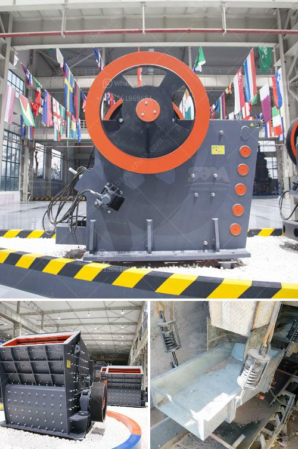

<h3>أسعار مطحنة الطوابع في الصين</h3>
في الصين، تُستخدم مطاحن الطوابع كأداة أساسية لتعقيم وتجهيز المواد الغذائية بشكل فعال وصحيح. تتنوع أسعار مطاحن الطوابع في الصين بين 200 و400 دولار. يعتبر ثمن المطاحن متوسطًا ومنخفضًا مقارنة بمدى التصميمات والموديلات المتاحة في السوق.

تتوفر في الصين مجموعة واسعة من مطاحن الطوابع المختلفة، وتتفاوت أسعارها تبعاً لعدة عوامل. تعتبر جودة صناعة المطحنة ومكوناتها الأساسية عاملاً رئيسياً في تحديد التكلفة. كلما كانت المطحنة ذات جودة أعلى، زادت الفرصة لزيادة سعرها. تعكس العلامات التجارية المشهورة في الصين والمعروفة بالجودة والموثوقية أسعارًا أعلى.

تعتمد أيضًا تكنولوجيا المطحنة ووظائفها المختلفة على تحديد السعر. العديد من المطاحن تحتوي على وظائف إضافية، مثل تحريك العجين وعصر العصائر، مما يجعلها أكثر تنوعًا وقدرة على تلبية الاحتياجات المتنوعة للمستخدمين. وبطبيعة الحال، ترتفع أسعار هذه المطاحن المتقدمة بشكل أعلى.

بالإضافة إلى ذلك، يتأثر سعر مطاحن الطوابع بحجمها وسعة التحميل. تتوفر مطاحن الطوابع بأحجام مختلفة تبدأ من الصغيرة وحتى الكبيرة. كلما كانت الطاقة الاستيعابية أكبر، كلما زادت تكلفة المطحنة.

يجب أيضًا أن نأخذ في الاعتبار المتطلبات الخاصة لكل منشأة أو مستخدم عند اختيار المطحنة المناسبة. بعض المستخدمين قد يحتاجون إلى مطاحن ذات تصميمات خاصة لتلبية احتياجاتهم المحددة، وهو ما يمكن أن يؤثر على السعر أيضًا.

بصفة عامة، يعتبر سعر مطحنة الطوابع في الصين في المدى المذكور بين 200 و400 دولار معقولًا ومناسبًا. توجد العديد من الشركات المصنعة الموثوقة في السوق الصينية التي توفر مطاحن ذات جودة جيدة بأسعار مناسبة للغاية.

في النهاية، يجب أن يأخذ المستهلكون في الاعتبار ميزانيتهم واحتياجاتهم الفردية عند شراء مطحنة الطوابع، بما في ذلك الغذاء الذي يعتزمون تجهيزه وحجم عملية التحضير التي يتوقعونها. من خلال مراعاة هذه العوامل، يمكن للمستهلكين العثور على مطحنة الطوابع المثالية لهم بسعر معقول في الصين.
<h3>Contact us</h3><ul><li><strong>Whatsapp:&nbsp;<a href="https://wa.me/8613661969651">+8613661969651</a></strong></li><li><a href="https://swt.shibang-china.com/?git&amp;zhl&amp;أسعار مطحنة الطوابع في الصين"><strong>Online Service(chat now)</strong></a></li></ul><h3>Related</h3><ul><li><a href='كسارة مخروطية قياسية دليل الإصلاح.md'>كسارة مخروطية قياسية دليل الإصلاح</a></li><li><a href='طريقة التعويم لتحليل رمل السيليكا.md'>طريقة التعويم لتحليل رمل السيليكا</a></li><li><a href='مصانع الكسارات الصينية.md'>مصانع الكسارات الصينية</a></li><li><a href='مصنع كسارة متنقلة.md'>مصنع كسارة متنقلة</a></li><li><a href='كسارة محمولة في المملكة العربية السعودية.md'>كسارة محمولة في المملكة العربية السعودية</a></li></ul>