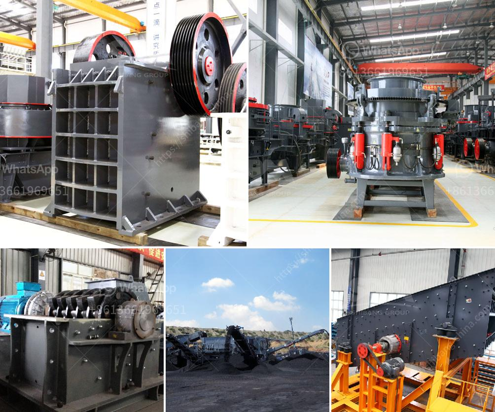

<h3>أسعار مطحنة الكرة في زيمبابوي</h3>
تنادي زيمبابوي بمحطم كروي نظرًا لأنها تعتبر واحدة من رواد صناعة تعدين الذهب في أفريقيا. تلعب مطاحن الكرة دورًا حاسمًا في عمليات استخلاص الذهب وسحق الخام. تستخدم هذه المطاحن الكرة لطحن وسحق الصخور والخامات الذهبية في حجم صغير حتى تتمكن من استخلاص الذهب الموجود فيها.

تتوفر مطحنة الكرة بسعر يتراوح بين 200 دولار و 400 دولار في زيمبابوي. يتنوع السعر بناءً على الموديل والحجم والعلامة التجارية للمطحنة. يعتبر هذا السعر معقولًا مقارنةً بفوائد استخلاص الذهب الهائلة التي تمثلها هذه المطاحن في صناعة التعدين في البلاد.

تأتي مطاحن الكرة بأحجام وطاقات مختلفة، بدءًا من النماذج الصغيرة المستخدمة في التعدين الصغير وصولًا إلى المطاحن الكبيرة المستخدمة في التعدين الصناعي. تعتمد السعة الانتاجية للمطاحن الكبيرة على سعة التحميل وحجم الخام المعالج. تتيح هذه المطاحن استخلاص الذهب بطريقة فعالة وسريعة.

توفر مطاحن الكرة في زيمبابوي تكنولوجيا حديثة، بما في ذلك نظام التشغيل والتحكم الآلي لتسهيل الاستخدام وزيادة الكفاءة. تأتي هذه المطاحن مجهزة بأوعية للتفريز وأسطوانة دوارة تحتوي على كرات معدنية تسحق الخام. كما تعمل هذه الكرات على طحن وسحق الصخور لتحويلها إلى حجم صغير قابل للاستغلال من قبل عمليات استخلاص الذهب.

تستخدم مطاحن الكرة في زيمبابوي في مجموعة متنوعة من العمليات التعدينية الأخرى أيضًا، بما في ذلك سحق الفوسفات والنحاس والفضة والبلاتين. إن اعتماد زيمبابوي على قطاع التعدين يعزز دور مطاحن الكرة في تمكين البلاد من استخراج وتسويق المعادن الثمينة.

باختصار، تلعب مطاحن الكرة دورًا حيويًا في صناعة التعدين في زيمبابوي، حيث تعتبر أداة حاسمة في استخلاص الذهب وغيرها من المعادن الثمينة. توفر هذه المطاحن بأسعار معقولة وتقنيات متقدمة التي تعزز الكفاءة وتسهل عمليات التعدين. رغم تحديات القطاع، يعد قطاع التعدين في زيمبابوي محطة طاقة مهمة ومصدرًا اقتصاديًا للبلاد.
<h3>Contact us</h3><ul><li><strong>Whatsapp:&nbsp;<a href="https://wa.me/8613661969651">+8613661969651</a></strong></li><li><a href="https://swt.shibang-china.com/?git&amp;zhl&amp;أسعار مطحنة الكرة في زيمبابوي"><strong>Online Service(chat now)</strong></a></li></ul><h3>Related</h3><ul><li><a href='مورد آلة كسارة النفايات الفلبين.md'>مورد آلة كسارة النفايات الفلبين</a></li><li><a href='كسارة مخروط زينث.md'>كسارة مخروط زينث</a></li><li><a href='سعر مصنع الكسارة الهندسي الجديد 200 طن في الساعة.md'>سعر مصنع الكسارة الهندسي الجديد 200 طن في الساعة</a></li><li><a href='آلة طحن صناعية في نيجيريا.md'>آلة طحن صناعية في نيجيريا</a></li><li><a href='مطاحن كرات تحطيم الفحم.md'>مطاحن كرات تحطيم الفحم</a></li></ul>